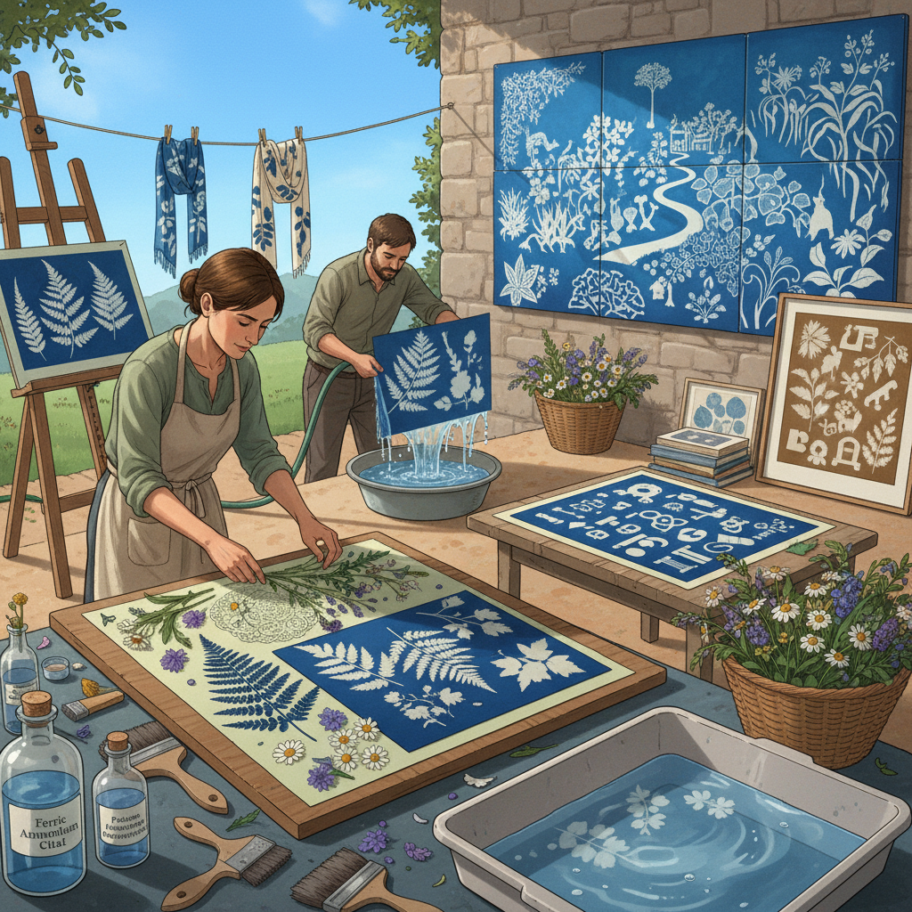

# Sun Printing 日光印刷

> "Sun printing is photography without a camera — objects placed on light-sensitive paper and exposed to the sun, their shadows burned into the emulsion as white silhouettes against a deep blue or brown ground, each print a collaboration between the artist's arrangement and the angle of the afternoon light." — Unknown

## 概述

日光印刷（Sun Printing）是一个涵盖所有利用阳光在光敏材料上创造图像的技法的总称——包括氰版印刷（cyanotype）、日晒纸印刷（solar paper printing）、织物日光印刷（fabric sun printing）等。最常见的日光印刷形式是使用预涂光敏化学物质的纸张或织物，将物体（叶子、花朵、蕾丝、透明胶片等）放置在其上，暴露在阳光下，光敏材料在受光区域发生化学反应变色，被物体遮挡的区域保持原色，形成负像。

日光印刷的魅力在于其"直接性"和"自然性"——不需要暗房、化学药品或复杂设备，只需要阳光和光敏材料。日光印刷是最早的摄影技术之一——Anna Atkins在1843年使用氰版印刷记录植物标本，被认为是第一本摄影书。当代日光印刷在艺术教育、纺织设计和当代艺术中有广泛的应用。

## 核心特征

| 特征 | 描述 |
|------|------|
| 阳光 | 利用阳光曝光 |
| 光敏 | 光敏材料 |
| 接触 | 接触印刷方式 |
| 负像 | 产生负像效果 |
| 简单 | 过程简单直接 |
| 自然 | 自然的创作方式 |

## 视觉特征

- **剪影**：物体的剪影效果
- **蓝色**：氰版的普鲁士蓝
- **细节**：精细的边缘细节
- **自然**：自然物体的印记
- **对比**：强烈的明暗对比
- **诗意**：诗意的视觉效果

## 代表作品

| 作品 | 艺术家 | 年代 | 意义 |
|------|--------|------|------|
| *Photographs of British Algae* | Anna Atkins | 1843 | 第一本摄影书 |
| *Sun print textiles* | Various | 当代 | 日光印刷织物 |
| *Solar paper art* | Various | 当代 | 日晒纸艺术 |
| *Contemporary sun prints* | Various | 当代 | 当代日光印刷 |
| *Educational sun prints* | Various | 当代 | 教育用日光印刷 |

## 历史时间线

| 时期 | 事件 |
|------|------|
| 1842年 | John Herschel发明氰版印刷 |
| 1843年 | Anna Atkins的植物氰版 |
| 19世纪 | 日光印刷在建筑蓝图中的应用 |
| 20世纪 | 日光印刷在教育中的普及 |
| 当代 | 日光印刷的艺术化发展 |

## 中国语境

日光印刷在中国的艺术教育和手工创作中有广泛的应用。中国的美术教育机构和自然教育机构将日光印刷作为科学与艺术结合的教学活动。中国的手工创作者使用日光印刷（特别是氰版印刷）创作植物标本艺术品、手工书和装饰品。中国的一些当代摄影艺术家使用日光印刷技法创作实验性摄影作品。中国丰富的植物资源为日光印刷提供了独特的创作素材。

## AI生成概念图

## 与其他风格的关系

- **Cyanotype** → 氰版印刷
- **Anthotype** → 花汁摄影
- **Lumen Printing** → 光敏印刷
- **Photogram** → 光影图
- **Contact Printing** → 接触印刷
- **Eco Printing** → 生态印花

---

*浮光艺志 | Chronicle of Artistry*
