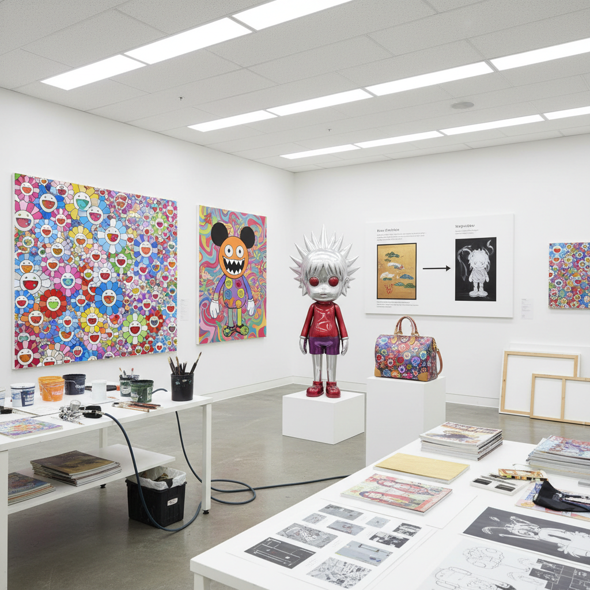

# Superflat Art 超扁平艺术

> "Superflat collapses all hierarchies into one shimmering surface — high art and low culture, traditional Japanese painting and anime, fine art and commercial design, depth and flatness, all compressed into a single plane where Edo-period screens meet manga eyes and Louis Vuitton meets Kanō school, Takashi Murakami's declaration that in Japan there was never a distinction between art and commerce, between the sacred and the cute." — Unknown

## 概述

超扁平（Superflat）是日本艺术家村上隆（Takashi Murakami）在2000年提出的艺术理论和美学概念，用于描述日本当代视觉文化的一个核心特征——所有的层次、等级和深度被压缩到一个平面上。"超扁平"既是一种视觉风格（平面化的、无透视的、装饰性的），也是一种文化批评（日本社会的等级扁平化、高雅与通俗的界限消失）。

村上隆认为，日本传统绘画（如琳派、浮世绘）本来就是"扁平"的——没有西方绘画的透视深度。这种扁平性在当代日本的动漫（anime）、漫画（manga）和御宅族（otaku）文化中得到延续。超扁平将这种日本特有的视觉传统与当代消费文化、可爱文化（kawaii）和亚文化结合，创造了一种既是"纯艺术"又是"商业设计"的混合形式。

## 核心特征

| 特征 | 描述 |
|------|------|
| 扁平 | 视觉的平面化 |
| 混合 | 高雅与通俗的混合 |
| 日本 | 日本视觉传统 |
| 动漫 | 动漫和御宅族文化 |
| 商业 | 艺术与商业的融合 |
| 可爱 | 可爱文化的美学 |

## 视觉特征

- **平面**：完全平面化的画面
- **色彩**：鲜艳的平涂色彩
- **图案**：重复的装饰图案
- **眼睛**：大眼睛的动漫角色
- **花朵**：微笑的花朵图案
- **光滑**：光滑无笔触的表面

## 代表作品

| 作品 | 艺术家 | 年代 | 意义 |
|------|--------|------|------|
| *My Lonesome Cowboy* | Takashi Murakami | 1998 | 村上隆的动漫雕塑 |
| *Flower Ball* | Takashi Murakami | 2002起 | 村上隆的花球系列 |
| *DOB series* | Takashi Murakami | 1993起 | 村上隆的DOB角色 |
| *Milk* | Mr. | 2000年代 | Mr.的少女画 |
| *Jellyfish Eyes* | Takashi Murakami | 2013 | 村上隆的电影 |

## 历史时间线

| 时期 | 事件 |
|------|------|
| 2000 | 村上隆提出"超扁平"概念 |
| 2001 | "超扁平"展览在洛杉矶开幕 |
| 2003 | 村上隆与Louis Vuitton合作 |
| 2000-10年代 | 超扁平的全球影响 |
| 当代 | 超扁平美学的持续扩散 |

## 中国语境

超扁平在中国当代艺术和设计中有显著影响。中国的年轻一代艺术家和设计师广泛借鉴超扁平的视觉语言——平面化的色彩、动漫元素、可爱美学等。中国的"二次元"文化和ACG（动画、漫画、游戏）产业与超扁平有天然的亲和性。有趣的是，中国传统绘画（如工笔画、年画）本身也具有"扁平"的视觉特征——没有西方透视的深度，强调线条和平涂。中国当代的一些艺术家（如周春芽的桃花系列）在创作中融合了中国传统的"扁平"美学与当代流行文化元素。

## AI生成概念图

## 与其他风格的关系

- **Pop Art** → 波普艺术
- **Japanese Art** → 日本艺术传统
- **Anime/Manga** → 动漫/漫画
- **Kawaii** → 可爱文化
- **Neo-Pop** → 新波普
- **Postmodernism** → 后现代主义

---

*浮光艺志 | Chronicle of Artistry*
