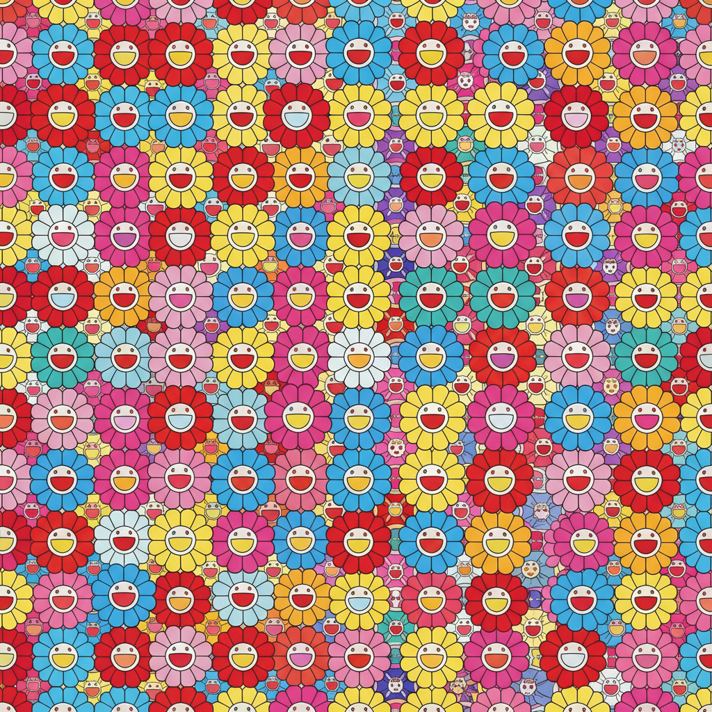

# Superflat 超扁平

> "The future of the world is in the hands of otaku." — Takashi Murakami

## 概述

超扁平（Superflat）是日本艺术家村上隆（Takashi Murakami）于2000年提出的艺术运动和理论框架。它主张日本传统艺术（浮世绘的平面性）、动漫/御宅族文化和当代消费主义之间存在一条连续的美学血脉——日本文化从古至今都是"扁平的"：没有西方式的高雅/低俗之分，没有深度透视，没有精英/大众的等级。

超扁平既是一种视觉风格（鲜艳色彩、平面构图、动漫元素），也是一种文化批评——它揭示了日本战后社会在美国消费主义影响下的"扁平化"。

## 核心特征

| 特征 | 描述 |
|------|------|
| 平面性 | 无透视、无阴影、纯平面构图 |
| 动漫美学 | 大眼睛、鲜艳色彩、卡通形象 |
| 高低混合 | 纯艺术与商业/御宅族文化无等级 |
| 重复图案 | 花朵、骷髅、眼球的密集重复 |
| 消费批判 | 对消费主义和商品化的反思 |
| 日本性 | 从浮世绘到动漫的日本美学连续性 |

## 视觉特征

- **色彩**：极度鲜艳的糖果色——粉、蓝、黄、红
- **线条**：清晰的轮廓线，无笔触痕迹
- **空间**：完全平面，无透视深度
- **图案**：密集重复的花朵、眼球、微笑面孔
- **形象**：动漫风格的角色、可爱与恐怖的并置
- **质感**：光滑、工业化、完美无瑕

## 代表作品

| 作品 | 艺术家 | 年代 | 意义 |
|------|--------|------|------|
| *My Lonesome Cowboy* | Takashi Murakami | 1998 | 御宅族文化的极端化 |
| *Flower Ball* series | Takashi Murakami | 2002+ | 微笑花朵的无限重复 |
| *DOB* series | Takashi Murakami | 1993+ | 超扁平的标志性角色 |
| *Milk* | Yoshitomo Nara | 2012 | 愤怒的大头娃娃 |
| *Princess of the Land of the Dead* | Chiho Aoshima | 2001 | 数字浮世绘 |
| *Jellyfish Eyes* | Murakami (film) | 2013 | 超扁平的电影化 |

## 历史时间线

| 时期 | 事件 |
|------|------|
| 1993 | 村上隆创造DOB角色 |
| 2000 | "Superflat"展览在东京开幕——运动正式命名 |
| 2001 | 展览巡回至洛杉矶MOCA |
| 2003 | Louis Vuitton × Murakami合作——艺术与时尚融合 |
| 2007 | 洛杉矶MOCA举办"©Murakami"大型回顾展 |
| 2010s | 超扁平影响全球插画、设计和数字艺术 |
| 2020s | NFT时代超扁平美学的数字复兴 |

## 子类型

| 子类型 | 特征 |
|--------|------|
| 村上隆系统 | 工厂化生产、品牌合作、商业帝国 |
| 奈良美智 | 孤独愤怒的大头娃娃——朋克精神 |
| 数字超扁平 | Aoshima——纯数字创作的梦幻景观 |
| 超扁平时尚 | LV合作、潮牌——艺术即商品 |
| 后超扁平 | 全球年轻艺术家对超扁平的继承和变异 |

## 中国语境

超扁平对中国当代艺术和设计影响显著。中国的"卡通一代"（黄一瀚等）和"新卡通"艺术家群体直接受超扁平启发。更广泛地说，中国的二次元文化、国潮设计、泡泡玛特等潮玩品牌都体现了超扁平的"高低混合"精神——传统文化元素+动漫美学+商业化运作。

## 争议与遗产

- **争议**：是深刻的文化批评还是精明的商业策略？
- **商业化悖论**：批判消费主义的艺术本身成为最昂贵的商品
- **文化挪用**：西方收藏家对日本亚文化的消费
- **遗产**：模糊了纯艺术与商业的边界，影响了全球数字艺术和设计
- **当代回响**：NFT艺术、潮玩文化、数字插画的平面美学

## AI生成概念图

## 与其他风格的关系

- **Ukiyo-e** → 浮世绘的平面性是超扁平的历史根源
- **Pop Art** → 波普艺术的商业美学和重复是超扁平的西方对应
- **Anime/Manga** → 动漫是超扁平的直接视觉来源
- **Kawaii** → 可爱文化是超扁平的文化基础
- **NFT Art** → NFT艺术继承了超扁平的数字平面美学
- **Neo-Pop** → 新波普与超扁平共享商业/艺术混合

---

*浮光艺志 | Chronicle of Artistry*
