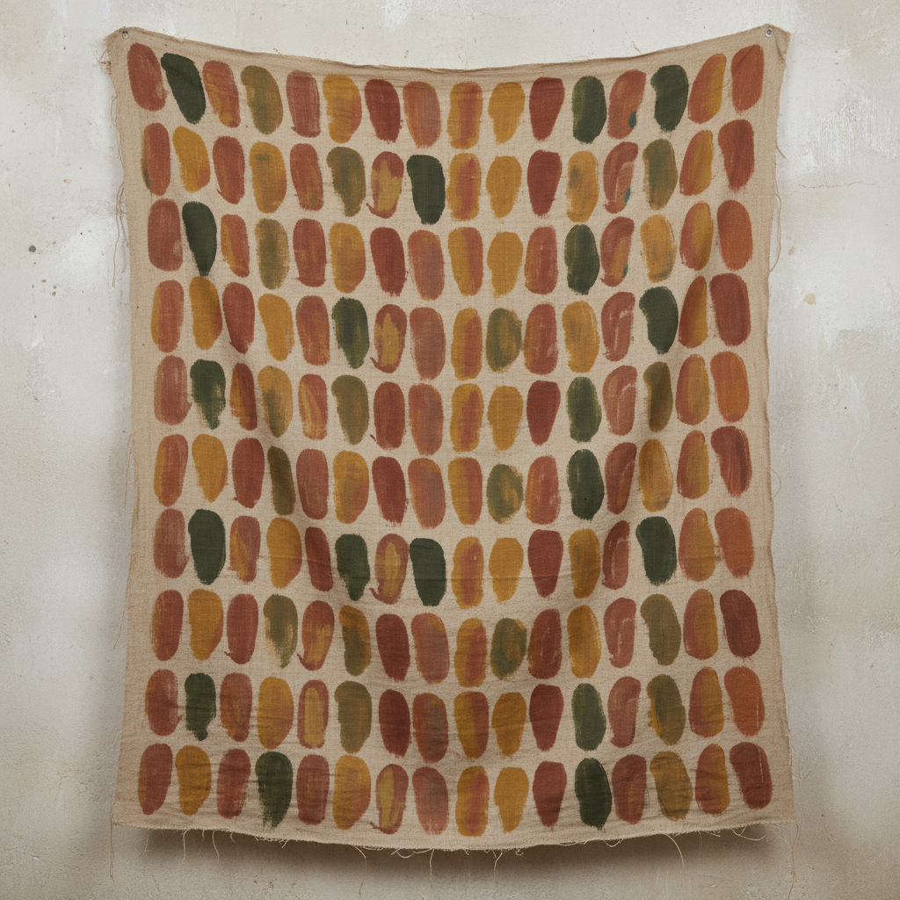

# Support/Surface 支架/表面

> **时期：** 1969–1974  
> **关键词：** 绘画物质性、去框架、解构画布、法国后极简

## 概述

Support/Surface 是1960年代末至1970年代初的法国艺术运动，核心关注绘画的物质基础——画布（surface）和画框（support）本身。他们将画布从画框上取下、折叠、染色、悬挂，或直接在未绷紧的布料上工作，将绘画还原为最基本的物质行为，质疑"一幅画是什么"这个根本问题。

## 风格特征

- **去框架**：画布脱离画框，自由悬挂或铺展
- **物质探索**：关注布料的编织、染色、折叠
- **重复与网格**：系统性的图案和色彩排列
- **过程可见**：创作过程本身成为作品内容
- **户外创作**：在自然环境中展示和创作

## 代表人物与作品

- Claude Viallat 重复形状系列
- Daniel Dezeuze 梯子与网格
- Patrick Saytour 折叠与燃烧
- Louis Cane 切割画布

## 概念图

