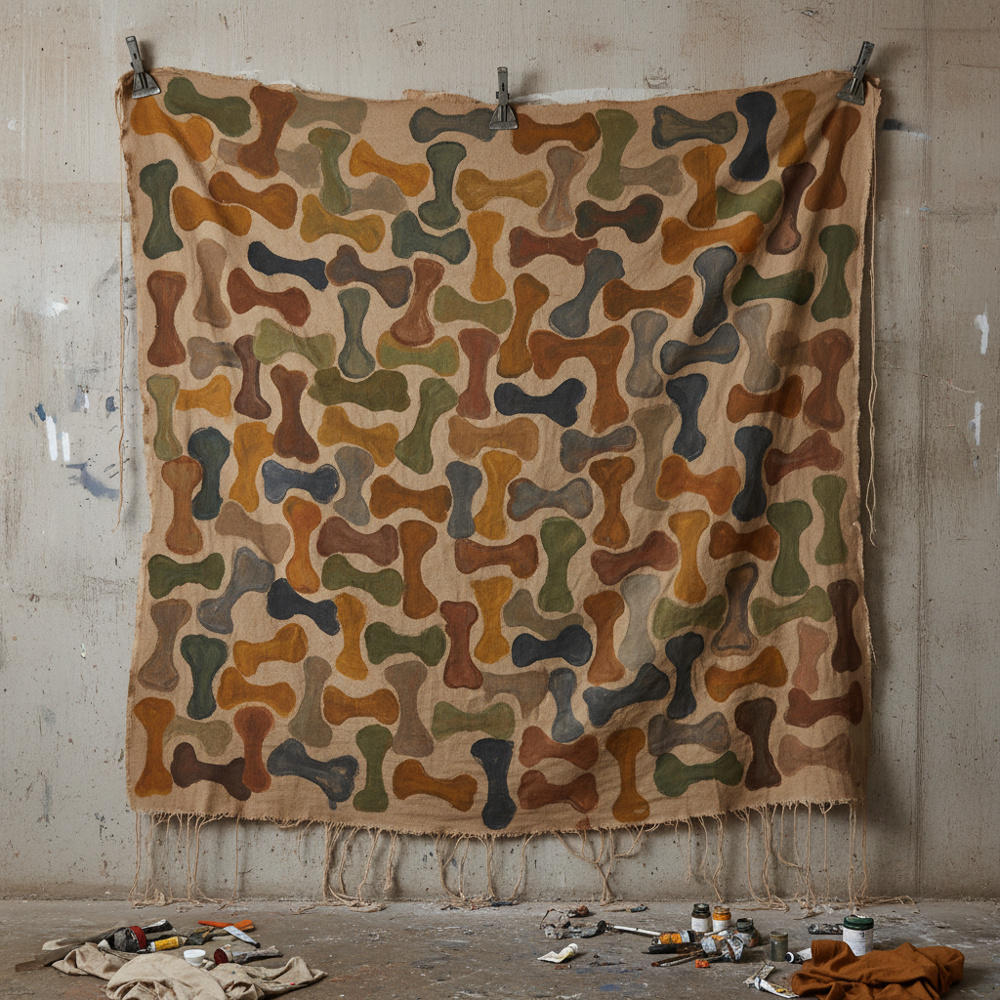

# Supports/Surfaces 载体/表面



> **"没有画笔的绘画，没有画框的画布——解构绘画本体，让材料自己说话。"**

## 概述

载体/表面（Supports/Surfaces）是1969–1972年间法国南部兴起的先锋艺术运动，旨在解构绘画和雕塑的本体——将注意力从"画什么"转向"用什么画"和"画在什么上"。它是二战后法国最重要的前卫艺术运动之一，与同时期意大利的贫穷艺术和美国的大地艺术并列。

## 时代背景

| 维度 | 内容 |
|------|------|
| 起源 | 1969年法国南部Coaraze村户外展览 |
| 正式命名 | 1970年巴黎ARC（现代艺术博物馆）首展 |
| 活跃期 | 1969–1972（核心期），影响延续至今 |
| 思想背景 | 五月风暴后、结构主义、马克思主义、毛主义 |
| 解散 | 1971–72年因理念分歧逐渐分裂 |

## 核心成员

| 艺术家 | 特征 |
|------|------|
| Claude Viallat 克洛德·维尔拉 | 领袖人物，重复有机图形于非传统织物上 |
| Daniel Dezeuze 丹尼尔·德泽兹 | 解构画框，透明纱布绘画 |
| Patrick Saytour | 折叠、烧焦的画布 |
| Louis Cane | 喷涂、印染 |
| André Valensi | 几何色块 |
| Vincent Bioulès | 色彩场域 |
| Jean-Pierre Pincemin | 拼贴与印痕 |
| Toni Grand | 雕塑——组装的木头 |

## 视觉特征

- **无画框**：拒绝传统绑框画布，使用自由悬挂的织物
- **非传统载体**：帆布、遮阳篷、蚊帐、帐篷、雨伞、床单
- **重复图形**：维尔拉标志性的"骨头/海绵"形状无尽重复
- **材料物性**：强调布料的褶皱、染色、破损、纹理
- **过程可见**：折叠、烧焦、浸染、盖章的痕迹
- **户外展示**：广场、海滩、河床、森林中的展览

## 核心理念

### 解构绘画的两个要素

- **Support（载体）**：画布、木板——承载绘画的物质基础
- **Surface（表面）**：颜料、色彩——覆盖载体的视觉层

运动主张将这两个要素分离、暴露、质疑——让观者意识到绘画不是"窗户"，而是物质对象。

### 去灵感化（Désinspiration）

维尔拉的核心理念：不追求灵感、不表达情感、不讲述故事——只是在材料上重复一个动作，让偶然性和材料本身的特质决定结果。

> "我知道我在做什么，但我不知道会发生什么。" ——Claude Viallat

## 与其他运动的关系

```
美国极简主义 ──→ [影响] ──→ Supports/Surfaces(1969)
美国色域绘画 ──→ [影响] ──→ Supports/Surfaces
                                    ↕
贫穷艺术(意) ←→ Supports/Surfaces ←→ 大地艺术(美)
                                    ↓
                        法国当代抽象绘画
```

## 当代影响

- 维尔拉88岁仍每日创作，2024–2025年在上海、昆明举办大型个展
- 对当代"过程艺术"（Process Art）的直接影响
- 纺织艺术（Textile Art）复兴的理论先驱
- 拍卖市场对Supports/Surfaces作品的持续关注
- 2025年CAB Saint-Paul de Vence纪念展

## 多语言名称

| 语言 | 名称 |
|------|------|
| 法语 | Supports/Surfaces |
| 英语 | Supports/Surfaces (保留法语原名) |
| 中文 | 载体/表面 / 支持-表面运动 |
| 德语 | Supports/Surfaces |

## 延伸阅读

- 巴黎现代艺术博物馆1970年ARC展览档案
- 蓬皮杜中心Claude Viallat回顾展（1982）
- 《Dictionnaire de Supports/Surfaces: 1967–1972》

---

*最后更新：2026-07-26*
