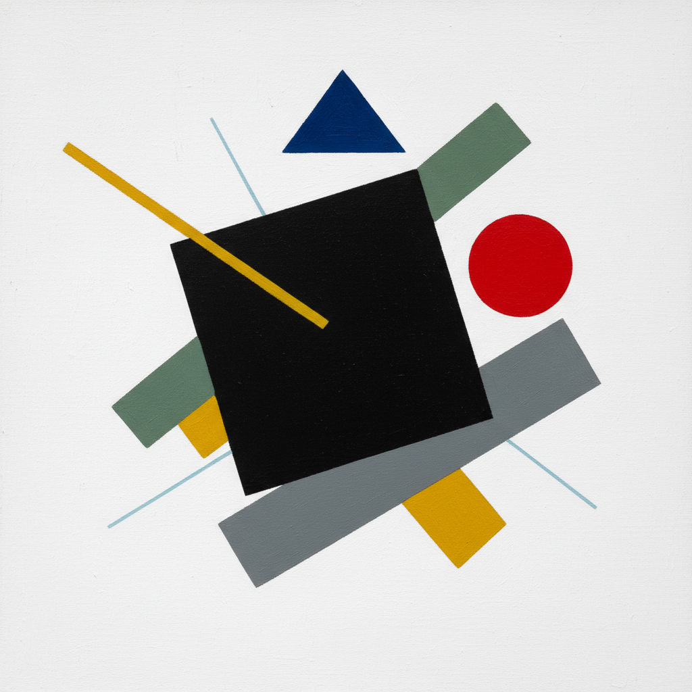

# Suprematism Painting 至上主义绘画

> **时期：** 1913年–1930年代  
> **关键词：** 纯粹几何、绝对抽象、白色空间、精神超越、马列维奇

## 概述

Suprematism（至上主义）由卡西米尔·马列维奇于1913年创立，是最早的纯粹几何抽象运动。"至上"指的是纯粹感觉在艺术中的至高地位——方形、圆形、十字形漂浮在无限的白色空间中，摆脱了一切对自然的模仿。《黑色方块》不是一幅画，而是一个宣言：艺术可以只关于自身。

## 风格特征

- **纯粹几何**：方形、圆形、十字形、三角形
- **白色空间**：无限的、无重力的背景
- **绝对抽象**：完全脱离自然形象
- **动态平衡**：几何形体的倾斜和漂浮
- **精神维度**：超越物质世界的纯粹感觉

## 代表人物与作品

- 卡西米尔·马列维奇《黑色方块》《白上白》
- 埃尔·利西茨基《用红楔子打白军》
- 奥尔加·罗赞诺娃 至上主义构图
- 尼古拉·苏耶廷 至上主义瓷器

## 概念图

