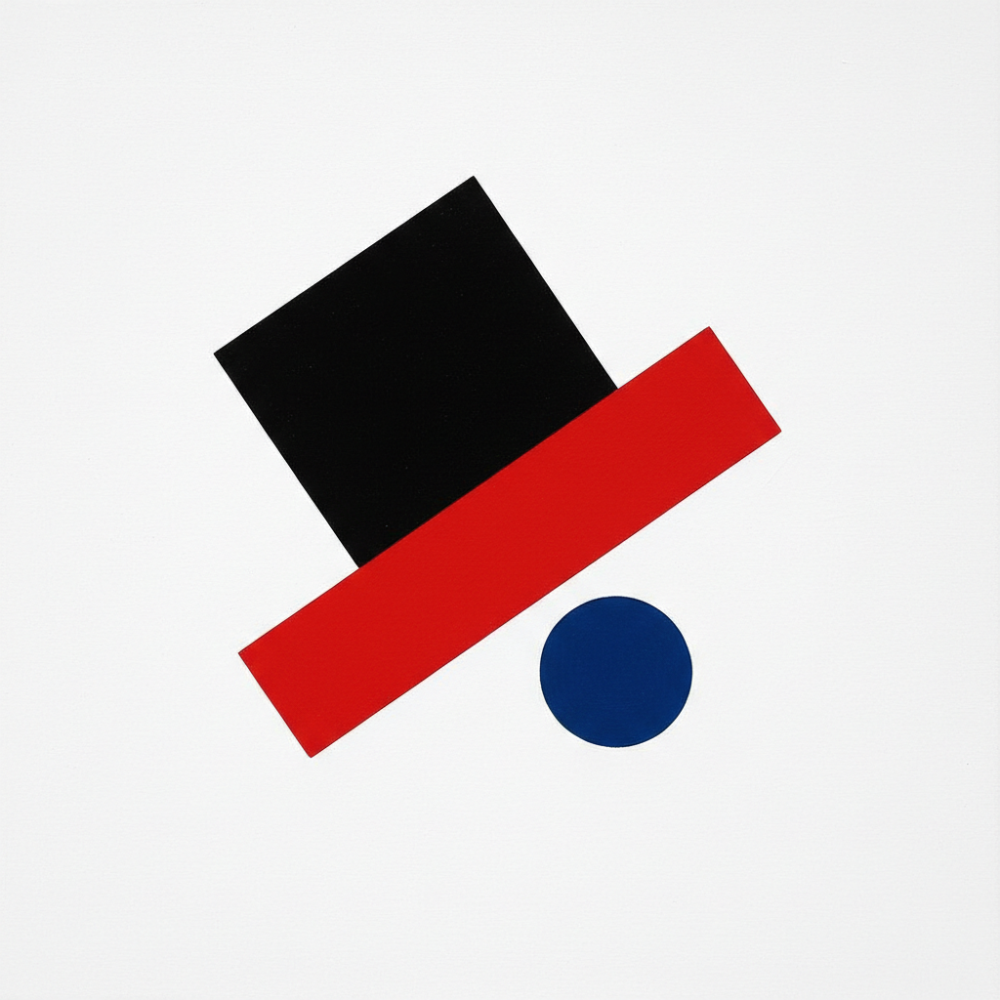

# Suprematism 至上主义

> "I have transformed myself in the zero of form and have fished myself out of the rubbishy slough of academic art." — Kazimir Malevich

## 概述

至上主义（Suprematism）是1915年由卡济米尔·马列维奇在俄国创立的抽象艺术运动。它追求"纯粹感觉的至上性"，将绘画简化为最基本的几何形式——方形、圆形、十字形——在白色虚空中漂浮。

马列维奇的《黑色方块》是艺术史上最激进的宣言之一：绘画不再需要再现任何东西，纯粹的形式本身就是终极现实。

## 核心特征

| 特征 | 描述 |
|------|------|
| 纯粹几何 | 方形、圆形、十字形、三角形 |
| 白色虚空 | 白色背景代表无限空间 |
| 非客观 | 完全脱离现实世界的再现 |
| 感觉至上 | 纯粹感觉优先于物质世界 |
| 动态平衡 | 几何形在空间中的漂浮与倾斜 |
| 极端简化 | 走向绘画的零度——黑方块 |

## 视觉特征

- **形状**：纯粹的几何形——方、圆、十字、矩形
- **色彩**：黑、白、红为主，偶有蓝、黄、绿
- **背景**：纯白色——代表无限虚空
- **构图**：倾斜的、漂浮的、动态的几何排列
- **边缘**：锐利的、精确的几何边缘
- **空间**：无重力的、无深度的纯粹平面

## 代表作品

| 作品 | 年代 | 意义 |
|------|------|------|
| *Black Square* | 1915 | 绘画的零度——艺术史的分水岭 |
| *White on White* | 1918 | 至上主义的终极——白色上的白色 |
| *Suprematist Composition* | 1916 | 动态几何的经典 |
| *Red Square* | 1915 | 色彩的纯粹力量 |
| *Supremus No. 58* | 1916 | 复杂几何的交响 |

## 真实作品（公共领域）

| 作品 | 来源 |
|------|------|
| *Black Square* | [Tretyakov Gallery](https://www.tretyakovgallery.ru/en/) |
| *White on White* | [MoMA](https://www.moma.org/collection/works/80385) |
| *Suprematist Composition* | [MoMA](https://www.moma.org/collection/works/79340) |

## AI生成概念图

## 与其他风格的关系

- **Constructivism** → 构成主义从至上主义分化而出
- **De Stijl** → 荷兰风格派的平行探索
- **Minimalism** → 极简主义的直接先驱
- **Abstract Art** → 纯粹抽象的最早实践之一
