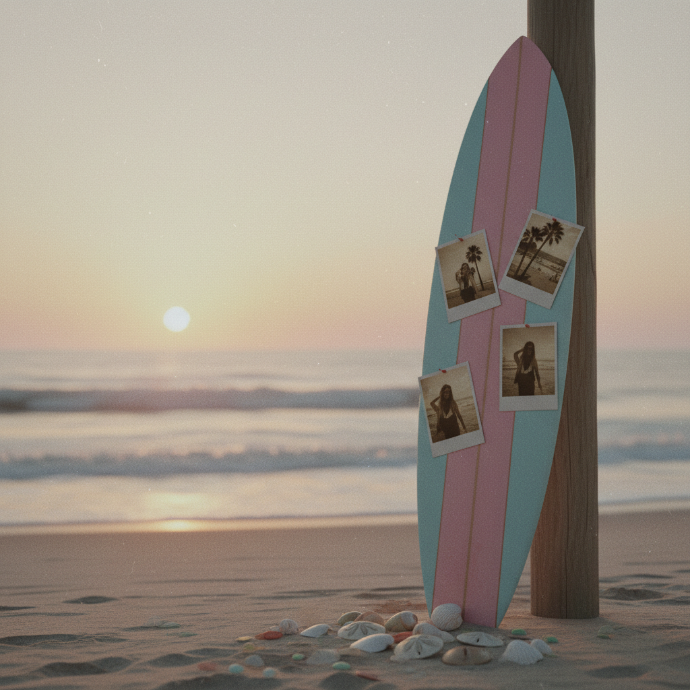
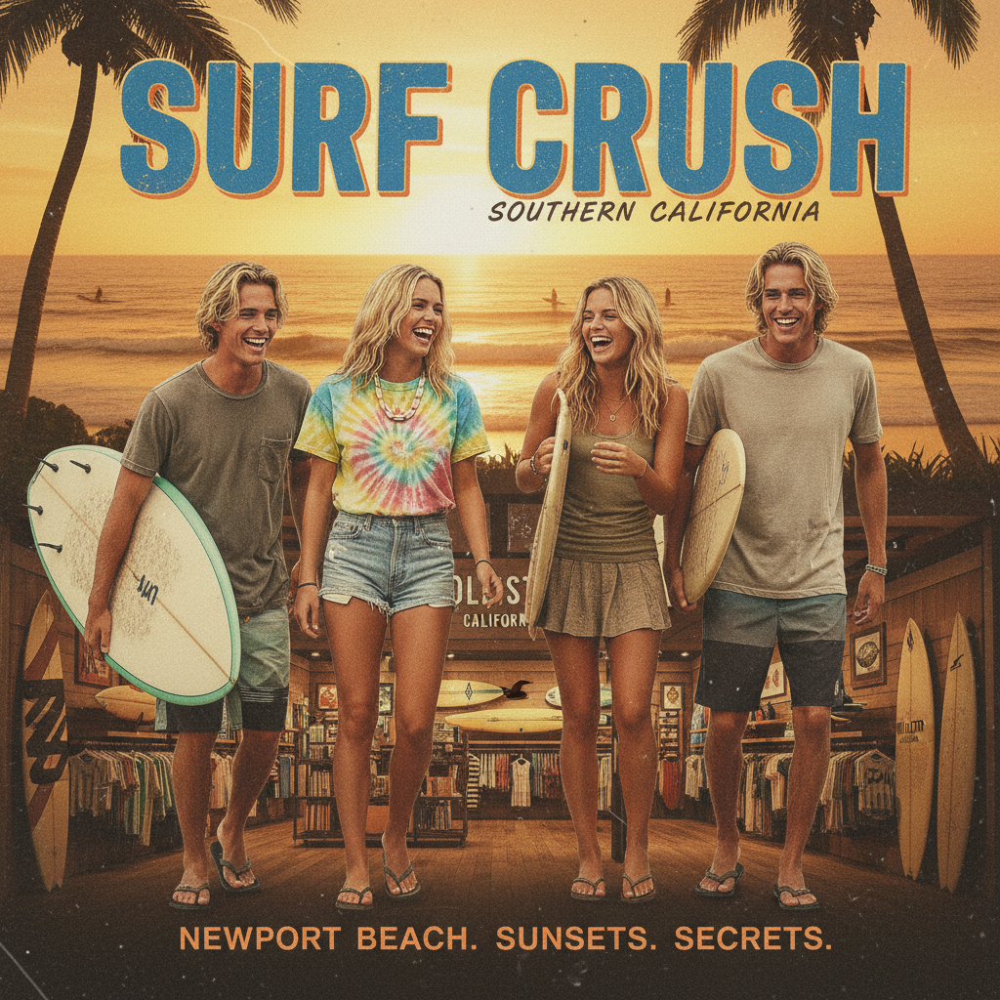

# Surf Crush | 冲浪甜心美学

> 加州阳光、海盐味的头发、Hollister 店里永远播放的冲浪视频。



## 概述

Surf Crush（又称 Coconut Girl 的前身）是一种流行于 **1999–2008 年**的青少年时尚与视觉美学，以**南加州海滩冲浪文化**为核心灵感。它由《The O.C.》《Laguna Beach》等电视剧推动，通过 Hollister、Abercrombie & Fitch、PacSun 等品牌商业化，成为 2000 年代美国青少年的"标准穿搭"。

## 历史背景

### Hollister：一个从未存在的加州

Hollister 品牌的故事本身就是 Surf Crush 美学的完美隐喻。虽然品牌声称灵感来自加州 Hollister 小镇，但实际上：
- 它由俄亥俄州的 Abercrombie & Fitch 公司于2000年创立
- 真正的 Hollister 小镇是一个内陆农业城镇，离海滩很远
- 品牌创造了一个**完全虚构的"加州冲浪生活"**，然后把它卖给了全世界的青少年

这种"贩卖一个不存在的地方"的商业逻辑，恰恰是 Surf Crush 美学的核心：它卖的不是冲浪，而是**对冲浪生活的想象**。

### 关键时间线

| 阶段 | 时间 | 标志事件 |
|------|------|----------|
| 萌芽 | 1999-2002 | 冲浪文化从小众运动走向主流时尚 |
| 商业化 | 2000 | Hollister 首店开业 |
| 媒体引爆 | 2003 | 《The O.C.》首播，南加州生活方式全球化 |
| 巅峰 | 2004-2006 | 《Laguna Beach》、Hollister 全球扩张 |
| 极致 | 2007 | A&F 为 Hollister 门店安装24小时海滩直播 |
| 衰退 | 2008-2010 | 金融危机+Indie Sleaze取代 |
| 回潮 | 2025-2026 | "Surfercore"回归 |

### 店铺体验：五感营销

Hollister 的店铺设计是 Surf Crush 美学的沉浸式体验：
- **视觉**：极暗的灯光（暗到看不清价签）、海滩主题装潢
- **听觉**：永远播放的冲浪视频和海浪声
- **嗅觉**：标志性的 SoCal 香水喷洒在店内
- **触觉**：柔软的棉质面料、做旧的牛仔
- **社交**：门口站着半裸的"模特"（实为店员）

这种"走进一家店就像走进加州海滩"的体验设计，在2000年代是革命性的。

- **1999–2002**：冲浪文化从小众运动走向主流时尚
- **2003**：《The O.C.》首播，南加州生活方式成为全球青少年的向往
- **2004**：《Laguna Beach》真人秀，将 Surf Crush 推向巅峰
- **2000**：Hollister 首店开业，以"加州慵懒冲浪风"为品牌概念
- **2007**：A&F 为全美 Hollister 门店安装 24 小时直播 Huntington Beach 的视频墙
- **2008 后**：被 Indie Sleaze 和 Scene 文化逐渐取代

## 视觉特征

| 维度 | 典型元素 |
|------|----------|
| 色彩 | 海蓝、珊瑚粉、日落橙、沙滩米白、棕榈绿 |
| 服装 | 吊带背心、比基尼、牛仔短裤、夏威夷印花、纱笼 |
| 配饰 | Puka 贝壳项链、脚链、趾戒、闪光纹身贴、木珠手链 |
| 发型 | 海盐喷雾的自然卷、阳光漂白的挑染、编发 |
| 妆容 | 古铜色肌肤、自然裸妆、唇彩 |
| 图案 | 芙蓉花（Hibiscus）、棕榈树、冲浪板、海浪、日落 |
| 空间 | 沙滩小屋、木质装潢、昏暗灯光（Hollister 店面风格） |

## 代表品牌

| 品牌 | 定位 |
|------|------|
| **Hollister** | A&F 副线，"海鸥"标志，加州冲浪风的商业化巅峰 |
| **Abercrombie & Fitch** | 更高端的 Preppy + Surf 混合 |
| **PacSun** | 滑板 + 冲浪的街头版本 |
| **Roxy / Quiksilver** | 正统冲浪运动品牌 |
| **Billabong** | 澳洲冲浪品牌 |
| **American Eagle** | 平价版的海滩休闲 |

## 影视与媒体

- 《The O.C.》(2003–2007) — Surf Crush 的视觉教科书
- 《Laguna Beach》(2004–2006) — 真人秀版的加州梦
- 《Blue Crush》(2002) — 冲浪女孩电影
- 《Summerland》(2004–2005)
- 各品牌的广告大片和店内视频

## 与其他风格的关系

```
Y2K Futurism (1997-2004)
    ↕ 同时代的另一面
Surf Crush (1999-2008) ← 阳光、自然、运动
    ↓ 经济衰退 + 反主流
Indie Sleaze (2006-2014)
    ↓ 2020s 怀旧复兴
Coconut Girl / "Surfercore" (2021+)
```

- **vs McBling**：同时代但审美对立——McBling 是城市夜店的闪光，Surf Crush 是海滩白天的阳光
- **vs Preppy**：有交叉（A&F 同时服务两个市场），但 Surf Crush 更休闲、更运动
- **vs Frutiger Aero**：共享"自然+乐观"的情绪，但 Surf Crush 是实体时尚，Frutiger Aero 是数字界面

## 当代复兴

2025–2026 年，Surf Crush 以 "Surfercore" 的名义强势回归：
- 贝壳配饰、人字拖、冲浪板短裤重回时尚杂志
- Hollister 推出全新 "Hollister House" 概念店
- Harper's Bazaar 宣布 2026 为 "Blue Crush Summer"

## 图库

| | |
|:---:|:---:|
|  |  |
| *Surf Crush 概念* | *南加州海滩日落* |

**推荐图片来源（需手动下载）：**
- https://aesthetics.fandom.com/wiki/Surf_Crush
- Pinterest 搜索 "surf crush aesthetic 2000s hollister"
- Hollister 早期广告存档
- 《The O.C.》剧照

## 参考链接

- [Aesthetics Wiki: Surf Crush](https://aesthetics.fandom.com/wiki/Surf_Crush)
- [Who What Wear: Y2K Surfercore Trends 2026](https://www.whowhatwear.com/fashion/trends/00s-surfer-fashion-trend-2026)
- [Harper's Bazaar: Blue Crush Summer](https://www.harpersbazaar.com/fashion/a73220898/blue-crush-summer-surf-fashion-trend-2026/)
- [NSS Magazine: 2000s Surfwear Style](https://www.nssmag.com/en/fashion/30081/2000s-surfwear-italy-maui-stussy-scorpion-bay)

---

[← Scene](scene.md) | [→ Metalheart](metalheart.md) | [↑ 返回目录](README.md)
