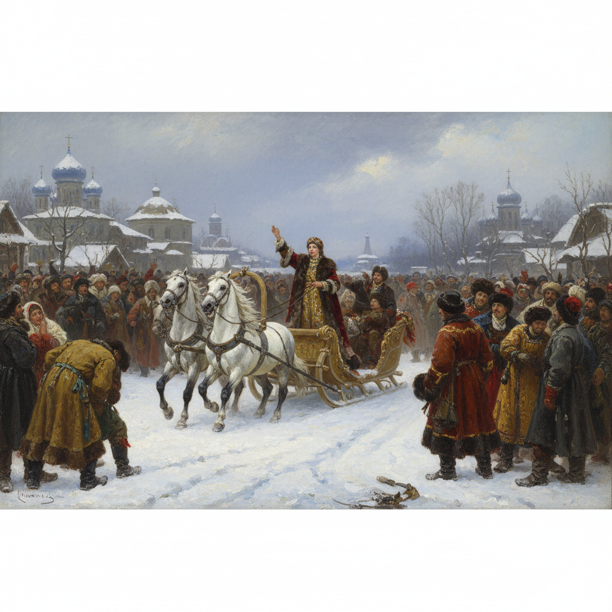

# Surikov Art 苏里科夫艺术

> "I do not conceive of historical figures without the people." — Vasily Surikov

## 概述

苏里科夫艺术（Surikov Art）是19世纪俄罗斯历史画大师瓦西里·伊万诺维奇·苏里科夫（Vasily Ivanovich Surikov, 1848-1916）创立的史诗历史画风格。苏里科夫被誉为俄罗斯最伟大的历史画家——他以宏大的构图、生动的群像和深刻的历史洞察力，创作了一系列再现俄罗斯重大历史事件的不朽巨作。他的历史画不是对帝王将相的歌颂，而是对人民在历史洪流中命运的深切关注。

苏里科夫最著名的作品《女贵族莫洛佐娃》（1887）描绘了17世纪宗教分裂时期一位贵族女性被押送流放的场景——她在雪橇上高举两指（旧礼仪派的标志），面对围观的人群展现出不屈的信仰力量。这幅画以其宏大的群像构图和戏剧性的张力成为俄罗斯历史画的巅峰。他的另一杰作《近卫军临刑的早晨》（1881）描绘了彼得大帝处决叛乱近卫军的历史瞬间。

苏里科夫艺术的核心要素包括：1）历史史诗——重大历史事件的再现；2）群像构图——宏大的多人物场景；3）人民视角——从人民角度看历史；4）色彩丰富——丰富而和谐的色彩；5）戏剧张力——充满戏剧性的构图；6）民族精神——俄罗斯民族性格的表达；7）细节真实——历史细节的精确还原。

## 核心特征

| 特征 | 描述 |
|------|------|
| 历史史诗 | 重大历史事件再现 |
| 群像构图 | 宏大多人物场景 |
| 人民视角 | 从人民角度看历史 |
| 色彩丰富 | 丰富和谐的色彩 |
| 戏剧张力 | 充满戏剧性构图 |
| 民族精神 | 俄罗斯民族性格表达 |

## 视觉特征

- **宏大场面**：数十甚至上百人的群像
- **雪景背景**：俄罗斯冬天的雪景
- **民族服饰**：精确描绘的历史服饰
- **面部表情**：每个人物独特的表情
- **对角构图**：充满动感的对角线构图
- **冷暖对比**：冷色雪景与暖色人物的对比

## 代表作品

| 作品 | 年代 | 意义 |
|------|------|------|
| *女贵族莫洛佐娃* (Boyarynya Morozova) | 1887 | 历史画巅峰 |
| *近卫军临刑的早晨* (Morning of the Streltsy Execution) | 1881 | 成名作 |
| *缅希科夫在别廖佐沃* (Menshikov in Berezovo) | 1883 | 权力的陨落 |
| *叶尔马克征服西伯利亚* (Conquest of Siberia by Yermak) | 1895 | 民族扩张 |
| *苏沃洛夫翻越阿尔卑斯山* (Suvorov Crossing the Alps) | 1899 | 军事史诗 |
| *斯捷潘·拉辛* (Stepan Razin) | 1906 | 民间英雄 |

## 历史时间线

| 时期 | 事件 |
|------|------|
| 1848年 | 出生于克拉斯诺亚尔斯克 |
| 1869-1875年 | 就读圣彼得堡美术学院 |
| 1881年 | 完成《近卫军临刑的早晨》 |
| 1887年 | 完成《女贵族莫洛佐娃》 |
| 1895年 | 完成《叶尔马克征服西伯利亚》 |
| 1916年 | 在莫斯科去世 |

## 中国语境

苏里科夫在中国有着深远的影响——他的历史画创作方法成为中国革命历史画的重要参考。中国画家如董希文（《开国大典》）、陈逸飞等在创作重大历史题材时，都借鉴了苏里科夫的群像构图和叙事方法。苏里科夫"从人民角度看历史"的理念与中国"人民创造历史"的史观高度契合——他的作品证明了历史画的主角可以是普通人民而非帝王将相。《女贵族莫洛佐娃》在中国美术教育中被作为"历史画构图"的经典案例——它展示了如何在一个画面中组织数十个人物并创造戏剧性的视觉效果。苏里科夫对历史细节的精确还原——包括服饰、建筑、器物——也为中国历史画家树立了严谨考证的榜样。

## 概念图

## 与其他风格的关系

- **Repin** → 列宾（现实主义同道）
- **Peredvizhniki** → 巡回展览画派
- **History Painting** → 历史画传统
- **Kramskoi** → 克拉姆斯柯依（精神导师）
- **Critical Realism** → 批判现实主义
- **Socialist Realism** → 社会主义现实主义（后继）

---

*浮光艺志 | Chronicle of Artistry*
