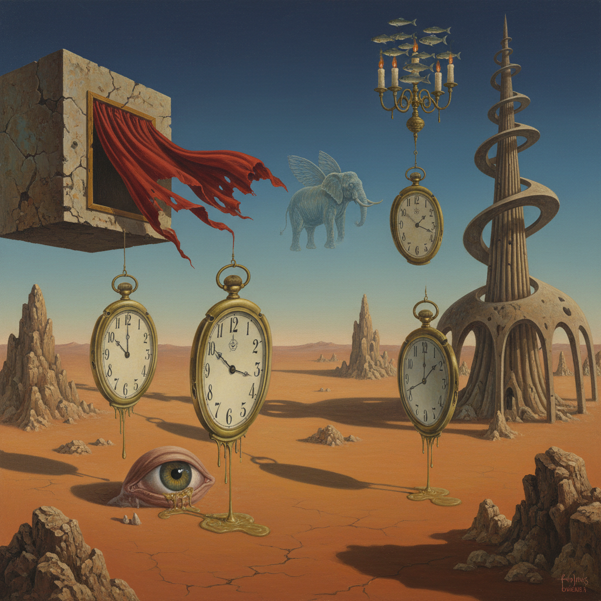

# Surrealism Painting 超现实主义绘画

> **时期：** 1924年–1960年代  
> **关键词：** 梦境逻辑、潜意识、自动主义、达利、弗洛伊德

## 概述

Surrealism Painting（超现实主义绘画）是1924年由安德烈·布勒东在巴黎发起的艺术运动——受弗洛伊德精神分析的启发，画家们试图绕过理性审查，直接表达潜意识的图像。达利的融化时钟、马格利特的悖论图像、恩斯特的拓印幻象——超现实主义不是画梦，而是用梦的逻辑重新组装现实，让不可能变得理所当然。

## 风格特征

- **梦境逻辑**：不可能的并置和变形
- **精确技法**：用写实手法画出荒诞场景
- **自动主义**：无意识的自由绘画
- **象征系统**：反复出现的个人符号
- **悖论图像**：挑战认知的视觉谜题

## 代表人物与作品

- 萨尔瓦多·达利《记忆的永恒》
- 勒内·马格利特《形象的叛逆》
- 马克斯·恩斯特 拓印与拼贴
- 胡安·米罗 生物形态抽象

## 概念图

