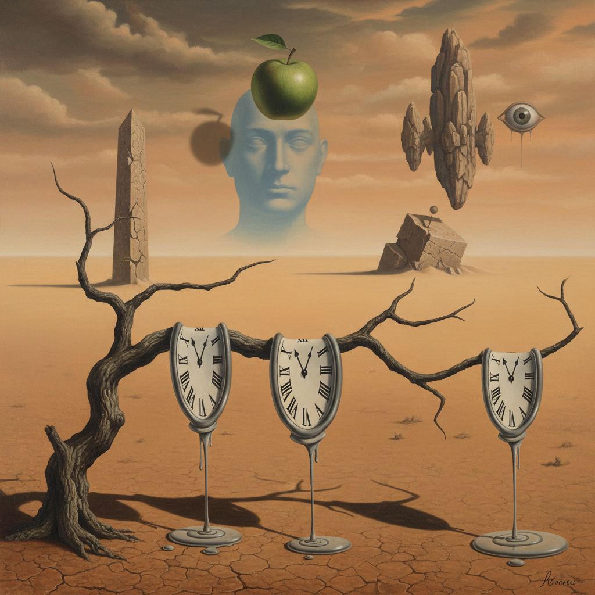

# Surrealism 超现实主义



> **"融化的时钟、漂浮的苹果、梦境逻辑——当潜意识成为画布。"**

## 概述

| 维度 | 描述 |
|------|------|
| 时期 | 1924–1960s 原版 / 影响至今 |
| 别名 | Surrealism, Surrealist Art, Dream Art |
| 核心色彩 | 无固定色板——取决于梦境内容 |
| 关键元素 | 不可能的组合、梦境逻辑、变形、并置 |
| 代表人物 | Salvador Dalí、René Magritte、Frida Kahlo |
| 关联风格 | Psychedelic, Liminal Space, Dark Fantasy, Dreamcore |

---

## 历史脉络

### 从弗洛伊德到 AI 生成

| 年份 | 事件 |
|------|------|
| 1924 | André Breton 发表《超现实主义宣言》 |
| 1929 | Dalí 加入超现实主义运动 |
| 1931 | 《记忆的永恒》（融化的时钟） |
| 1936 | Magritte《人子》（苹果遮脸） |
| 1960s | 超现实主义影响广告和电影 |
| 2022 | AI 图像生成 = "人人都是超现实主义者" |

### 核心哲学

Surrealism 的精神是**"现实不是唯一的真实——梦境也是"**：
- 潜意识比意识更真实
- 逻辑是牢笼——打破它
- 不可能的组合揭示隐藏的真相
- "我不理解它"= 它在工作
- 自动写作/绘画 = 让潜意识说话

---

## 视觉语法

### 色彩系统

```
规则：
  - 没有固定色板
  - 可以极度写实（Dalí）
  - 可以极度抽象（Miró）
  - 色彩服务于"不安感"
  - 熟悉的颜色+不熟悉的组合 = 诡异

常见倾向：
  天空蓝 — 开阔、梦境
  沙漠黄 — Dalí 的荒原
  肉色 — 身体、变形
  深蓝 — 夜晚、潜意识
  灰色 — Magritte 的天空

质感：
  超写实 — Dalí 的精确笔触
  平涂 — Magritte 的冷静
  流动 — 融化、变形
  拼贴 — Max Ernst
```

### 标志性元素

| 类别 | 元素 |
|------|------|
| 变形 | 融化的时钟、拉长的肢体、液化的物体 |
| 并置 | 不可能的组合（苹果+脸、大象+蜘蛛腿） |
| 空间 | 无限延伸的平原、漂浮的物体 |
| 身体 | 抽屉人、分裂的身体、眼睛 |
| 自然 | 变形的动物、超大的花 |
| 逻辑 | 梦境逻辑、因果倒置 |

---

## 与千禧怀旧的关系

### AI 时代的超现实主义
- Midjourney/DALL-E = "自动超现实主义机器"
- AI 生成图像天然具有超现实特质
- "不可能的组合"现在人人可以创造
- 超现实主义从精英艺术变成了大众工具

### 与 Liminal Space 的交叉
- 两者都创造"不安的熟悉感"
- Liminal Space = 超现实主义的空间版
- Dreamcore = 超现实主义的互联网版
- 共同点：打破现实的逻辑

---

## 中国语境

- "超现实"在中国当代艺术中的应用
- AI 生成艺术在中国的爆发
- 与"魔幻现实主义"文学的交叉
- 中国超现实摄影/插画社区

---

## 设计应用

| 场景 | 应用方式 |
|------|----------|
| 广告 | 不可能的组合+视觉冲击+记忆点 |
| 艺术 | 梦境逻辑+变形+并置+潜意识 |
| 品牌 | 超现实视觉+差异化+话题性 |
| 数字 | AI生成+不可能场景+视觉奇观 |

---

## 相关风格

← [Pop Art 波普艺术](pop-art.md) | [Psychedelic 迷幻艺术](psychedelic-revival.md) →

↑ [返回千禧怀旧目录](README.md) | [返回总目录](../README.md)
