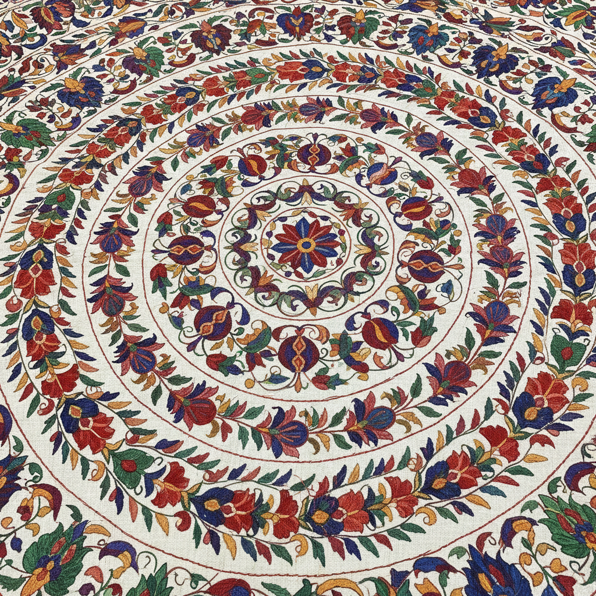

# Suzani 苏扎尼刺绣 | Сўзана

> **"丝绸之路上的花园——中亚新娘用链锁绣缝出天堂的模样。"**

## 概述

苏扎尼（Suzani / Сўзана）是中亚（乌兹别克斯坦、塔吉克斯坦、哈萨克斯坦）的传统刺绣纺织艺术，"suzani"源自波斯语"سوزن"（suzan，意为"针"）。这种大幅刺绣布通常由新娘的母亲和女性亲属在婚前数年开始制作，作为嫁妆的核心部分。苏扎尼以其华丽的花卉图案、太阳圆盘和石榴母题著称，用链锁绣（chain stitch）和缎面绣（satin stitch）在棉布或丝绸底布上绣制。不同城市（布哈拉、撒马尔罕、努拉塔、沙赫里萨布兹）各有独特风格。

## 主要地区风格

| 城市 | 特征 |
|------|------|
| 布哈拉 Bukhara | 大型太阳圆盘，红色为主 |
| 撒马尔罕 Samarkand | 大朵花卉，色彩丰富 |
| 努拉塔 Nurata | 精细小花，淡雅色调 |
| 沙赫里萨布兹 Shahrisabz | 密集填充，几何化花卉 |
| 塔什干 Tashkent | 月牙和星形图案 |

## 核心特征

- **链锁绣**：主要使用链锁绣技法
- **大幅尺寸**：通常覆盖整面墙或床
- **花卉主题**：程式化的花朵、藤蔓、叶片
- **嫁妆传统**：婚前数年开始制作
- **多人合作**：多位女性分工绣制不同部分
- **丝线刺绣**：丝线在棉布底上

## 常见母题

| 母题 | 含义 |
|------|------|
| 太阳圆盘 | 生命、丰饶、宇宙 |
| 石榴 | 多子多福 |
| 月牙 | 伊斯兰传统 |
| 花卉 | 天堂花园 |
| 藤蔓 | 生命延续 |
| 鸟类 | 幸福、自由 |

## 视觉特征

- 大面积的华丽花卉图案
- 鲜艳的红、蓝、绿、黄色彩
- 白色或米色底布
- 链锁绣的独特质感
- 对称或放射状构图
- 密集的图案填充

## 与其他风格的关系

| 风格 | 关系 |
|------|------|
| 波斯细密画 | 共享伊斯兰花卉传统 |
| Ikat中亚丝绸 | 共享中亚纺织传统 |
| 印度Crewel刺绣 | 共享链锁绣技法 |
| 奥斯曼刺绣 | 共享伊斯兰装饰传统 |
| 当代室内设计 | Suzani是流行的装饰面料 |

## 概念图

---

*浮光艺志 | Chronicle of Artistry*
