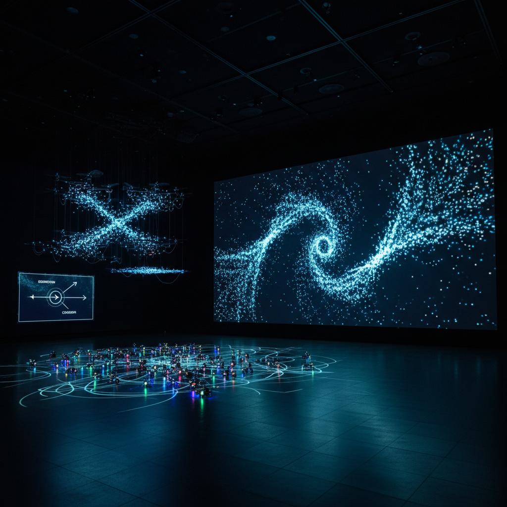

# Swarm Art 群体智能艺术

> "Swarm art reveals the intelligence of the collective — it shows that a thousand mindless agents can together produce behavior more sophisticated than any individual genius, that the murmuration of starlings is a masterpiece no single bird composed, that the termite mound is architecture no termite designed, and that the most profound creativity may not reside in the individual mind but in the space between minds, in the patterns that emerge when many simple beings dance together according to simple rules." — Eric Bonabeau

## 概述

群体智能艺术（Swarm Art）是利用群体智能（swarm intelligence）——大量简单个体通过局部交互产生集体智能行为——进行创作的艺术实践。群体智能是自然界中普遍存在的现象：蚂蚁群落的觅食路径优化、蜜蜂的集体决策、鱼群的协调运动、鸟群的壮观编队。

群体智能艺术的实践包括：1）模拟自然群体——用计算机模拟鸟群、鱼群、蚁群等自然群体的行为，将其转化为视觉艺术；2）群体机器人艺术——使用大量小型机器人进行集体创作；3）参与式群体——让大量人类参与者作为"群体"共同创作；4）群体优化——使用蚁群算法、粒子群优化等算法生成艺术；5）群体音乐——让多个音乐智能体协作生成音乐。

## 核心特征

| 特征 | 描述 |
|------|------|
| 集体 | 集体智能 |
| 局部 | 局部交互 |
| 涌现 | 全局涌现 |
| 去中心 | 去中心化 |
| 自组织 | 自组织 |
| 适应 | 适应性 |

## 视觉特征

- **群体**：大量个体的运动
- **轨迹**：运动轨迹的可视化
- **编队**：动态的编队变化
- **密度**：密度的变化
- **流动**：流体般的集体运动
- **分离**：分离与聚合

## 代表作品

| 作品 | 艺术家 | 年代 | 意义 |
|------|--------|------|------|
| *Boids* | Craig Reynolds | 1987 | 群体行为模拟 |
| *Swarm robots* | Various | 2010年代 | 群体机器人 |
| *Murmuration simulations* | Various | 2010年代 | 椋鸟群模拟 |
| *Ant colony art* | Various | 2000年代 | 蚁群艺术 |
| *Drone swarm art* | Various | 2020年代 | 无人机群表演 |

## 历史时间线

| 时期 | 事件 |
|------|------|
| 1987 | Craig Reynolds的Boids算法 |
| 1992 | 蚁群优化算法 |
| 1995 | 粒子群优化算法 |
| 2010年代 | 群体机器人艺术 |
| 2020年代 | 大规模无人机群表演 |

## 中国语境

群体智能艺术在中国有独特的发展。中国是无人机群表演的世界领先者——从国庆庆典到各种大型活动，中国的无人机群表演以其规模和精确度闻名世界（如深圳的千架无人机编队表演）。中国传统文化中也有丰富的群体美学——从集体舞蹈到大型团体操，从龙舟竞渡的协调到太极拳的集体练习。中国当代的一些艺术家在探索群体智能艺术：利用无人机群创作空中艺术、用群体算法生成视觉作品、以及探索中国传统的集体美学与当代群体智能的结合。

## AI生成概念图

## 与其他风格的关系

- **Emergent Art** → 涌现艺术
- **Robotic Art** → 机器人艺术
- **Generative Art** → 生成艺术
- **Kinetic Art** → 动态艺术
- **Drone Art** → 无人机艺术
- **Participatory Art** → 参与式艺术

---

*浮光艺志 | Chronicle of Artistry*
