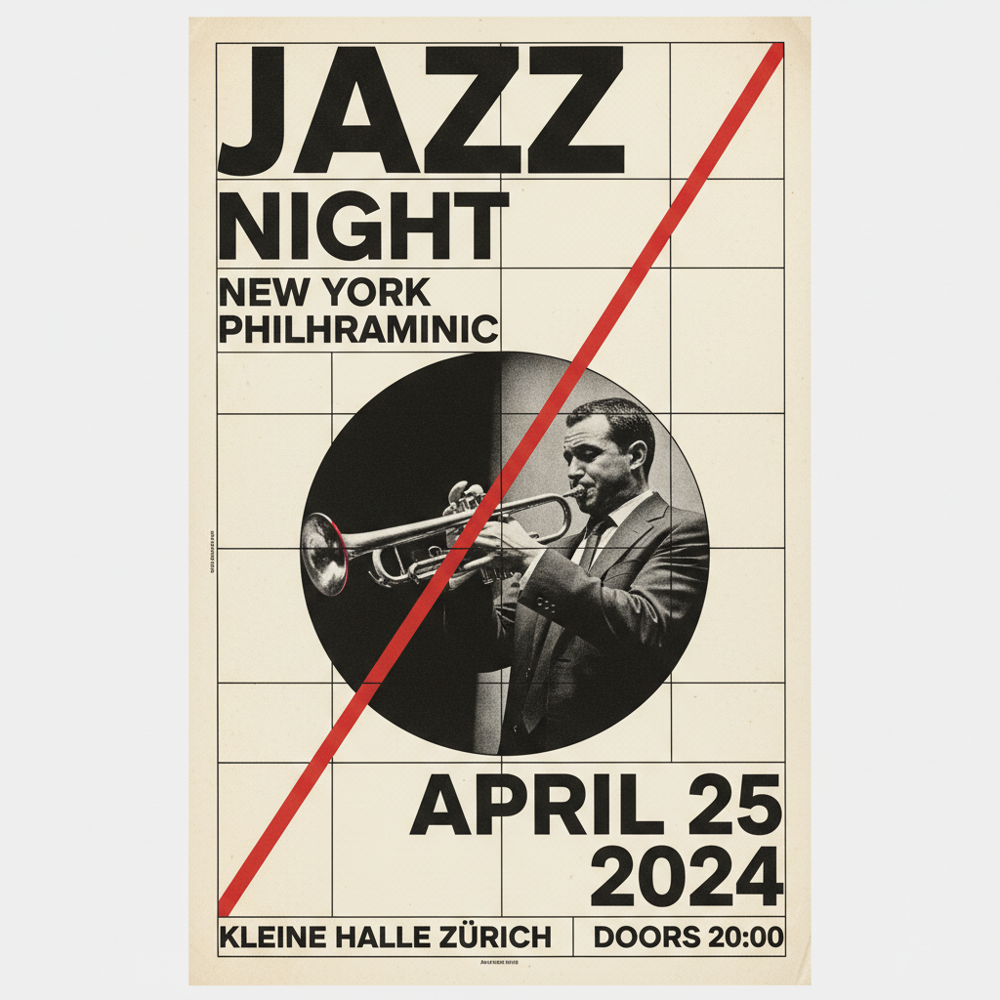

# Swiss Design 瑞士国际主义设计



> **"网格、Helvetica、留白——当设计追求绝对的客观与清晰。"**

## 概述

| 维度 | 描述 |
|------|------|
| 时期 | 1950s–1970s 原版 / 影响至今 |
| 别名 | Swiss Design, International Typographic Style, Swiss Style |
| 核心色彩 | 黑色、白色、红色（极少用色） |
| 关键元素 | 网格系统、Helvetica、留白、摄影 |
| 代表人物 | Josef Müller-Brockmann、Max Bill、Massimo Vignelli |
| 关联风格 | Bauhaus, Minimalism, Flat Design, Brutalism |

---

## 历史脉络

### 从苏黎世到全球标准

| 年份 | 事件 |
|------|------|
| 1950s | 苏黎世和巴塞尔设计学校确立风格 |
| 1957 | Helvetica 字体诞生 |
| 1958 | Josef Müller-Brockmann 的网格系统理论 |
| 1960s | 成为企业设计的国际标准 |
| 1972 | 慕尼黑奥运会视觉系统（Otl Aicher） |
| 2000s | 网页设计中的网格系统复兴 |
| 2010s | 与 Flat Design 融合 |

### 核心哲学

Swiss Design 的精神是**"设计师是信息的组织者——不是艺术家"**：
- 客观 > 主观
- 清晰 > 装饰
- 系统 > 灵感
- "好设计是尽可能少的设计"
- 网格 = 秩序 = 民主（信息对所有人平等）

---

## 视觉语法

### 色彩系统

```
主色：
  黑色 (#000000) — 文字、信息
  白色 (#FFFFFF) — 留白、呼吸
  红色 (#FF0000) — 强调（极少使用）

规则：
  - 尽可能少用颜色
  - 颜色是功能性的，不是装饰性的
  - 黑白为主
  - 如果用色，用纯色
  - 摄影提供视觉丰富度

质感：
  无质感 — 平面、干净
  摄影 — 客观、纪实
  纸张 — 印刷品的物理存在
```

### 标志性元素

| 类别 | 元素 |
|------|------|
| 字体 | Helvetica、Univers、Akzidenz-Grotesk |
| 布局 | 严格网格、数学比例、不对称平衡 |
| 图像 | 客观摄影、无装饰 |
| 留白 | 大量留白、呼吸空间 |
| 对齐 | 左对齐（Flush Left）、齐整 |
| 层次 | 通过大小、粗细、位置建立层次 |

---

## 与千禧怀旧的关系

### 数字时代的网格
- CSS Grid / Flexbox = Swiss Design 的数字实现
- Material Design / iOS = Swiss Design 的后代
- "网格系统"从印刷到屏幕
- Helvetica 仍然是最常用的字体之一

### 与 Flat Design 的关系
- Flat Design (2012) = Swiss Design + 数字
- 两者共享：极简、网格、无装饰
- Swiss Design 是 Flat Design 的"祖父"
- 但 Swiss Design 更严格、更系统化

---

## 中国语境

- "国际主义风格"在中国设计教育中的地位
- 中国平面设计中的网格系统应用
- 与"极简设计"/"高级感"的关联
- 中国品牌升级中的 Swiss Design 影响

---

## 设计应用

| 场景 | 应用方式 |
|------|----------|
| 品牌 | Helvetica+网格+留白+极少色彩 |
| 信息 | 网格系统+层次+清晰+客观 |
| 导视 | 图标+网格+无衬线+国际化 |
| 数字 | 网格布局+留白+系统化+清晰 |

---

## 相关风格

← [Bauhaus 包豪斯](bauhaus.md) | [Flat Design 扁平设计](flat-design.md) →

↑ [返回千禧怀旧目录](README.md) | [返回总目录](../README.md)
