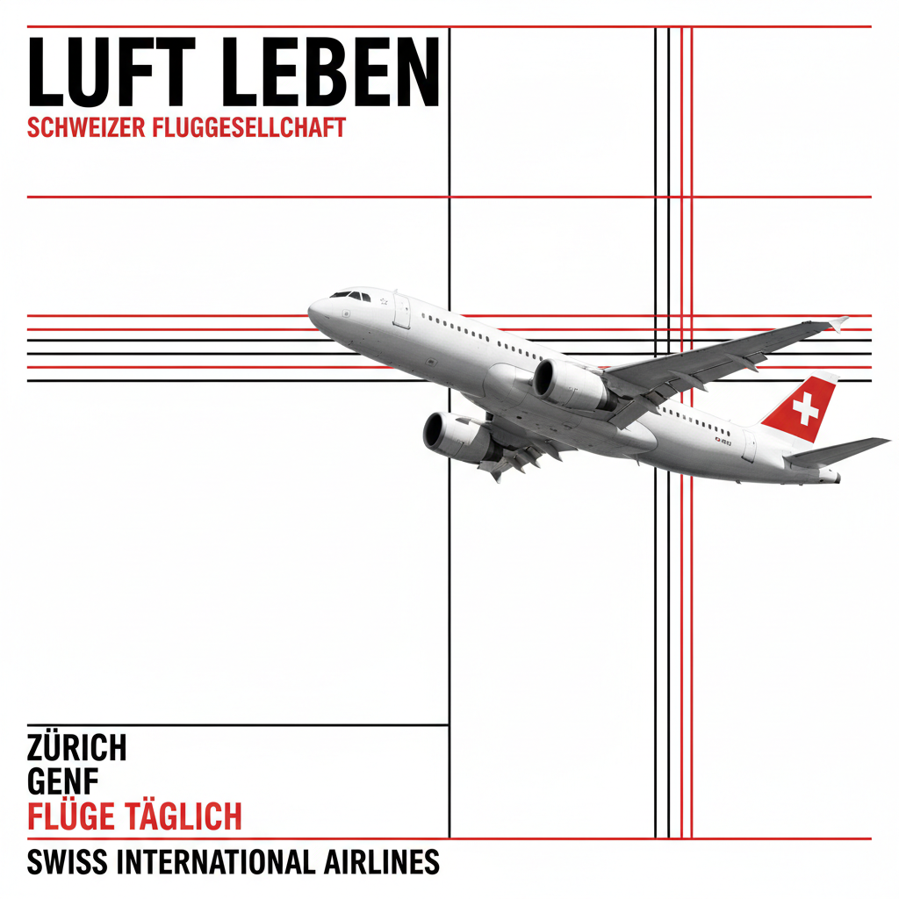

# Swiss Style 瑞士国际主义风格

> **时期：** 1950年代–至今  
> **关键词：** 网格系统、无衬线字体、客观摄影、数学秩序、信息清晰

## 概述

Swiss Style（瑞士国际主义风格）是20世纪最具影响力的平面设计运动之一，起源于1950年代的瑞士巴塞尔和苏黎世。它以数学网格系统、无衬线字体（尤其是Helvetica）、客观摄影和不对称排版为核心，追求"设计的客观性"——让信息以最清晰、最理性的方式传达，排除设计师的个人情感干预。

## 风格特征

- **网格系统**：严格的数学网格组织所有元素
- **无衬线字体**：Helvetica、Univers等几何字体
- **客观摄影**：代替插画的纪实性照片
- **不对称排版**：左对齐的动态平衡
- **留白运用**：大面积空白作为设计元素

## 代表人物与作品

- 约瑟夫·穆勒-布罗克曼《网格系统》
- 马克斯·比尔（具体艺术+设计）
- 阿明·霍夫曼（巴塞尔设计学派）
- 《Neue Grafik》杂志

## 概念图

