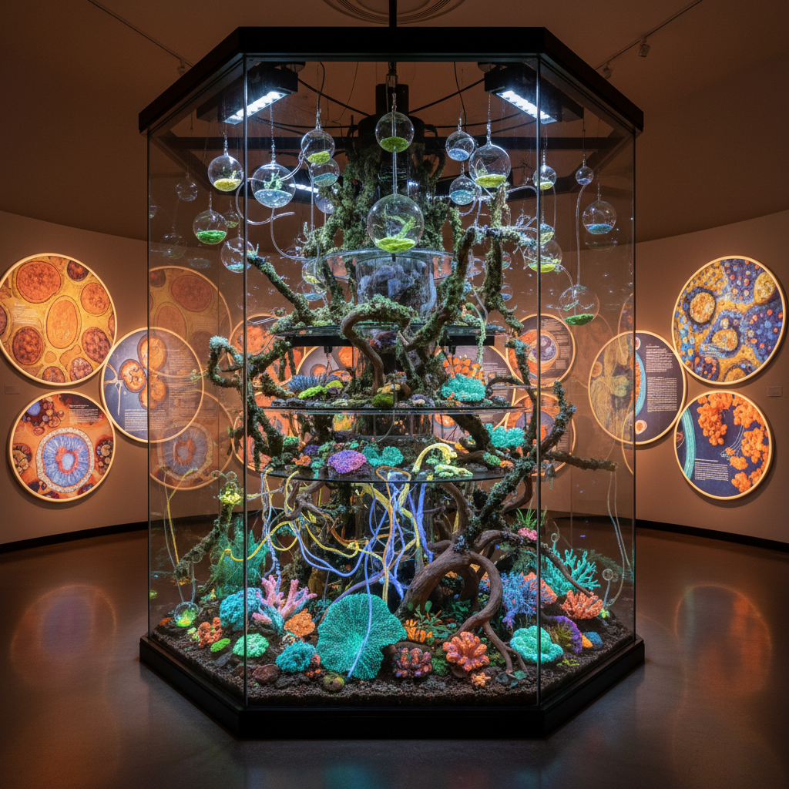

# Symbiotic Art 共生艺术

> "Symbiotic art models itself on nature's most profound strategy — the recognition that no organism survives alone, that life is not a competition of isolated individuals but a web of mutual dependencies, that the lichen is not one organism but two becoming more together than either could be apart, that the coral reef is a city of cooperation, and that art itself is always already symbiotic, emerging from the collaboration between artist and material, viewer and work, culture and nature." — Lynn Margulis

## 概述

共生艺术（Symbiotic Art）是以共生（symbiosis）——不同物种之间的密切长期关系——为核心概念和方法论的艺术实践。共生是生物学中最重要的概念之一：从线粒体的内共生起源，到菌根网络连接森林中的树木，到人体内数万亿的共生微生物，共生是生命的基本组织原则。

共生艺术的实践包括：1）展示共生关系——将自然界中的共生关系（互利共生、偏利共生、寄生）可视化；2）创造共生系统——设计不同生物或系统之间相互依赖的艺术装置；3）共生作为方法——将艺术创作本身视为一种共生过程，艺术家与材料、环境、观众之间的相互塑造；4）共生的政治性——用共生来思考社会合作、互助和超越竞争的可能性。

## 核心特征

| 特征 | 描述 |
|------|------|
| 互依 | 相互依赖 |
| 合作 | 跨物种合作 |
| 网络 | 关系网络 |
| 共存 | 共同存在 |
| 转化 | 相互转化 |
| 整体 | 整体大于部分 |

## 视觉特征

- **交织**：不同生物的交织
- **界面**：共生界面的展示
- **网络**：连接的网络
- **融合**：不同物种的融合
- **生长**：共同生长的过程
- **色彩**：共生产生的色彩

## 代表作品

| 作品 | 艺术家 | 年代 | 意义 |
|------|--------|------|------|
| *Lichen installations* | Various | 2010年代 | 地衣装置 |
| *Mycorrhizal networks* | Various | 2010年代 | 菌根网络 |
| *Coral symbiosis* | Various | 2020年代 | 珊瑚共生 |
| *Human microbiome* | Various | 2020年代 | 人体微生物组 |
| *Symbiotic architecture* | Various | 当代 | 共生建筑 |

## 历史时间线

| 时期 | 事件 |
|------|------|
| 1967 | Lynn Margulis的内共生理论 |
| 2000年代 | 共生概念的文化扩展 |
| 2010年代 | 共生艺术的兴起 |
| 2016 | Anna Tsing的多物种民族志 |
| 当代 | 共生设计和建筑 |

## 中国语境

共生艺术在中国有深厚的哲学基础。中国传统思想中的"和"——和谐、和合——本质上就是一种共生哲学：不同的元素在差异中共存、在互动中共生。中国传统园林是共生美学的典范——山石、水体、植物、建筑、动物在一个有限的空间中形成复杂的共生系统。中国传统医学的"阴阳平衡"也是一种共生思维——不同的力量在动态平衡中维持生命。中国当代的一些艺术家在探索共生艺术：创造人与自然共生的装置、探索城市生态中的共生关系、以及将传统的"和合"美学与当代生态科学结合。

## AI生成概念图

## 与其他风格的关系

- **Bio Art** → 生物艺术
- **Eco-Art** → 生态艺术
- **Multispecies Art** → 多物种艺术
- **Mycological Art** → 真菌艺术
- **Relational Art** → 关系艺术
- **Systems Art** → 系统艺术

---

*浮光艺志 | Chronicle of Artistry*
