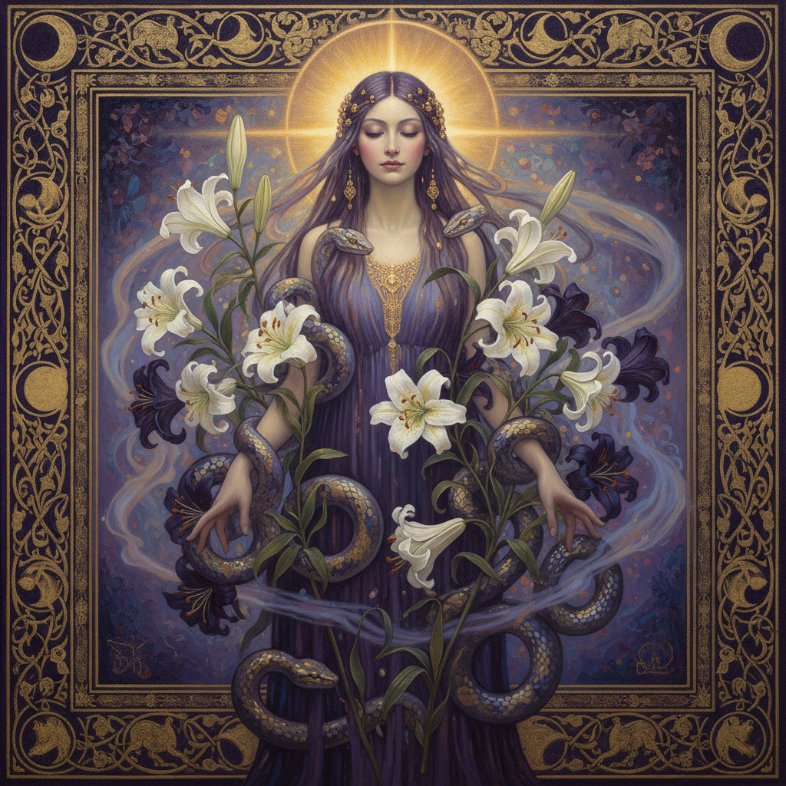

# Symbolism 象征主义



> **"不画所见，画所感——梦境、神话与灵魂的视觉语言。"**

## 概述

| 维度 | 描述 |
|------|------|
| 时期 | 1880s–1910s |
| 别名 | Symbolism, 象征主义, 象征派 |
| 核心色彩 | 深紫、暗蓝、金色、苍白肤色——梦幻与神秘的色调 |
| 关键元素 | 神话意象、梦境、死亡与爱、女性形象、自然隐喻 |
| 代表人物 | Gustave Moreau, Odilon Redon, Gustav Klimt, Fernand Khnopff |
| 关联风格 | Art Nouveau, Pre-Raphaelite, Surrealism, Romanticism |

---

## 历史脉络

| 年份 | 事件 |
|------|------|
| 1886 | Jean Moréas发表《象征主义宣言》 |
| 1880s | Gustave Moreau的神话绘画——象征主义视觉先驱 |
| 1890s | Odilon Redon的梦幻石版画 |
| 1897 | Gustav Klimt创立维也纳分离派——象征主义+装饰 |
| 1900s | 象征主义影响Art Nouveau和表现主义 |
| 1910s | 象征主义逐渐被前卫运动取代 |

### 核心哲学

象征主义的精神是**"艺术不是镜子——是窗户，通向灵魂的内在世界"**：
- 象征 ≠ 寓言（"不是一对一的符号——是多义的暗示"）
- 梦境 = 真实（"梦比现实更真——因为梦是灵魂的语言"）
- 美 = 神秘（"最美的东西无法完全理解——只能感受"）
- 女性 = 宇宙（"女性形象是生命、死亡、欲望的化身"）
- "我们厌倦了现实主义的平庸——我们要画看不见的东西"

---

## 视觉语法

### 色彩系统

```
主色：
  深紫 (#2E0854) — 神秘、灵性、死亡
  暗蓝 (#0D1B2A) — 夜晚、梦境、深渊
  金色 (#CFB53B) — 神圣、永恒、装饰
  苍白 (#F5E6D3) — 肉体、脆弱、美

辅色：
  血红 (#8B0000) — 激情、牺牲
  翠绿 (#004D40) — 自然、毒药
  银灰 (#C0C0C0) — 月光、幽灵

规则：
  - 色彩服务于情绪而非写实
  - 深色背景+发光主体
  - 金色用于神圣和装饰边框
  - 整体偏暗、偏冷、偏梦幻
```

### 标志性元素

| 类别 | 元素 |
|------|------|
| 人物 | 蛇蝎美人、天使、斯芬克斯、莎乐美、俄耳甫斯 |
| 自然 | 百合、蛇、孔雀、月亮、水面倒影 |
| 主题 | 死亡与爱、梦与现实、灵魂与肉体 |
| 构图 | 中心对称、装饰性边框、平面化空间 |
| 技法 | 柔焦、光晕、金箔、细密装饰 |
| 氛围 | 静谧、神秘、忧郁、超凡 |

---

## 与其他风格的关系

- **前拉斐尔派** → 象征主义（共享中世纪+神话主题）
- **象征主义** → Art Nouveau（装饰性+有机线条）
- **象征主义** → 超现实主义（梦境+潜意识）
- **象征主义** → Gustav Klimt → 维也纳分离派

---

## 设计应用

| 场景 | 应用方式 |
|------|----------|
| 插画 | 书籍封面+塔罗牌+奇幻插画 |
| 品牌 | 香水+珠宝+高端美妆 |
| 游戏 | 世界观+角色设计+UI装饰 |
| 影视 | 美术概念+视觉隐喻 |

---

## 相关风格

← [Romanticism 浪漫主义](romanticism.md) | [Art Nouveau 新艺术](art-nouveau.md) →

↑ [返回千禧怀旧目录](README.md) | [返回总目录](../README.md)
