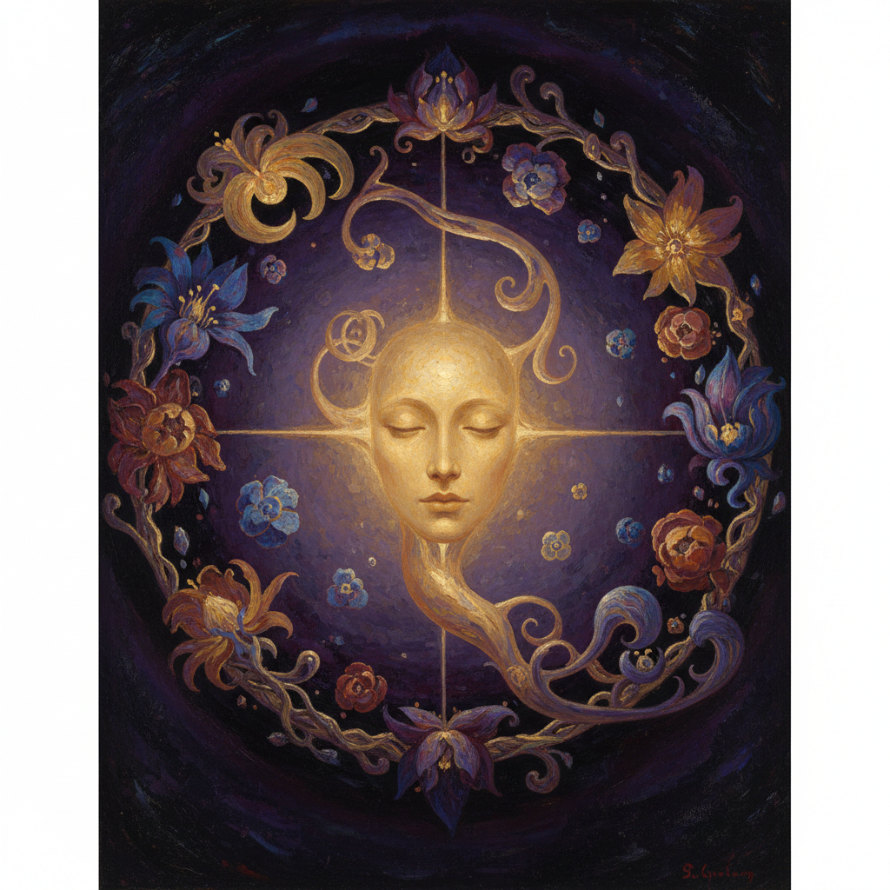

# Symbolist Painting 象征主义绘画

> **时期：** 1880年代–1910年代  
> **关键词：** 梦境与神秘、内在世界、反自然主义、文学性、世纪末

## 概述

Symbolist Painting（象征主义绘画）是19世纪末对自然主义和印象派"只画眼睛所见"的反叛——画家们转向描绘眼睛看不见的内在世界：梦境、恐惧、欲望和神秘。古斯塔夫·莫罗的神话幻象、奥迪隆·雷东的浮游眼球——象征主义者相信可见世界只是表象，真正的现实隐藏在符号和暗示之中。

## 风格特征

- **神秘主题**：死亡、梦境、命运、欲望
- **暗示而非描述**：用符号代替叙事
- **文学性**：与诗歌和戏剧深度关联
- **非自然色彩**：情感驱动的色彩选择
- **模糊空间**：梦境般的不确定环境

## 代表人物与作品

- 古斯塔夫·莫罗 神话幻象
- 奥迪隆·雷东 浮游生物
- 费尔南·赫诺普夫 神秘面具
- 阿诺德·勃克林《死之岛》

## 概念图

