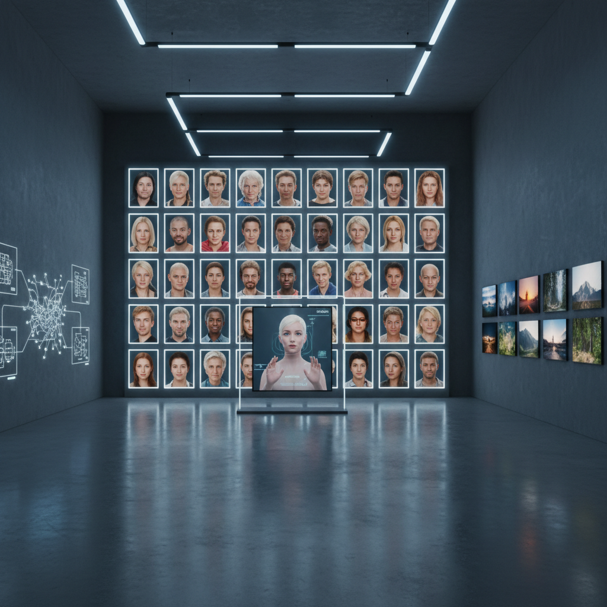

# Synthetic Media Art 合成媒体艺术

> "Synthetic media art embraces the uncanny — it operates in the space where the real and the fabricated become indistinguishable, where voices speak words never uttered, where faces express emotions never felt, where entire worlds exist that no camera ever captured, forcing us to confront the fundamental question of our age: if we can no longer trust our eyes and ears, what new forms of truth and beauty become possible in a world unmoored from the indexical?" — Unknown

## 概述

合成媒体艺术（Synthetic Media Art）是利用AI和机器学习技术生成逼真的合成内容——包括图像、视频、音频和文本——的艺术实践。合成媒体（synthetic media）是指由算法生成或显著修改的媒体内容，包括深度伪造（deepfake）视频、AI生成的语音、神经网络渲染的图像等。

合成媒体艺术的实践包括：1）AI生成的视觉内容——使用GAN、扩散模型等生成逼真的图像和视频；2）语音合成艺术——使用AI生成或克隆语音进行创作；3）虚拟人物——创造完全由AI生成的虚拟角色和表演者；4）合成现实——创造完全由算法生成的逼真场景和世界；5）批判性合成媒体——利用合成媒体技术来反思真实性、身份和媒体信任的问题。

## 核心特征

| 特征 | 描述 |
|------|------|
| 逼真 | 高度逼真 |
| 生成 | AI生成 |
| 不可辨 | 真假难辨 |
| 身份 | 身份的流动 |
| 批判 | 媒体批判 |
| 虚拟 | 虚拟存在 |

## 视觉特征

- **逼真**：照片级逼真度
- **完美**：过度完美的表面
- **不安**：恐怖谷效应
- **变形**：面部和身体的变形
- **虚拟**：虚拟人物
- **混合**：真实与合成的混合

## 代表作品

| 作品 | 艺术家 | 年代 | 意义 |
|------|--------|------|------|
| *Virtual influencers* | Various | 2016至今 | 虚拟网红 |
| *Deepfake art* | Various | 2018至今 | 深度伪造艺术 |
| *AI voice art* | Holly Herndon | 2019 | AI语音艺术 |
| *Synthetic actors* | Various | 2020年代 | 合成演员 |
| *Neural rendering* | Various | 2020年代 | 神经渲染 |

## 历史时间线

| 时期 | 事件 |
|------|------|
| 2014 | GAN的发明 |
| 2017 | Deepfake技术的出现 |
| 2019 | 合成媒体的艺术化 |
| 2022 | 扩散模型的突破 |
| 当代 | 合成媒体的日常化 |

## 中国语境

合成媒体艺术在中国有广泛的商业和文化应用。中国是虚拟偶像和数字人产业最发达的市场之一——从洛天依到各种品牌虚拟代言人，合成媒体已经深入中国的娱乐和商业文化。中国的AI换脸应用（如ZAO）曾引发广泛的社会讨论。中国的一些艺术家在探索合成媒体的批判性可能：质疑数字身份的真实性、探索虚拟存在的伦理问题、以及利用合成媒体技术创造新的叙事形式。中国的短视频文化（抖音等）也为合成媒体艺术提供了独特的传播平台。

## AI生成概念图

## 与其他风格的关系

- **AI Art** → 人工智能艺术
- **Digital Art** → 数字艺术
- **Post-Photography** → 后摄影
- **Virtual Art** → 虚拟艺术
- **Video Art** → 视频艺术
- **Media Art** → 媒体艺术

---

*浮光艺志 | Chronicle of Artistry*
