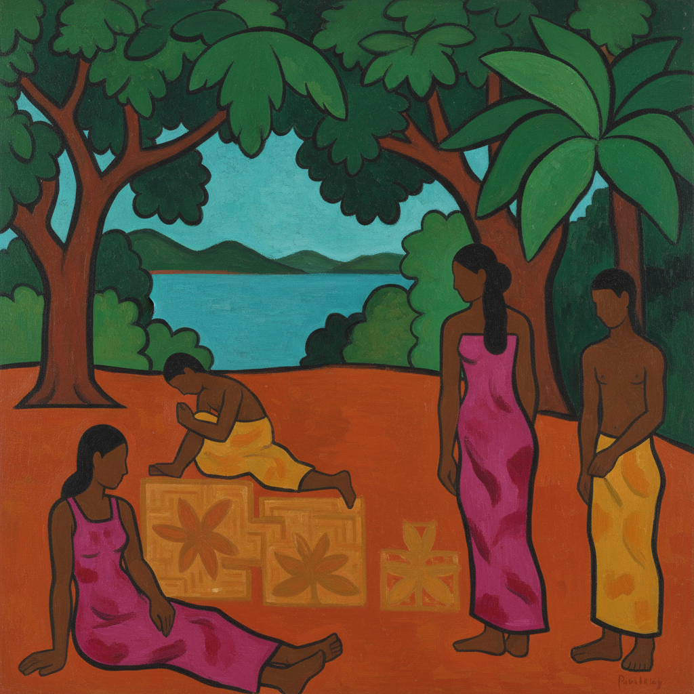

# Synthetism 综合主义

> "I shut my eyes in order to see." — Paul Gauguin

## 概述

综合主义（Synthetism / Synthétisme）是1880年代末至1890年代由保罗·高更主导发展的后印象派风格，强调将视觉观察、情感记忆和装饰形式"综合"为一体。画家不再追求对自然的忠实再现，而是从记忆和想象中提取本质，用简化的形态、主观的色彩和象征性的构图来表达内在体验。

综合主义是从印象派的客观观察走向表现主义主观表达的关键转折点。

## 核心特征

| 特征 | 描述 |
|------|------|
| 记忆创作 | 从记忆而非直接观察中创作 |
| 形态简化 | 将自然形态提炼为本质形状 |
| 主观色彩 | 色彩表达情感而非描述现实 |
| 象征内涵 | 画面承载象征性和精神性含义 |
| 装饰统一 | 线条、色彩、形态的装饰性统一 |
| 反印象派 | 拒绝印象派的瞬间性和光学分析 |

## 视觉特征

- **形态**：大胆简化的人物和风景轮廓
- **色彩**：非自然的、情感驱动的色彩选择
- **空间**：平面化，多视角并置
- **线条**：流畅的装饰性曲线
- **构图**：大面积色块的装饰性排列
- **氛围**：神秘、原始、精神性

## 代表人物

| 画家 | 代表作 | 特点 |
|------|--------|------|
| Paul Gauguin | *Where Do We Come From?* (1897) | 综合主义的核心人物 |
| Émile Bernard | *Madeleine in the Bois d'Amour* (1888) | 理论贡献者 |
| Paul Sérusier | *The Talisman* (1888) | 将综合主义带给那比派 |
| Charles Laval | 布列塔尼和马提尼克风景 | 高更的旅伴 |

## 历史背景

1. **1886年**：高更首次前往布列塔尼蓬塔旺
2. **1888年**：高更与贝尔纳合作，综合主义成熟
3. **1889年**："印象主义与综合主义"展览在巴黎举办
4. **1891-93年**：高更前往塔希提，将综合主义与原始主义结合
5. **1890年代**：影响那比派、象征主义和表现主义

## 与其他风格的关系

- **Cloisonnism** → 综合主义的视觉技法基础
- **Symbolism** → 共享对精神内涵的追求
- **Nabis** → 直接继承者
- **Expressionism** → 主观色彩和形态简化的先驱
- **Primitivism** → 高更对"原始"文化的追求

## 概念图

---

*浮光艺志 | Chronicle of Artistry*
