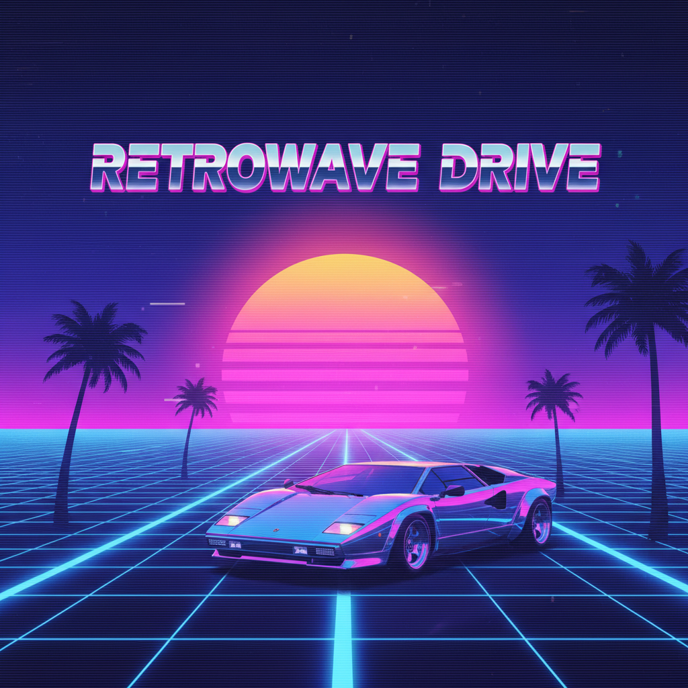

# Synthwave 合成波



> **"紫色夕阳、网格地平线、兰博基尼——用2020年代的技术重建1980年代从未存在的未来。"**

## 概述

| 维度 | 描述 |
|------|------|
| 时期 | 2005–至今 |
| 别名 | Synthwave, Retrowave, Outrun, Dreamwave |
| 核心色彩 | 霓虹粉、电紫、青蓝、黑色、日落橙 |
| 关键元素 | 网格地平线、霓虹日落、棕榈树剪影、跑车、VHS质感 |
| 代表人物 | Kavinsky、The Midnight、Perturbator、《Drive》 |
| 关联风格 | Vaporwave, Cyberpunk, Retrowave, Dark Neon |

---

## 历史脉络

### 从地下到主流

| 年份 | 事件 |
|------|------|
| 2005–08 | 法国电子音乐人开始复兴80s合成器音色 |
| 2010 | Kavinsky《Nightcall》进入《Drive》原声 |
| 2011 | 电影《Drive》将 Synthwave 美学推向主流 |
| 2014 | 《Hotline Miami》游戏巩固视觉语言 |
| 2016 | 《Stranger Things》片头 = Synthwave 的胜利 |
| 2020s | 从音乐风格扩展为完整的视觉文化 |

### 它怀念什么？

| 1980s 元素 | Synthwave 的重构 |
|-----------|-----------------|
| VHS 录像带 | 扫描线+色彩溢出 |
| 街机游戏 | 网格+霓虹+像素 |
| 迈阿密风云 | 棕榈树+跑车+日落 |
| 合成器音乐 | 模拟合成器音色 |
| 科幻电影 | 《银翼杀手》《电子世界争霸战》 |

### 核心哲学

Synthwave 的精神是**"怀念一个从未存在的过去"**：
- 1980s 的乐观主义——未来是光明的
- 但加上当代的忧郁——我们知道那个未来没有到来
- 美在于这种"失落的未来"的感伤
- 技术是浪漫的，不是冰冷的

---

## 视觉语法

### 色彩系统

```
主色：
  霓虹粉 (#FF1493) — 标志性
  电紫 (#8B00FF) — 夜空
  青蓝 (#00FFFF) — 霓虹灯
  黑色 (#000000) — 夜晚
  日落橙 (#FF4500) — 地平线

渐变：
  粉→紫 — 天空
  橙→粉→紫 — 日落
  青→紫 — 霓虹

规则：
  - 深色背景（夜晚）
  - 霓虹色作为光源
  - 渐变天空
  - 高对比度
  - 发光效果

质感：
  网格 — 透视消失点
  扫描线 — VHS/CRT
  铬金属 — 80s字体
  雾气 — 神秘感
  星空 — 宇宙背景
```

### 标志性元素

| 类别 | 元素 |
|------|------|
| 地景 | 网格地平线、霓虹日落、棕榈树 |
| 交通 | 兰博基尼/法拉利、摩托车 |
| 字体 | 铬金属效果、80s风格 |
| 天空 | 渐变日落、双月、星空 |
| 建筑 | 霓虹城市天际线 |
| 效果 | 发光、扫描线、色差、VHS噪点 |

---

## 与千禧怀旧的关系

### 双重怀旧
- Synthwave 怀念 1980s
- 但它本身诞生于 2000s–2010s
- 所以现在怀念 Synthwave = 怀念"怀念80s的那个时代"
- 这是一种"元怀旧"(meta-nostalgia)

### 与 Vaporwave 的区别
| Synthwave | Vaporwave |
|-----------|-----------|
| 怀念80s | 讽刺90s |
| 真诚的 | 反讽的 |
| 动感的 | 慵懒的 |
| 夜晚 | 白天/商场 |
| 跑车 | 雕像 |
| 热情 | 空虚 |

---

## 中国语境

- "蒸汽波"/"合成波"在国内的混用
- B站/抖音上的 Synthwave 混剪
- 与"赛博朋克"标签的交叉
- 国产游戏中的 Synthwave 美学
- 夜店/酒吧的霓虹装修风格

---

## 设计应用

| 场景 | 应用方式 |
|------|----------|
| 音乐 | 专辑封面+MV+演出视觉 |
| 游戏 | 赛车/动作游戏的视觉风格 |
| 品牌 | 霓虹+渐变+铬字体+80s元素 |
| 空间 | LED霓虹+深色+网格+紫色灯光 |

---

## 相关风格

← [Vaporwave 蒸汽波](vaporwave.md) | [Dark Neon 暗黑霓虹](dark-neon.md) →

↑ [返回千禧怀旧目录](README.md) | [返回总目录](../README.md)
