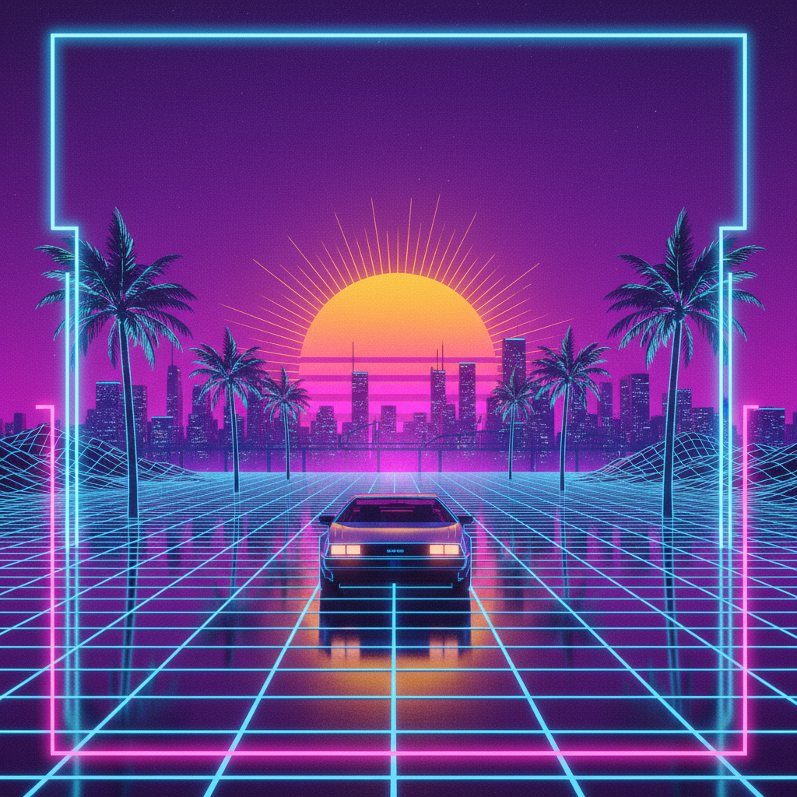
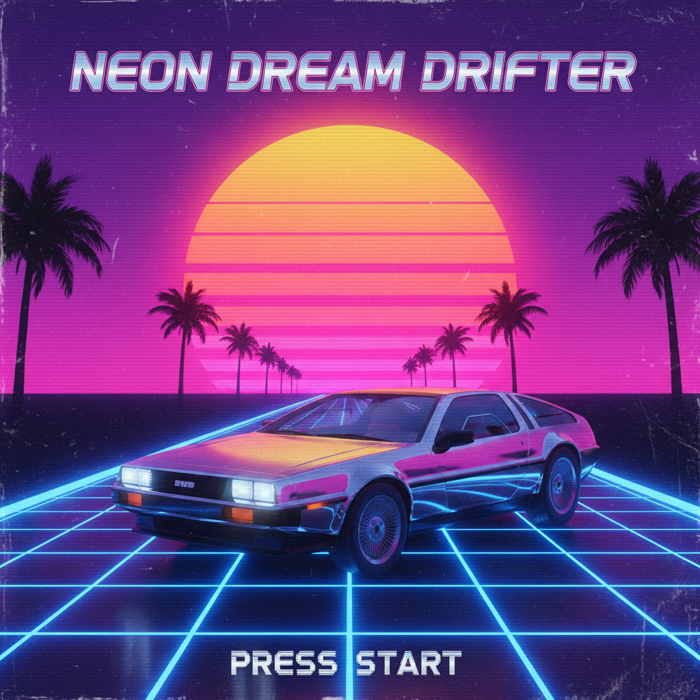
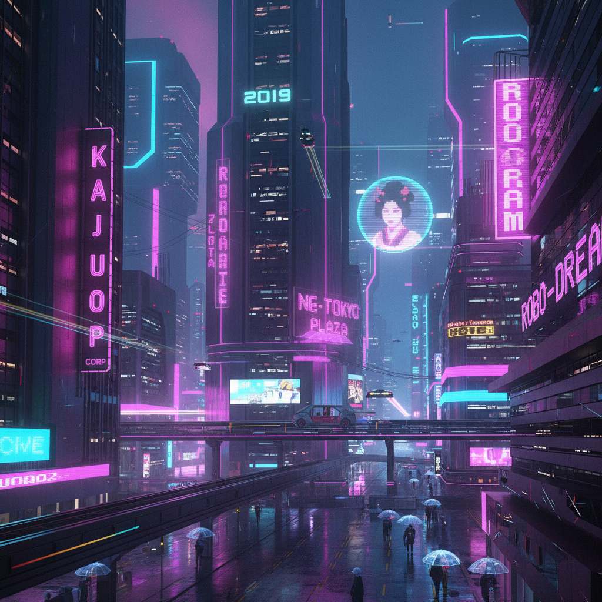

# 合成器浪潮 | Synthwave / Retrowave

> 霓虹网格上的落日永远不会结束——这是80年代许诺给我们的未来。

## 概述

- **时间跨度**：2005 – 至今（回望 1980s）
- **发源地**：法国（早期）→ 全球互联网
- **核心理念**：对80年代黄金岁月的真诚致敬与浪漫化重构
- **别名**：Retrowave、Outrun、Neon Noir

## 历史背景

Synthwave 发迹于2000年代后期，由 College、Kavinsky、FM Attack 等法国电子音乐人开创。其真正的原型来自1980年代的电影配乐——John Carpenter（《万圣节》《怪形》）、Vangelis（《银翼杀手》）和 Tangerine Dream 的合成器音乐。

2011年电影《Drive》的配乐让 Synthwave 进入主流视野，随后游戏《Hotline Miami》(2012) 进一步推动了这一风格的流行。与蒸汽波不同，Synthwave 对80年代的态度是**真诚的热爱与致敬**，而非讽刺。

### 为什么是法国？

Synthwave 的法国起源并非偶然：
- **法国电子乐传统**：Jean-Michel Jarre、Daft Punk、Justice 建立了深厚的电子音乐土壤
- **法国对美国流行文化的浪漫化**：法国人对80年代美国（迈阿密、洛杉矶、跑车）有一种独特的"异域迷恋"
- **Ed Banger Records**：Justice 所在的厂牌为电子音乐的复古转向铺路
- **Kavinsky 的角色扮演**：他创造了一个"1986年车祸后变成僵尸的赛车手"的虚构人设

### 关键时间线

| 阶段 | 时间 | 标志事件 |
|------|------|----------|
| 前身 | 2005-2008 | College "A Real Hero"、Kavinsky 早期EP |
| 地下期 | 2008-2011 | Bandcamp/SoundCloud 社区形成 |
| 主流突破 | 2011 | 《Drive》电影配乐 |
| 爆发 | 2012-2015 | Hotline Miami、Far Cry 3: Blood Dragon |
| 巅峰 | 2016-2018 | 《怪奇物语》、The Midnight 全球巡演 |
| 成熟 | 2019-至今 | 风格稳定，子流派分化完成 |

### 80年代的"真实"vs Synthwave的"想象"

Synthwave 怀念的并不是真实的80年代，而是**80年代电影和广告中的80年代**：
- 真实的80年代有冷战恐惧、艾滋危机、经济衰退
- Synthwave 的80年代只有霓虹灯、跑车、落日和永恒的夏夜
- 这种"选择性怀旧"本身就是一种创作行为——它创造了一个从未存在的黄金时代

## 视觉特征

### 色彩
- 霓虹色系：洋红、电蓝、紫色、橙红
- 日落渐变（从深紫到橙红）
- 黑色背景上的高对比霓虹
- 铬银金属色

### 核心视觉元素
- **霓虹网格**（无限延伸的透视网格地面）
- **落日/日出**（巨大的渐变太阳，通常带有水平线条）
- **80年代跑车**（法拉利 Testarossa、兰博基尼 Countach、DeLorean）
- **棕榈树剪影**
- **霓虹灯管文字**
- **线框抽象图形**
- **VHS磁带质感**
- **像素艺术**（8-bit 风格）
- **城市天际线**（迈阿密/洛杉矶风格）
- **激光束和光线**
- **星空与星云**

### 排版
- Chrome 金属质感字体
- 80年代科幻电影标题风格（Blade Runner、TRON）
- 铭黄+铬银配色
- 恐怖风格：血红笔刷字体（Darksynth）
- 常用字体：Outrun Future、Lazer 84、Neon Tubes

### 空间构成

Synthwave 的视觉空间有一套固定语法：
- **前景**：跑车/摩托车/人物剪影
- **中景**：公路/城市/棕榈树
- **背景**：巨大的落日/星空
- **地面**：霓虹网格向远方延伸
- **透视**：强烈的单点透视，制造速度感和无限感

## 子流派

| 子流派 | 特征 | 代表艺术家 | 视觉差异 |
|--------|------|------------|----------|
| Outrun（超越风） | 驾驶感、跑车、速度 | Kavinsky, Lazerhawk | 公路+跑车+落日 |
| Dreamwave | 梦幻、柔和、浪漫 | Timecop1983, FM-84 | 更柔和的渐变，更少黑色 |
| Darksynth | 黑暗、恐怖、暴力 | Perturbator, Carpenter Brut | 红黑为主，骷髅/恶魔元素 |
| Retrowave | 忠实复刻80年代 | Miami Nights 1984 | 最接近原版80年代视觉 |
| Cyberpunk Synth | 赛博朋克+合成器 | Daniel Deluxe | 城市废墟+霓虹 |
| Horror Synth Revival | 70-80年代恐怖片配乐复兴 | Survive, S U R V I V E | VHS质感+恐怖字体 |

## 代表作品

| 类型 | 作品 | 年代 | 影响 |
|------|------|------|------|
| 电影 | 《Drive》 | 2011 | 让Synthwave进入主流 |
| 电影 | 《银翼杀手2049》 | 2017 | 霓虹+合成器的视觉巅峰 |
| 游戏 | Hotline Miami | 2012 | 暴力+霓虹+电子乐 |
| 游戏 | Far Cry 3: Blood Dragon | 2013 | 对80年代动作片的完美戏仿 |
| 游戏 | Cyberpunk 2077 | 2020 | Synthwave视觉的3A级呈现 |
| 剧集 | 《怪奇物语》Stranger Things | 2016 | 让全球观众认识Synthwave |
| 音乐 | Kavinsky - Nightcall | 2010 | Synthwave的"国歌" |
| 音乐 | The Midnight - Days of Thunder | 2014 | Dreamwave的代表 |
| 音乐 | Carpenter Brut - Turbo Killer | 2015 | Darksynth的视觉标杆 |
| 音乐 | Gunship - Tech Noir | 2015 | MV融合动画+实拍 |

## 文化内核

### 真诚的怀旧

与蒸汽波的讽刺不同，Synthwave 的怀旧是**真诚的**：
- 不是讽刺，而是对"更好的过去"的浪漫化
- 不是解构，而是重建一个理想化的世界
- 不是批判消费主义，而是拥抱其美学快感

### 复古未来主义

Synthwave 展示的是**80年代人想象中的未来**，而非真实的未来：
- 飞行汽车而非电动汽车
- 霓虹城市而非智能城市
- 合成器而非AI
- 这种"过去的未来"比"真实的未来"更有魅力

### 逃避主义的正当性

Synthwave 社区对"逃避主义"的态度是坦然的：
- "现实太无聊了，我们需要霓虹灯"
- 这不是对现实的否认，而是对想象力的肯定
- 在一个越来越"优化"和"高效"的世界里，Synthwave 提供了一个纯粹的美学避难所

## Synthwave vs Vaporwave 关键区别

| 维度 | Synthwave | Vaporwave |
|------|-----------|-----------|
| 态度 | 致敬、热爱 | 讽刺、解构 |
| 回望年代 | 1980s | 1980s-1990s |
| 色调 | 霓虹暖色（橙红紫） | 冷色渐变（粉紫蓝） |
| 情绪 | 热血、浪漫、速度感 | 迷幻、慵懒、疏离 |
| 音乐 | 原创合成器编曲 | 采样+降速处理 |
| 空间 | 开阔（公路、天际线） | 封闭（商场、房间） |
| 时间感 | 永恒的黄昏 | 凌晨3点的失眠 |

## 图片画廊

<!-- 存放于 assets/artworks/synthwave/ -->

| | |
|:---:|:---:|
|  |  |
| *合成器浪潮概念* | *Outrun 霓虹公路* |
|  | |
| *赛博城市夜景* | |

## 延伸阅读

- [Synthwave | 美学Wiki](https://aesthetics.fandom.com/zh/wiki/Synthwave)
- [Outrun | 萌娘百科](https://zh.moegirl.org.cn/Outrun)
- [NewRetroWave (YouTube)](https://www.youtube.com/@NewRetroWave) — 最大的Synthwave频道
- [合成器浪潮-复古未来主义（贴吧）](https://tieba.baidu.com/p/9426182445)
- [Irwin Sparkes: The Rise of Synthwave](https://daily.bandcamp.com/lists/essential-synthwave)

---

[← 蒸汽波 Vaporwave](vaporwave.md) | [→ Frutiger Aero](frutiger-aero.md) | [↑ 返回目录](README.md)
