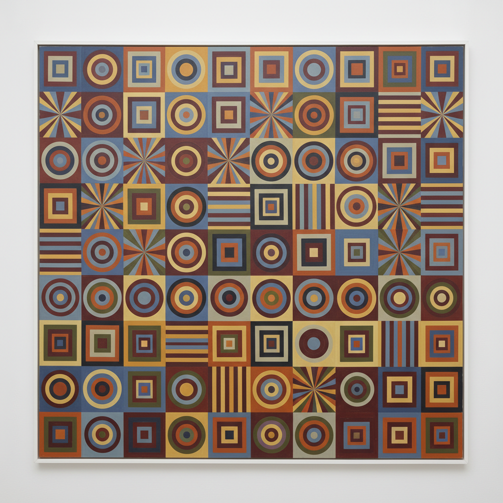

# Systemic Painting 系统绘画

> **时期：** 1960年代–1970年代  
> **关键词：** 系统化构图、重复模块、非关系性、整体结构、后极简

## 概述

Systemic Painting（系统绘画）由评论家劳伦斯·阿洛韦于1966年古根海姆展览命名，描述一种以整体系统而非局部关系为基础的抽象绘画。画家们使用重复的模块、对称的结构和预设的规则来组织画面——不是表达情感，而是呈现一个自足的视觉系统。它是极简主义在绘画领域的逻辑延伸。

## 风格特征

- **整体结构**：画面作为统一系统而非局部组合
- **重复模块**：相同或相似元素的规律排列
- **非层级**：没有中心焦点或主次关系
- **预设规则**：创作遵循明确的逻辑系统
- **去个人化**：消除艺术家的情感痕迹

## 代表人物与作品

- 弗兰克·斯特拉 条纹画
- 肯尼斯·诺兰 靶心画
- 拉里·普恩斯 圆点画
- 罗伯特·曼戈尔德 几何形状

## 概念图

