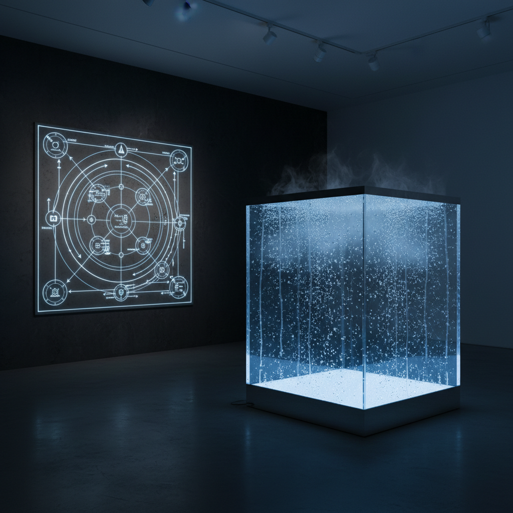

# Systems Art 系统艺术

> "The system is the work of art." — Jack Burnham

## 概述

系统艺术（Systems Art / Systems Aesthetics）是1960-70年代兴起的艺术实践，将复杂系统——生态系统、社会系统、信息系统、经济系统——作为艺术的主题和媒介。艺术家不再创造孤立的物品，而是设计、揭示或干预系统的运作过程。

Jack Burnham在1968年的文章"Systems Aesthetics"中提出，艺术正从"物品"转向"系统"——从制造东西转向理解和操控关系、过程和信息流。

## 核心特征

| 特征 | 描述 |
|------|------|
| 系统思维 | 关注整体系统而非孤立物品 |
| 过程导向 | 过程和关系比最终产品更重要 |
| 信息性 | 信息流和反馈循环是核心 |
| 跨学科 | 融合控制论、生态学、社会学 |
| 去物质化 | 从物质对象转向非物质系统 |
| 开放性 | 系统是开放的、持续变化的 |

## 视觉特征

- **图表**：流程图、网络图、系统图
- **数据**：数字、统计、实时信息流
- **过程**：变化中的、动态的、不断更新的
- **网络**：节点和连接的网络结构
- **反馈**：输入-处理-输出的循环
- **不可见**：许多系统是不可见的——需要可视化

## 代表作品

| 作品 | 艺术家 | 年代 | 意义 |
|------|--------|------|------|
| *Software* exhibition | Jack Burnham | 1970 | 信息系统作为艺术——里程碑展览 |
| *Haacke's Systems* | Hans Haacke | 1960s-70s | 物理和社会系统的揭示 |
| *Condensation Cube* | Hans Haacke | 1963-65 | 封闭系统中的水循环 |
| *MoMA Poll* | Hans Haacke | 1970 | 观众投票作为社会系统 |
| *Cybernetic Serendipity* | Jasia Reichardt | 1968 | 控制论与艺术的交汇展览 |
| *Telephones* | László Moholy-Nagy | 1922 | 通过电话指令制作的画——远程系统 |

## 历史时间线

| 时期 | 事件 |
|------|------|
| 1948 | Norbert Wiener出版《控制论》 |
| 1960s | Haacke开始物理系统作品 |
| 1968 | Burnham发表"Systems Aesthetics" |
| 1968 | "Cybernetic Serendipity"展览——ICA伦敦 |
| 1970 | "Software"展览——Jewish Museum纽约 |
| 1970s | Haacke转向社会和政治系统 |
| 1990s | 互联网——新的系统艺术平台 |
| 2000s | 复杂性科学影响当代系统艺术 |
| 2010s-至今 | AI系统、算法治理成为新主题 |

## 子类型

| 子类型 | 特征 |
|--------|------|
| 物理系统 | Haacke早期——水、风、温度的系统 |
| 社会系统 | Haacke后期——揭示权力和经济系统 |
| 信息系统 | Burnham——信息处理作为艺术 |
| 生态系统 | 生态系统的艺术化呈现 |
| 控制论艺术 | 反馈和自我调节的系统 |
| 算法系统 | 当代——AI和算法作为系统 |

## 中国语境

系统艺术在中国的直接实践较少，但系统思维在中国当代艺术中有体现。中国传统的"天人合一"哲学本身就是一种系统观。当代中国艺术家如徐冰的"蜻蜓之眼"（用监控摄像头画面创作）揭示了监控系统；曹斐的虚拟世界作品探索了数字系统。中国快速发展的AI和大数据系统为系统艺术提供了丰富的当代素材。

## AI生成概念图

## 与其他风格的关系

- **Conceptual Art** → 概念艺术的去物质化为系统艺术提供基础
- **Data Art** → 数据艺术是系统艺术的当代延伸
- **Institutional Critique** → 制度批判揭示艺术体制的系统
- **Net Art** → 网络艺术探索互联网作为系统
- **Kinetic Art** → 动态艺术的反馈机制与系统相通
- **Environmental Art** → 生态艺术关注自然系统

---

*浮光艺志 | Chronicle of Artistry*
