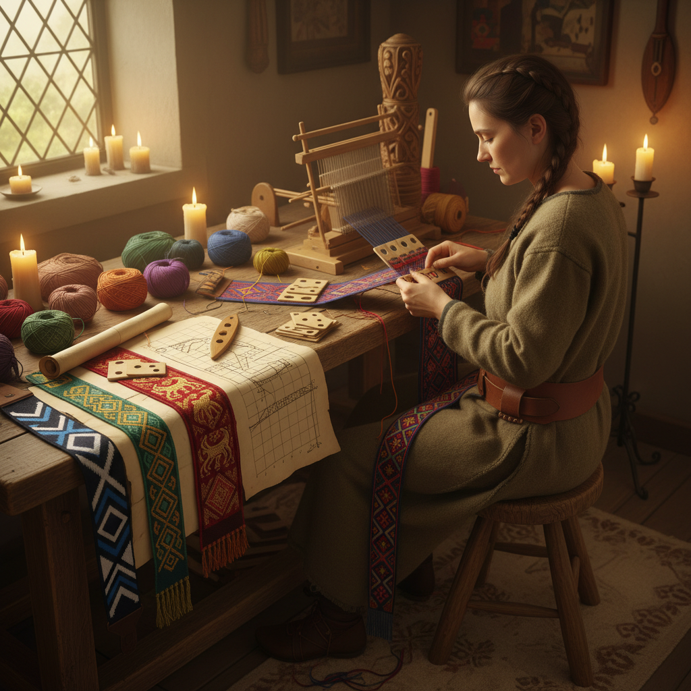

# Tablet Weaving Art 卡片织艺术

> "Tablet weaving is weaving's oldest trick — threading cards with holes, then rotating them forward and back to create sheds through which a weft passes. With nothing more than a pack of cards and some yarn, a weaver can produce bands of astonishing complexity: intricate geometric patterns, flowing curves, even legible text woven into narrow strips that have survived in Viking graves and medieval treasuries for a thousand years." — Unknown

## 概述

卡片织艺术（Tablet Weaving Art）是使用穿孔卡片（织板）作为经线控制装置的古老织带技法——通过旋转穿有经线的方形卡片来创造梭口，使纬线穿过形成织物。卡片织可以在极窄的织带上创造出极其复杂的图案，包括几何纹样、文字和曲线图案。

卡片织艺术的实践包括：1）基础卡片织——简单的条纹和棋盘格；2）翻转卡片织——通过翻转卡片创造复杂图案；3）双面卡片织——正反面不同图案的织带；4）浮纹卡片织——表面浮起的纹样；5）文字卡片织——织入文字的织带；6）当代卡片织——将古老技法与现代设计结合的创作。

## 核心特征

| 特征 | 描述 |
|------|------|
| 卡片 | 穿孔卡片控制经线 |
| 窄带 | 制作窄幅织带 |
| 复杂 | 极其复杂的图案 |
| 便携 | 设备简单便携 |
| 古老 | 极其古老的技法 |
| 耐久 | 织带极其耐用 |

## 视觉特征

- **几何**：精确的几何图案
- **色彩**：多色经线的搭配
- **窄幅**：窄而精致的织带
- **密实**：经线密集的厚实织物
- **对称**：精确的对称图案
- **文字**：可织入文字和符号

## 代表作品

| 作品 | 艺术家/文化 | 年代 | 意义 |
|------|-------------|------|------|
| *Snartemo band* | 维京 | 6世纪 | 最早的复杂卡片织 |
| *Oseberg ship bands* | 维京 | 9世纪 | 维京卡片织 |
| *Medieval ecclesiastical bands* | 中世纪欧洲 | 10-15世纪 | 教会织带 |
| *Andean tablet weaving* | 安第斯 | 古代至今 | 南美卡片织 |
| *Contemporary tablet weaving* | 当代 | 当代 | 当代卡片织 |

## 历史时间线

| 时期 | 事件 |
|------|------|
| 青铜时代 | 最早的卡片织证据 |
| 铁器时代 | 凯尔特和日耳曼卡片织 |
| 维京时代 | 北欧卡片织的繁荣 |
| 中世纪 | 教会和贵族的织带 |
| 当代 | 卡片织的复兴和创新 |

## 中国语境

卡片织艺术在中国有潜在的历史联系。中国古代的"综版织"与卡片织有技术上的相似之处——都是通过板状工具控制经线的开合。中国新疆地区出土的古代织带中可能包含卡片织技法的产品——丝绸之路沿线的文化交流可能将卡片织技术传入中国。中国少数民族（如藏族、苗族）的一些传统织带技法与卡片织有结构上的相似性。中国当代的手工织布爱好者中，卡片织作为一种入门级的织布技法正在获得关注——因为设备简单、便于携带。中国的一些手工工作室开始教授卡片织——将其作为纺织艺术入门课程。中国的纺织研究者也在关注卡片织与中国古代织造技术的关系——探索东西方织造技术的交流历史。

## AI生成概念图

## 与其他风格的关系

- **Inkle Weaving** → 窄带织艺术
- **Backstrap Weaving** → 腰机织
- **Viking Art** → 维京艺术
- **Textile Art** → 纺织艺术
- **Pattern Design** → 图案设计
- **Folk Art** → 民间艺术

---

*浮光艺志 | Chronicle of Artistry*
