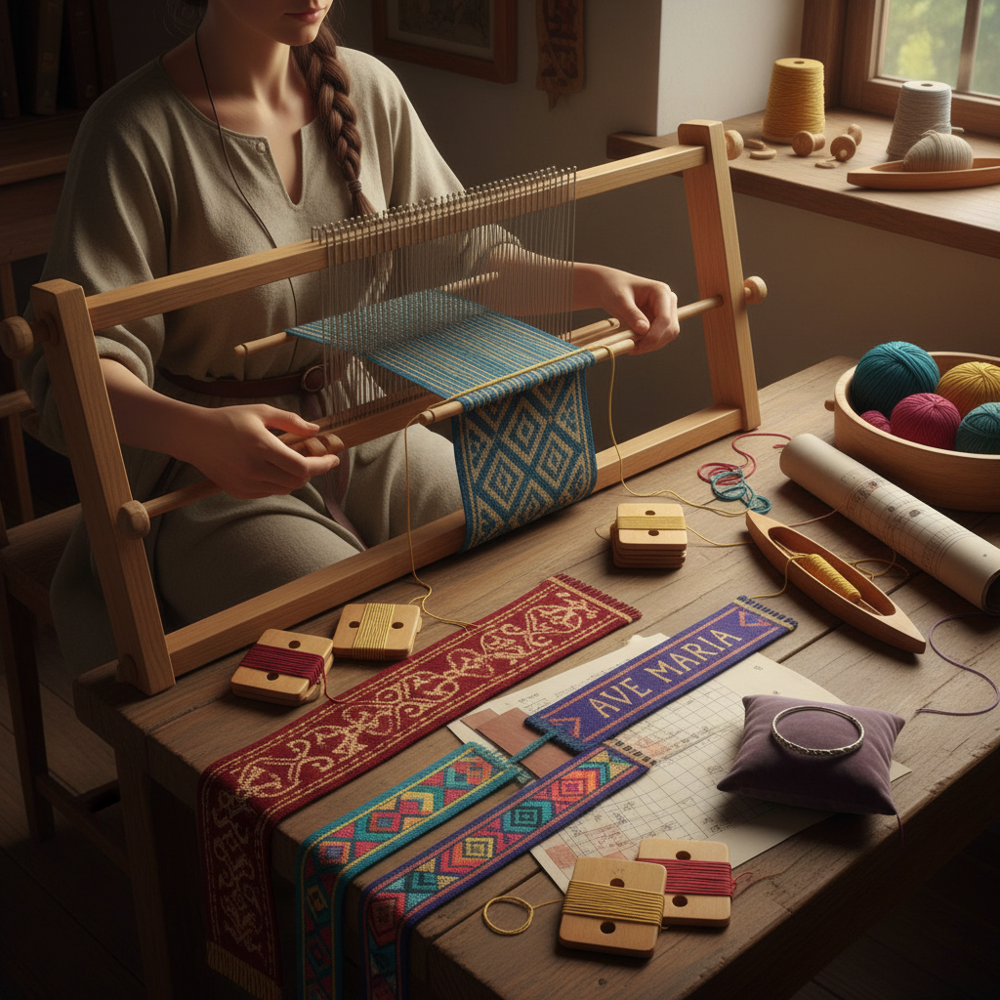

# Tablet Weaving 织带

> "Tablet weaving is portable complexity — a handful of cards threaded with yarn, turned in sequence, creating patterns of astonishing intricacy from the simplest of setups that fits in a pocket." — Unknown

## 概述

织带（Tablet Weaving / Card Weaving）是一种使用穿孔卡片（tablets / cards）作为综框来编织窄带的古老技法。每张卡片通常是正方形的，四角各有一个孔，经线穿过这些孔。通过旋转卡片（向前或向后转动），经线的位置发生变化，形成开口（shed），纬线从中穿过。不同的卡片旋转序列产生不同的图案。

织带的独特之处在于：设备极其简单（只需要一些穿孔卡片和纱线），但可以创造出极其复杂的图案——从简单的条纹到精美的文字、动物和几何图案。织带在维京时代的北欧、中世纪的欧洲和中亚的游牧文化中都有重要地位——用于制作腰带、绑带、装饰边和马具。

## 核心特征

| 特征 | 描述 |
|------|------|
| 卡片 | 使用穿孔卡片 |
| 旋转 | 通过旋转卡片换综 |
| 窄带 | 制作窄带织物 |
| 便携 | 设备极其便携 |
| 复杂 | 可创造复杂图案 |
| 古老 | 极其古老的技法 |

## 视觉特征

- **窄带**：窄而长的带状
- **图案**：精美的几何图案
- **色彩**：多色的经线图案
- **密实**：密实的织物
- **对称**：对称的图案
- **文字**：可织入文字

## 代表作品

| 作品 | 艺术家 | 年代 | 意义 |
|------|--------|------|------|
| *Viking tablet-woven bands* | 匿名 | 维京时代 | 维京织带 |
| *Hallstatt textiles* | 匿名 | 铁器时代 | 最早的织带证据 |
| *Medieval ecclesiastical bands* | 匿名 | 中世纪 | 教会织带 |
| *Andean backstrap bands* | 匿名 | 传统 | 安第斯织带 |
| *Contemporary tablet weaving* | Various | 当代 | 当代织带艺术 |

## 历史时间线

| 时期 | 事件 |
|------|------|
| 铁器时代 | 最早的织带证据（哈尔施塔特） |
| 罗马时期 | 罗马帝国的织带 |
| 维京时代 | 北欧织带的繁荣 |
| 中世纪 | 欧洲教会和贵族的织带 |
| 近代 | 织带的衰落 |
| 当代 | 织带的复兴和研究 |

## 中国语境

织带在中国有着对应的传统——中国古代的"组带"（用于系玉佩、印章等的编织带）与织带有相似的原理。中国传统的"绦带"也是一种窄幅编织物。中国少数民族（如苗族、藏族）的腰带和装饰带中也有类似织带的技法。当代中国的手工编织爱好者群体中，织带（card weaving）作为一种便携且有趣的编织方式正在获得关注。一些中国的纺织研究者也在研究中国古代织带技术与世界其他地区的联系。

## AI生成概念图

## 与其他风格的关系

- **Weaving** → 编织
- **Inkle Weaving** → 窄带编织
- **Backstrap Weaving** → 腰机编织
- **Braiding** → 编绳
- **Textile Art** → 纺织艺术
- **Viking Craft** → 维京工艺

---

*浮光艺志 | Chronicle of Artistry*
