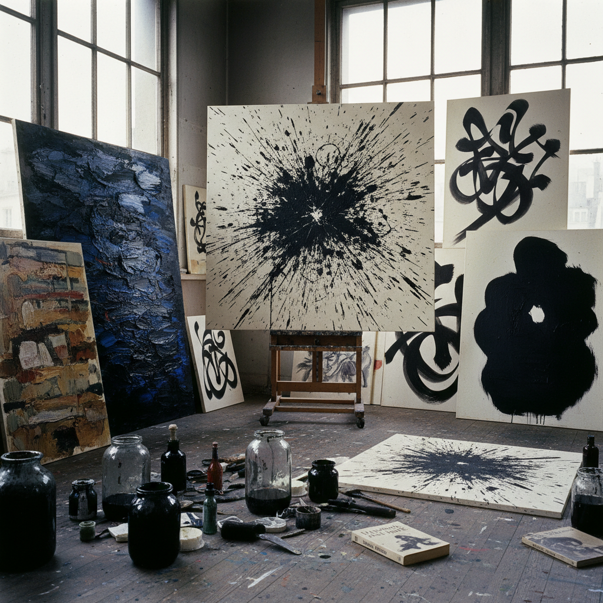

# Tachisme Art 塔希主义艺术

> "Tachisme is the European answer to Abstract Expressionism — not the heroic gesture of the American frontier but the intimate stain, the blot, the tache that spreads across the canvas like ink on blotting paper, a painting practice rooted in automatism and chance where the artist surrenders control to the material, where paint is thrown, dripped, splashed and smeared in pursuit of a direct unmediated expression that bypasses rational thought and reaches toward something primal, spontaneous, and irreducibly physical in the act of marking a surface." — Unknown

## 概述

塔希主义（Tachisme，源自法语"tache"，意为"斑点"或"污渍"）是1940-50年代在欧洲（主要是法国）兴起的一种抽象绘画运动，与美国的抽象表现主义平行发展。塔希主义强调自发性、偶然性和材料的物理性——艺术家通过泼洒、滴落、涂抹等方式让颜料在画布上自由运动，追求一种超越理性控制的直接表达。

塔希主义的代表艺术家包括乔治·马修（Georges Mathieu）、汉斯·哈同（Hans Hartung）、皮埃尔·苏拉热（Pierre Soulages）、沃尔斯（Wols）和让·福特里耶（Jean Fautrier）。塔希主义与"非形式艺术"（Art Informel）密切相关，两者常被互换使用，但塔希主义更强调"斑点"和"污渍"的物质性，而Art Informel是一个更广泛的范畴。评论家米歇尔·塔皮耶（Michel Tapié）在1952年的著作《另一种艺术》中为这一运动提供了理论框架。

## 核心特征

| 特征 | 描述 |
|------|------|
| 斑点 | 斑点和污渍 |
| 自发 | 自发性和偶然性 |
| 物质 | 材料的物理性 |
| 手势 | 手势和身体性 |
| 自动 | 自动主义 |
| 直接 | 直接的表达 |

## 视觉特征

- **泼洒**：颜料的泼洒和滴落
- **斑点**：不规则的色斑
- **笔触**：激烈的笔触痕迹
- **厚涂**：厚重的颜料堆积
- **黑色**：大量使用黑色
- **纹理**：丰富的表面纹理

## 代表作品

| 作品 | 艺术家 | 年代 | 意义 |
|------|--------|------|------|
| *Hommage au Connétable de Bourbon* | Georges Mathieu | 1959 | 马修的表演性绘画 |
| *Peinture* | Pierre Soulages | 1950年代 | 苏拉热的黑色绘画 |
| *Composition* | Hans Hartung | 1950年代 | 哈同的书法性抽象 |
| *Painting* | Wols | 1940年代 | 沃尔斯的有机抽象 |
| *Otages* | Jean Fautrier | 1943-45 | 福特里耶的人质系列 |

## 历史时间线

| 时期 | 事件 |
|------|------|
| 1940年代 | 沃尔斯和福特里耶的早期实验 |
| 1950 | 哈同和苏拉热的成熟期 |
| 1952 | 塔皮耶的《另一种艺术》 |
| 1954 | "塔希主义"术语的流行 |
| 1960年代 | 运动的衰退 |

## 中国语境

塔希主义与中国书法和水墨画有深层的精神联系。中国书法中的"飞白"、"泼墨"和"写意"传统与塔希主义对自发性和材料物理性的追求有惊人的相似。事实上，一些塔希主义艺术家（如哈同）明确受到东亚书法的影响。中国的现代水墨运动中，许多艺术家在探索类似的"自动主义"和"偶然性"——如刘国松的"抽筋剥皮皴"技法、张大千的泼彩山水等。中国当代的实验水墨艺术家继续在这个传统中工作，将中国书画的自发性与西方抽象的自由结合。

## AI生成概念图

## 与其他风格的关系

- **Art Informel** → 非形式艺术
- **Abstract Expressionism** → 抽象表现主义
- **Action Painting** → 行动绘画
- **Calligraphy** → 书法艺术
- **Automatism** → 自动主义
- **Gestural Abstraction** → 手势抽象

---

*浮光艺志 | Chronicle of Artistry*
