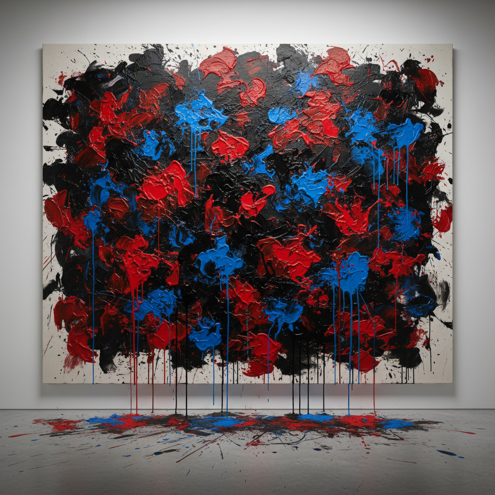

# Tachisme 塔希主义

> "The painting is an adventure whose outcome is unknown." — Georges Mathieu

## 概述

塔希主义（Tachisme，源自法语"tache"即"斑点"）是1940年代末至1960年代活跃于欧洲的抽象绘画运动，与美国的抽象表现主义平行发展。它强调自发性的笔触、泼洒和滴落，拒绝几何抽象的理性控制，追求直觉和潜意识的直接表达。

塔希主义是"非形式艺术"（Art Informel）的核心分支，代表了战后欧洲对理性主义幻灭后的情感爆发。

## 核心特征

| 特征 | 描述 |
|------|------|
| 自发性 | 即兴创作，拒绝预先构图 |
| 斑点与泼洒 | 颜料的自由滴落、泼溅、涂抹 |
| 非形式 | 无可辨识的形象或几何结构 |
| 身体性 | 绘画作为身体动作的痕迹 |
| 材质实验 | 厚涂、刮擦、混合媒介 |
| 潜意识 | 受超现实主义自动书写影响 |

## 视觉特征

- **色彩**：浓烈而对比强烈，或沉郁的黑灰棕
- **笔触**：粗犷、快速、可见的身体力量
- **质感**：厚重的颜料堆积，有时混入沙石
- **构图**：全面覆盖（all-over），无焦点
- **动态**：飞溅、流淌、爆发的运动感
- **尺幅**：通常为大画幅，强调身体参与

## 代表作品

| 作品 | 艺术家 | 年代 | 意义 |
|------|--------|------|------|
| *Painting* | Pierre Soulages | 1956 | 黑色的光——"超越黑色" |
| *Hommage to Louis XIV* | Georges Mathieu | 1954 | 公开表演式绘画 |
| *Otage* series | Jean Fautrier | 1943-45 | 战争创伤的物质化 |
| *Composition* | Hans Hartung | 1947 | 书法式抽象 |
| *Concetto Spaziale* | Lucio Fontana | 1949+ | 刺穿画布——空间主义 |
| *Untitled* | Wols | 1946 | 微观宇宙的爆发 |

## 历史时间线

| 时期 | 事件 |
|------|------|
| 1945 | Fautrier的"人质"系列震动巴黎 |
| 1947 | 批评家Michel Tapié开始推广非形式艺术 |
| 1950 | "Tachisme"一词首次被使用 |
| 1951 | Tapié组织"Signifiants de l'Informel"展览 |
| 1954 | Mathieu在东京公开表演绘画 |
| 1956 | 运动达到国际影响力高峰 |
| 1960s | 逐渐被新现实主义和波普艺术取代 |

## 子类型

| 子类型 | 特征 |
|--------|------|
| 抒情抽象 | Hartung、Soulages——优雅的书法式笔触 |
| 物质绘画 | Fautrier、Dubuffet——厚重的材质实验 |
| 行动绘画（欧洲） | Mathieu——公开表演的即兴创作 |
| 空间主义 | Fontana——刺穿/切割画布 |
| CoBrA | Appel、Jorn——原始主义+自发性 |

## 中国语境

塔希主义与中国书法的"写意"传统有深层共鸣——两者都强调笔触的即兴性和身体性。赵无极（Zao Wou-Ki）和朱德群（Chu Teh-Chun）作为旅法华人画家，成功将中国书法精神融入塔希主义框架，成为运动的重要参与者。当代中国实验水墨也延续了这一东西方对话。

## 争议与遗产

- **争议**：被保守派嘲讽为"随便泼洒也能叫艺术"
- **与美国抽象表现主义的关系**：平行发展，互有影响，但欧洲更强调物质性
- **遗产**：为行为艺术、过程艺术奠定了"创作即表演"的观念
- **当代回响**：当代抽象绘画中的手势性和物质性

## AI生成概念图

## 与其他风格的关系

- **Abstract Expressionism** → 美国的平行运动，共享自发性理念
- **Action Painting** → 行动绘画是塔希主义的美国对应物
- **Surrealism** → 超现实主义的自动书写是塔希主义的思想源头
- **Art Informel** → 塔希主义是非形式艺术的核心分支
- **CoBrA** → CoBrA运动与塔希主义共享原始自发性
- **Lyrical Abstraction** → 抒情抽象是塔希主义的延续

---

*浮光艺志 | Chronicle of Artistry*
