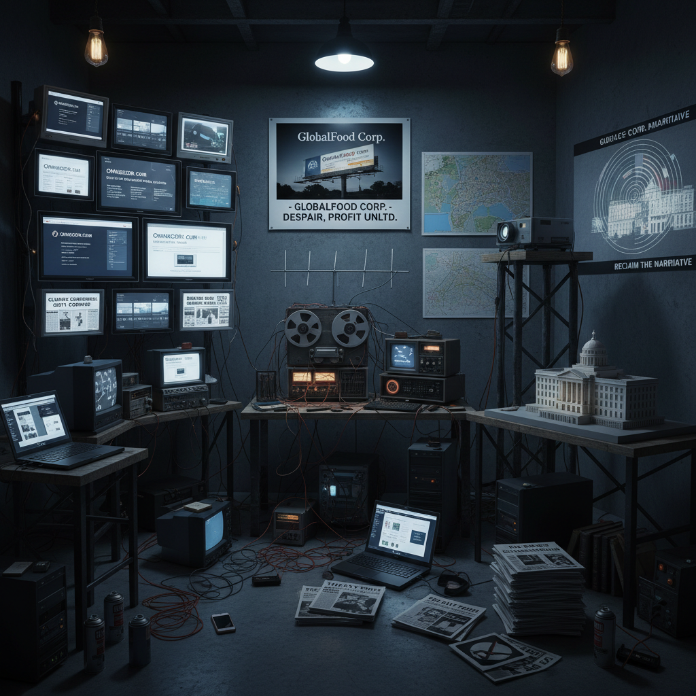

# Tactical Media Art 战术媒体艺术

> "Tactical media is the art of the temporary autonomous zone in information space — of hijacking broadcast frequencies, of culture jamming corporate messages, of using the master's tools to dismantle the master's house, of artists and activists who understand that in a media-saturated society the most powerful weapon is not the gun but the meme, not the barricade but the bandwidth, who create interventions that are hit-and-run, temporary, mobile, and impossible to pin down, using whatever media is at hand — pirate radio, fake websites, viral videos, hacked billboards — to puncture the smooth surface of spectacular society and let reality leak through." — Unknown

## 概述

战术媒体（Tactical Media）是1990年代在欧洲（特别是荷兰）兴起的一种艺术-行动主义实践，将媒体技术作为政治干预的工具。"战术"一词来自米歇尔·德·塞尔托（Michel de Certeau）的理论——"战术"是弱者在强者的领地上进行的游击式操作，与"战略"（强者的系统性控制）相对。

战术媒体的代表实践包括：文化干扰（culture jamming）、媒体黑客（media hacking）、假新闻艺术（fake news as art）、电子公民不服从（electronic civil disobedience）、以及各种形式的媒体干预。代表团体和艺术家包括：Critical Art Ensemble、RTMark/The Yes Men、Electronic Disturbance Theater、以及荷兰的Next 5 Minutes会议组织者。战术媒体强调"做"而非"是"——它不是一种固定的风格，而是一种临时的、情境性的、机会主义的实践。

## 核心特征

| 特征 | 描述 |
|------|------|
| 干预 | 媒体干预和黑客 |
| 临时 | 临时和游击式 |
| 政治 | 政治行动主义 |
| 戏仿 | 戏仿和文化干扰 |
| DIY | DIY和低技术 |
| 网络 | 网络化的行动 |

## 视觉特征

- **干扰**：对商业媒体的干扰
- **黑客**：黑客和篡改的美学
- **假冒**：假网站和假新闻
- **广播**：海盗电台和电视
- **标语**：篡改的广告标语
- **网络**：早期互联网的美学

## 代表作品

| 作品 | 艺术家 | 年代 | 意义 |
|------|--------|------|------|
| *The Yes Men* | Jacques Servin & Igor Vamos | 1999起 | 企业身份伪装 |
| *Electronic Disturbance* | Critical Art Ensemble | 1994 | 电子干扰理论 |
| *FloodNet* | Electronic Disturbance Theater | 1998 | 电子公民不服从 |
| *Next 5 Minutes* | Various | 1993-2003 | 战术媒体会议 |
| *Adbusters* | Kalle Lasn | 1989起 | 文化干扰杂志 |

## 历史时间线

| 时期 | 事件 |
|------|------|
| 1993 | 第一届Next 5 Minutes会议 |
| 1994 | Critical Art Ensemble的理论 |
| 1996 | "战术媒体"术语的确立 |
| 1999 | The Yes Men的WTO恶作剧 |
| 当代 | 社交媒体时代的战术媒体 |

## 中国语境

战术媒体在中国有独特的实践语境。中国的互联网文化中有丰富的"战术性"实践——网民通过谐音、暗语、表情包和各种创造性的规避策略来表达被审查的内容，这本身就是一种"战术媒体"的实践。中国的一些网络艺术家和行动主义者在探索类似的策略——利用社交媒体平台的漏洞和盲区来进行文化干预。中国的"恶搞"文化、"鬼畜"视频和各种网络亚文化也体现了战术媒体的精神——用低成本的DIY方式对主流媒体进行戏仿和干扰。中国的快速数字化也为战术媒体提供了新的工具和平台。

## AI生成概念图

## 与其他风格的关系

- **Net Art** → 网络艺术
- **Hacktivism** → 黑客行动主义
- **Culture Jamming** → 文化干扰
- **Situationism** → 情境主义
- **Fluxus** → 激浪派
- **Street Art** → 街头艺术

---

*浮光艺志 | Chronicle of Artistry*
