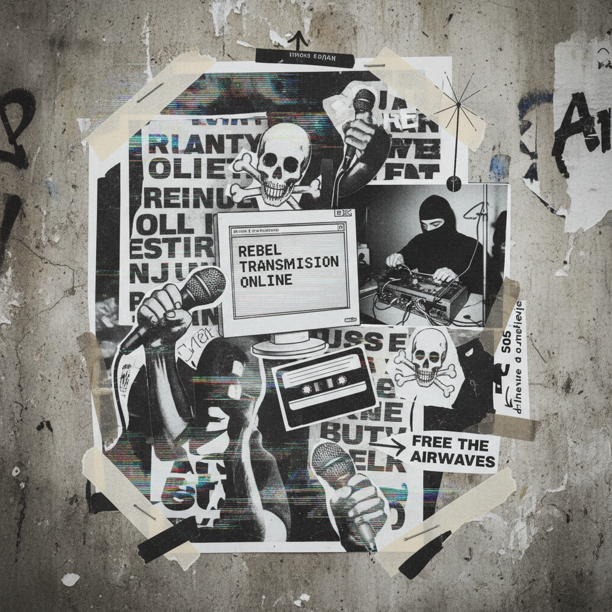

# Tactical Media 战术媒体

> **时期：** 1990年代–2000年代  
> **关键词：** 媒体干预、临时性、DIY传播、政治行动、游击传播

## 概述

战术媒体（Tactical Media）是1990年代兴起于欧洲的艺术与行动主义交叉实践。它利用廉价的、临时性的媒体工具——盗版电台、早期互联网、廉价摄像机、传真机——进行短暂但有效的政治干预。与传统媒体艺术不同，战术媒体强调"用完即弃"的游击策略：快速介入、制造事件、然后消失。

## 风格特征

- **临时性**：短暂的干预而非永久的作品
- **DIY美学**：低成本、低技术的制作方式
- **媒体劫持**：挪用主流媒体渠道进行颠覆
- **网络化**：利用早期互联网进行分布式行动
- **跨学科**：艺术家、黑客、活动家的协作

## 代表人物与作品

- Critical Art Ensemble 电子市民不服从
- The Yes Men 企业身份劫持
- RTMark 企业破坏基金
- Next 5 Minutes 会议系列（阿姆斯特丹）

## 概念图

