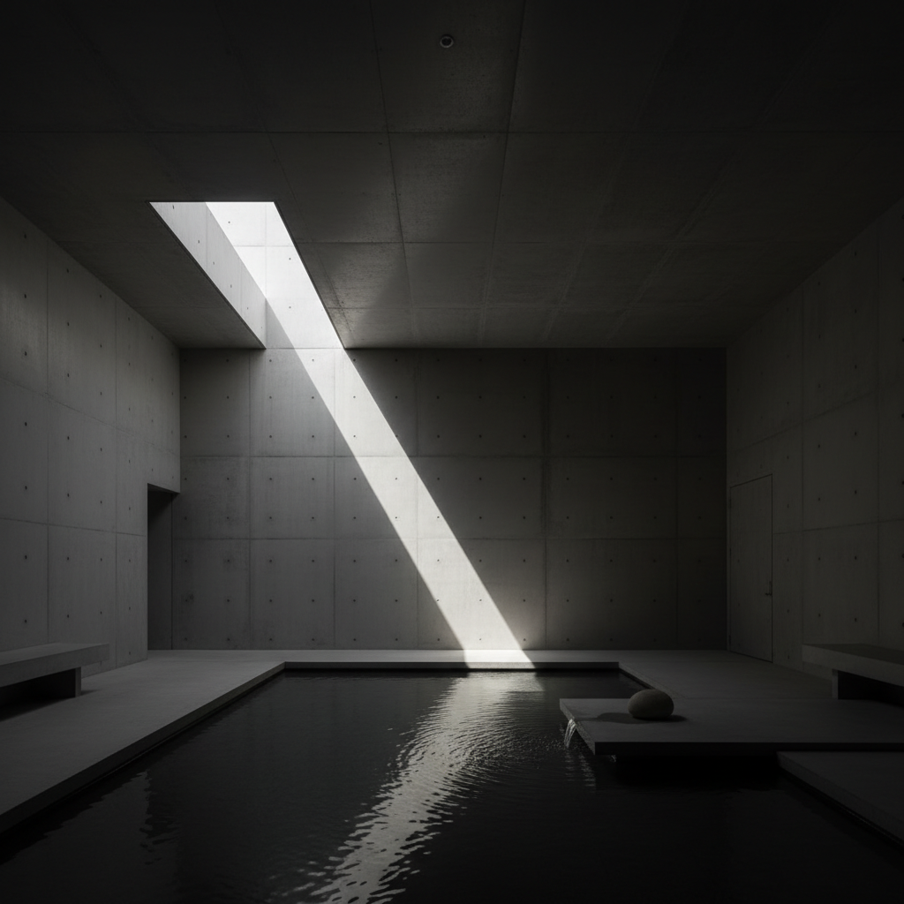

# Tadao Ando 安藤忠雄

> **时期：** 1941–至今  
> **关键词：** 清水混凝土、光与影、极简禅意、自然对话

## 概述

Tadao Ando 是日本建筑师，自学成才的普利兹克奖得主。他以精确的清水混凝土墙面和对光线的诗意运用闻名——建筑如同冥想的容器，用最少的材料创造最丰富的空间体验，让自然的光、水、风成为建筑的主角。

## 风格特征

- **清水混凝土**：光滑如丝的混凝土表面是唯一的材料语言
- **光的戏剧**：精确计算的开口让光线成为空间的雕塑家
- **几何纯粹**：圆形、方形、三角形等基本几何体
- **水的运用**：水面作为反射和冥想的元素
- **自然嵌入**：建筑与地形、植被深度融合

## 代表作品

- *光之教堂*（1989）
- *直岛地中美术馆*（2004）
- *住吉的长屋*（1976）
- *上海保利大剧院*（2014）

## 概念图

