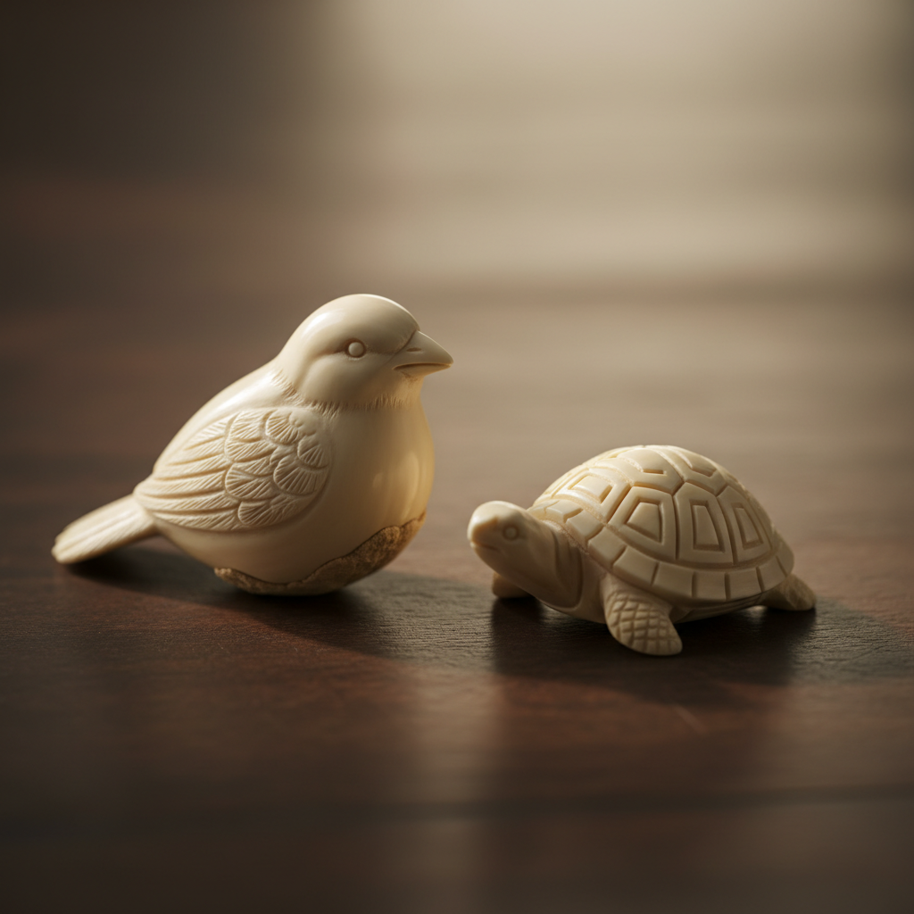

# Tagua Carving Art 象牙果雕刻艺术

> "Tagua is the rainforest's gift to the carver — the dried seed of a South American palm hardens to a density and whiteness so similar to elephant ivory that it earned the name 'vegetable ivory.' It can be carved, turned, dyed, and polished with the same tools and techniques used for animal ivory, yet no creature is harmed in its harvest. It is nature's answer to the ethical dilemma of ivory art." — Unknown

## 概述

象牙果雕刻艺术（Tagua Carving Art）是一种使用象牙椰子（Tagua Palm）的种子进行雕刻的艺术形式——象牙果（Tagua Nut）干燥后硬度和色泽极似动物象牙，因此被称为"植物象牙"（Vegetable Ivory）。象牙果雕刻提供了一种可持续和道德的替代方案，使艺术家能够在不伤害动物的情况下创作类似象牙的精美雕刻作品。

象牙果雕刻艺术的实践包括：1）选材——选择大小和质量合适的象牙果；2）设计——根据果实形状设计造型；3）粗雕——用刻刀进行初步造型；4）细雕——精细的细节雕刻；5）打磨——逐级打磨至光滑；6）染色——可以染成各种颜色；7）当代象牙果雕刻——将传统雕刻技法与现代设计结合的创作。

## 核心特征

| 特征 | 描述 |
|------|------|
| 植物 | 植物来源的材料 |
| 类象牙 | 类似动物象牙 |
| 可持续 | 可持续的材料 |
| 道德 | 不伤害动物 |
| 可雕 | 适合精细雕刻 |
| 南美 | 源自南美洲 |

## 视觉特征

- **白色**：类似象牙的白色
- **光泽**：打磨后的光泽
- **精细**：精细的雕刻细节
- **有机**：有机的材料质感
- **温润**：温润的触感
- **小巧**：受果实大小限制

## 代表作品

| 作品 | 艺术家/文化 | 年代 | 意义 |
|------|-------------|------|------|
| *Ecuadorian tagua carvings* | 厄瓜多尔 | 传统 | 厄瓜多尔象牙果雕刻 |
| *Victorian buttons* | 欧洲 | 19世纪 | 维多利亚时代纽扣 |
| *Netsuke-style carvings* | 国际 | 当代 | 根付风格雕刻 |
| *Contemporary tagua jewelry* | 国际 | 当代 | 当代象牙果珠宝 |
| *Tagua figurines* | 南美 | 当代 | 象牙果人偶 |

## 历史时间线

| 时期 | 事件 |
|------|------|
| 古代 | 南美原住民使用象牙果 |
| 19世纪 | 欧洲大量进口用于纽扣制造 |
| 20世纪初 | 被塑料取代后衰落 |
| 1990年代 | 作为象牙替代品重新受到关注 |
| 当代 | 象牙果雕刻的艺术化发展 |

## 中国语境

象牙果雕刻在中国近年来获得了快速发展。中国有悠久的象牙雕刻传统——但随着象牙贸易禁令的实施，象牙果成为重要的替代材料。中国的牙雕艺术家开始转向象牙果雕刻——将传统的牙雕技法应用于植物象牙。中国的文玩市场中，象牙果是受欢迎的雕刻材料——因其类似象牙的质感和合法的来源。中国的一些雕刻大师使用象牙果创作了精美的微雕作品——展示了中国传统雕刻技艺的精湛水平。中国的电商平台上，象牙果雕刻作品和原材料有广泛的销售——从手串到摆件都有丰富的产品。中国的非遗传承中，象牙果为传统牙雕技艺的延续提供了合法和可持续的材料——使这一古老技艺得以传承。

## AI生成概念图

## 与其他风格的关系

- **Ivory Carving** → 象牙雕刻
- **Netsuke** → 根付雕刻
- **Miniature Sculpture** → 微型雕塑
- **Sustainable Art** → 可持续艺术
- **Jewelry** → 珠宝艺术
- **Wood Carving** → 木雕

---

*浮光艺志 | Chronicle of Artistry*
