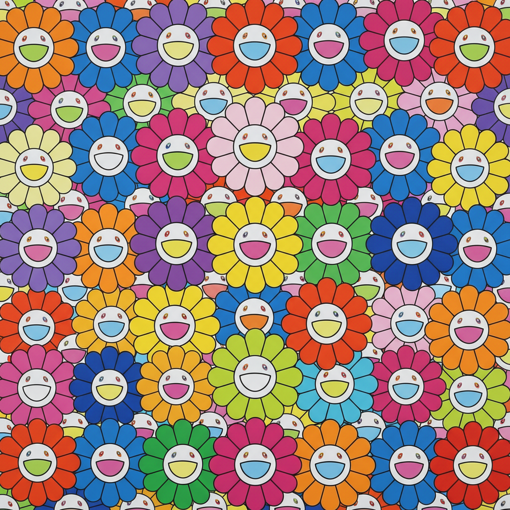

# Takashi Murakami 村上隆

> **流派**: 超扁平 (Superflat) · 当代艺术  
> **时期**: 1962–至今 日本  
> **关键词**: 超扁平、御宅族文化、花朵图案、高低艺术融合

## 概述

村上隆是当代日本最具国际影响力的艺术家。他提出"超扁平"(Superflat)理论——认为日本传统绘画的平面性、动漫的扁平美学和消费社会的浅薄性是同一种文化逻辑。他的作品融合了御宅族文化、传统日本画和安迪·沃霍尔式的商业策略。

## 视觉特征

- **超扁平**: 完全没有透视和阴影的平面构图
- **花朵图案**: 标志性的彩色笑脸花朵反复出现
- **动漫美学**: 大眼睛角色、卡通造型
- **极度精细**: 工作室团队制作的完美表面
- **商业跨界**: 与Louis Vuitton等品牌的合作

## 代表作品

- 《727》(1996)
- 《花球》系列
- 《我的寂寞牛仔》(2003)
- 与Louis Vuitton合作系列 (2003–)

## 历史影响

村上隆打破了高雅艺术与商业文化之间的最后壁垒，证明了动漫、玩具和奢侈品可以与美术馆共存。他的超扁平理论为理解日本当代视觉文化提供了关键框架。

## 相关风格

- [Pop Art 波普艺术](pop-art.md)
- [Superflat 超扁平](superflat.md)
- [Yayoi Kusama 草间弥生](yayoi-kusama.md)
