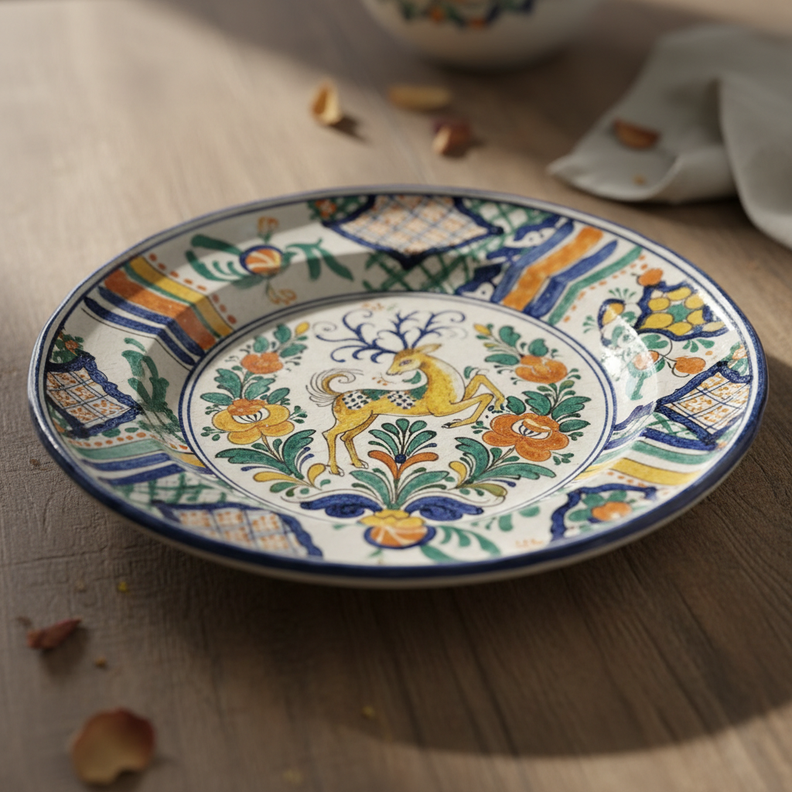

# Talavera Art 塔拉韦拉艺术

> "Talavera is the meeting point of two worlds — the Islamic and the Christian, the Old World and the New." — Mexican ceramic tradition

## 概述

塔拉韦拉艺术（Talavera Art）是西班牙卡斯蒂利亚-拉曼恰地区塔拉韦拉·德·拉·雷纳（Talavera de la Reina）为中心的锡釉陶器艺术传统。塔拉韦拉陶器是西班牙最重要的陶瓷传统之一——它融合了伊斯兰摩尔人的釉彩技术、意大利文艺复兴的装饰风格和西班牙本土的审美趣味，创造了一种色彩丰富、装饰华丽的独特风格。

塔拉韦拉陶器的历史可追溯至15世纪——当时摩尔人的制陶技术与基督教西班牙的文化需求相结合，产生了独特的西班牙锡釉陶器传统。16-17世纪是塔拉韦拉的黄金时代——西班牙王室和教会大量订购塔拉韦拉陶器用于宫殿和教堂装饰。更重要的是，西班牙殖民者将塔拉韦拉技术带到了墨西哥普埃布拉——在那里发展出了独特的"墨西哥塔拉韦拉"传统，成为拉丁美洲最重要的陶瓷艺术之一。

塔拉韦拉艺术的核心要素包括：1）摩尔遗产——伊斯兰釉彩技术的传承；2）多彩装饰——蓝、黄、绿、橙的丰富色彩；3）动物纹样——鹿、鸟、兔等动物装饰；4）植物纹样——花卉和卷草的精美描绘；5）建筑瓷砖——宫殿和教堂的瓷砖装饰；6）跨大西洋传播——从西班牙到墨西哥的传播；7）王室赞助——西班牙王室的支持。

## 核心特征

| 特征 | 描述 |
|------|------|
| 摩尔遗产 | 伊斯兰釉彩技术传承 |
| 多彩装饰 | 蓝黄绿橙丰富色彩 |
| 动物纹样 | 鹿鸟兔等动物装饰 |
| 植物纹样 | 花卉卷草精美描绘 |
| 建筑瓷砖 | 宫殿教堂瓷砖装饰 |
| 跨大西洋传播 | 从西班牙到墨西哥 |

## 视觉特征

- **蓝白主调**：蓝色和白色的经典搭配
- **多彩版本**：加入黄、绿、橙的丰富版本
- **动物形象**：鹿、鸟、兔的生动描绘
- **花卉纹样**：大朵花卉的装饰
- **几何边框**：摩尔风格的几何边框
- **瓷砖拼图**：大型瓷砖壁画

## 代表作品

| 作品 | 年代 | 意义 |
|------|------|------|
| *蓝白系列* (Serie azul) | 16世纪 | 经典风格 |
| *多彩系列* (Serie polícroma) | 16-17世纪 | 丰富色彩 |
| *狩猎纹盘* | 16世纪 | 动物装饰 |
| *埃斯科里亚尔宫瓷砖* | 16世纪 | 王室订制 |
| *药罐* (Albarello) | 15-17世纪 | 药房陶器 |
| *当代塔拉韦拉* | 21世纪 | 传统延续 |

## 历史时间线

| 时期 | 事件 |
|------|------|
| 15世纪 | 塔拉韦拉陶器生产兴起 |
| 16世纪 | 黄金时代，王室赞助 |
| 16世纪末 | 技术传入墨西哥普埃布拉 |
| 17世纪 | 持续繁荣 |
| 18世纪 | 受英国陶器竞争衰落 |
| 19-20世纪 | 复兴运动 |
| 2019年 | 墨西哥塔拉韦拉列入UNESCO非遗 |

## 中国语境

塔拉韦拉陶器与中国陶瓷有着间接但重要的历史联系。塔拉韦拉的蓝白风格明显受到中国青花瓷的影响——16世纪西班牙通过马尼拉大帆船贸易大量进口中国瓷器，中国青花的蓝白美学深刻影响了塔拉韦拉的装饰风格。塔拉韦拉从西班牙到墨西哥的跨大西洋传播，是全球化早期文化传播的生动案例——中国的釉彩技术经由伊斯兰世界传入西班牙，再由西班牙殖民者带到美洲，形成了一条跨越三大洲的文化传播链。墨西哥塔拉韦拉2019年被列入UNESCO非物质文化遗产——这对中国传统陶瓷的非遗保护有重要的参考意义。

## 概念图

## 与其他风格的关系

- **Islamic Ceramics** → 伊斯兰陶瓷（技术来源）
- **Puebla Tile** → 普埃布拉瓷砖（墨西哥传承）
- **Delft** → 代尔夫特（同受中国影响）
- **Majolica** → 马约利卡（意大利影响）
- **Chinese Blue-and-White** → 中国青花瓷（间接影响）
- **Azulejo** → 阿苏莱霍瓷砖

---

*浮光艺志 | Chronicle of Artistry*
