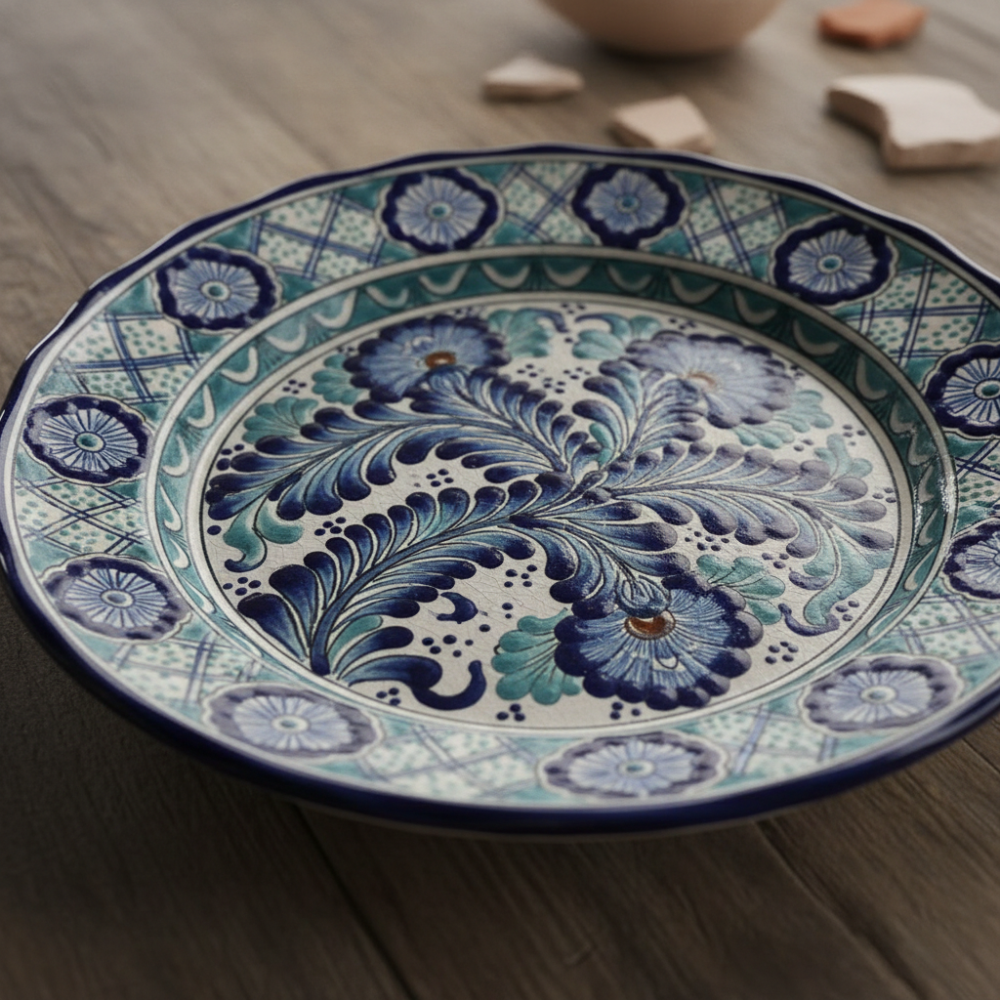

# Talavera 塔拉韦拉陶瓷 | Talavera Poblana

> **"西班牙的蓝白遇见墨西哥的色彩——普埃布拉的陶工用火焰锻造新世界的美。"**

## 概述

塔拉韦拉（Talavera / Talavera Poblana）是墨西哥普埃布拉州（Puebla）的传统锡釉陶瓷艺术，起源于16世纪西班牙殖民时期。西班牙陶工将伊比利亚半岛的锡釉陶技术（源自摩尔人/伊斯兰传统）带到墨西哥，与当地原住民的陶瓷传统融合，形成了独特的墨西哥塔拉韦拉风格。2019年被联合国教科文组织列入人类非物质文化遗产代表作名录。正宗的Talavera必须产自普埃布拉及周边地区，使用当地黑泥和白泥混合，经过严格的工艺流程。

## 核心特征

- **锡釉**：白色锡釉底色
- **手绘**：完全手工绘制图案
- **双烧**：素烧+釉烧两次烧制
- **蓝白为主**：经典配色，也有多色
- **混合风格**：西班牙+伊斯兰+墨西哥原住民
- **产地保护**：只有普埃布拉产的才是正宗Talavera

## 色彩等级

| 色彩 | 等级 |
|------|------|
| 蓝白 | 最经典，最高等级 |
| 多色（蓝黄绿橙黑） | 较晚发展，更墨西哥化 |
| 金色 | 最稀有，使用金粉 |

## 常见图案

| 图案 | 来源 |
|------|------|
| 花卉藤蔓 | 西班牙/伊斯兰传统 |
| 石榴 | 摩尔人传统 |
| 鸟类 | 墨西哥原住民传统 |
| 几何图案 | 伊斯兰传统 |
| 骷髅/亡灵 | 墨西哥传统 |
| 仙人掌/龙舌兰 | 墨西哥本土元素 |

## 视觉特征

- 白色锡釉底上的蓝色图案
- 精细的手绘笔触
- 花卉和几何的混合
- 陶瓷的温润质感
- 多文化融合的图案语言
- 鲜艳的多色装饰

## 与其他风格的关系

| 风格 | 关系 |
|------|------|
| Delft Blue | 共享锡釉蓝白传统 |
| İznik陶瓷 | 共享伊斯兰锡釉传统 |
| Azulejo | 共享伊比利亚陶瓷传统 |
| 中国青花瓷 | 间接影响（通过贸易） |
| 当代墨西哥设计 | Talavera是墨西哥视觉身份 |

## 概念图

---

*浮光艺志 | Chronicle of Artistry*
