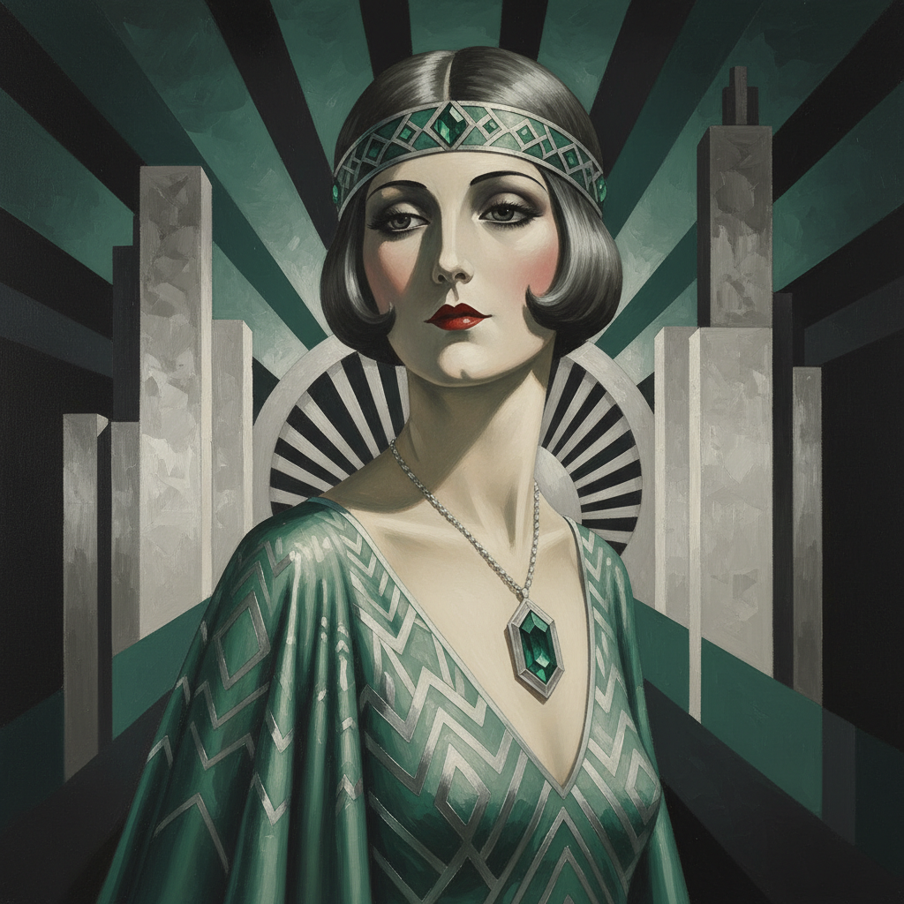

# Tamara de Lempicka 塔玛拉·德·兰碧嘉

> "I live life in the margins of society, and the rules of normal society don't apply to those who live on the fringe." — Tamara de Lempicka

## 概述

塔玛拉·德·兰碧嘉（Tamara de Lempicka，1898–1980）是波兰裔法国画家，Art Deco绘画的最重要代表。她以光滑如瓷器的肖像画闻名——几何化的人体、金属般的光泽和冷峻的魅力，完美捕捉了1920–30年代上流社会的奢华与颓废。

## 核心特征

| 特征 | 描述 |
|------|------|
| 几何化人体 | 立体主义影响的简化形体 |
| 光滑表面 | 如抛光金属般的肌肤质感 |
| 冷峻魅力 | 高冷的、不可接近的美 |
| Art Deco色彩 | 翡翠绿、宝石蓝、银灰 |
| 上流社会 | 名流、贵族、时尚女性 |
| 强烈光影 | 戏剧性的明暗对比 |

## 代表作品

| 作品 | 年代 | 意义 |
|------|------|------|
| *Autoportrait (Tamara in the Green Bugatti)* | 1929 | 现代女性独立的象征 |
| *Young Lady with Gloves* | 1930 | Art Deco肖像的极致 |
| *Adam and Eve* | 1932 | 几何化的人体之美 |
| *The Musician* | 1929 | 爵士时代的视觉翻译 |

## AI生成概念图

## 与其他风格的关系

- **Art Deco** → Art Deco绑画的最重要代表
- **Cubism** → 受立体主义几何化影响
- **Ingres** → 继承新古典主义的光滑表面
- **Fashion Illustration** → 影响了时尚插画
