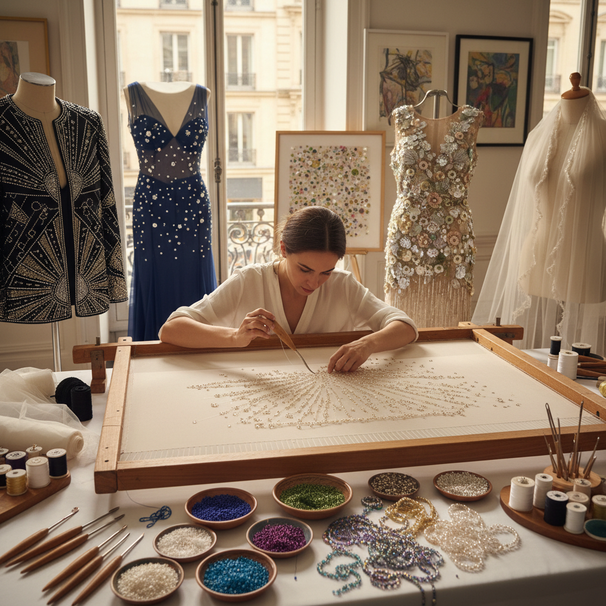

# Tambour Beading 钩针珠绣

> "Tambour beading is speed married to precision — a tiny hooked needle plunging through stretched fabric from above, catching thread strung with beads or sequins from below, creating chain stitches that lock embellishments into place at a pace no hand needle could match, building surfaces of shimmering light one bead at a time." — Unknown

## 概述

钩针珠绣（Tambour Beading）是一种使用特殊的钩针（tambour hook/crochet de Lunéville）在绷紧的织物上快速固定珠子、亮片和刺绣线的技法。"Tambour"一词来自法语"鼓"——因为织物被绷紧在圆形或方形的绣架上如同鼓面。钩针从织物正面刺入，在背面钩住穿有珠子的线，拉回正面形成链式针脚（chain stitch），同时将珠子固定在织物背面（即成品面）。

钩针珠绣起源于18世纪的法国，最初用于刺绣链式针脚。19世纪发展出在链式针脚中加入珠子和亮片的技法。这种技法的最大优势是速度——熟练的工匠每分钟可以固定数十颗珠子，远超手缝珠绣。钩针珠绣是巴黎高级定制时装（Haute Couture）的核心技法——Lesage、Lunéville等著名刺绣工坊都以此技法闻名。

## 核心特征

| 特征 | 描述 |
|------|------|
| 钩针 | 特殊的tambour钩针 |
| 珠子 | 固定珠子和亮片 |
| 链式 | 链式针脚结构 |
| 速度 | 高速的工作效率 |
| 绷架 | 织物绷紧在架上 |
| 奢华 | 高定时装的奢华 |

## 视觉特征

- **闪耀**：珠子和亮片的闪耀
- **密集**：密集的珠饰覆盖
- **流动**：珠饰的流动线条
- **光影**：光线在珠面的变化
- **奢华**：极致的奢华质感
- **精密**：精密的排列图案

## 代表作品

| 作品 | 艺术家 | 年代 | 意义 |
|------|--------|------|------|
| *Lesage Haute Couture embroidery* | Maison Lesage | 20世纪 | 高定珠绣 |
| *Chanel beaded jackets* | Chanel/Lesage | 当代 | 香奈儿珠绣外套 |
| *Dior beaded gowns* | Dior | 当代 | 迪奥珠绣礼服 |
| *Lunéville embroidery* | Various | 传统 | 吕内维尔刺绣 |
| *Indian zardozi* | 印度工匠 | 传统 | 印度金属珠绣 |

## 历史时间线

| 时期 | 事件 |
|------|------|
| 18世纪 | 法国tambour刺绣的起源 |
| 19世纪 | 珠饰加入tambour技法 |
| 20世纪初 | Art Deco时期的珠绣鼎盛 |
| 20世纪中后期 | 高级定制时装的核心技法 |
| 当代 | 全球珠绣教育和创作的发展 |

## 中国语境

钩针珠绣在中国的高级定制和舞台服装制作中有应用。中国传统的珠绣（如潮汕珠绣）使用不同的技法（手缝），但视觉效果相似。潮汕珠绣是国家级非物质文化遗产——使用细小的玻璃珠在织物上缝制图案。当代中国的时装设计师和刺绣工坊开始学习和应用法式tambour技法。中国的一些高端婚纱定制和舞台服装工作室使用钩针珠绣技法。中国的刺绣教育机构也开始引入Lunéville钩针珠绣课程。

## AI生成概念图

## 与其他风格的关系

- **Goldwork Embroidery** → 金线刺绣
- **Haute Couture** → 高级定制
- **Beadwork** → 珠饰工艺
- **Embroidery** → 刺绣
- **Sequin Art** → 亮片艺术
- **Fashion Design** → 时装设计

---

*浮光艺志 | Chronicle of Artistry*
