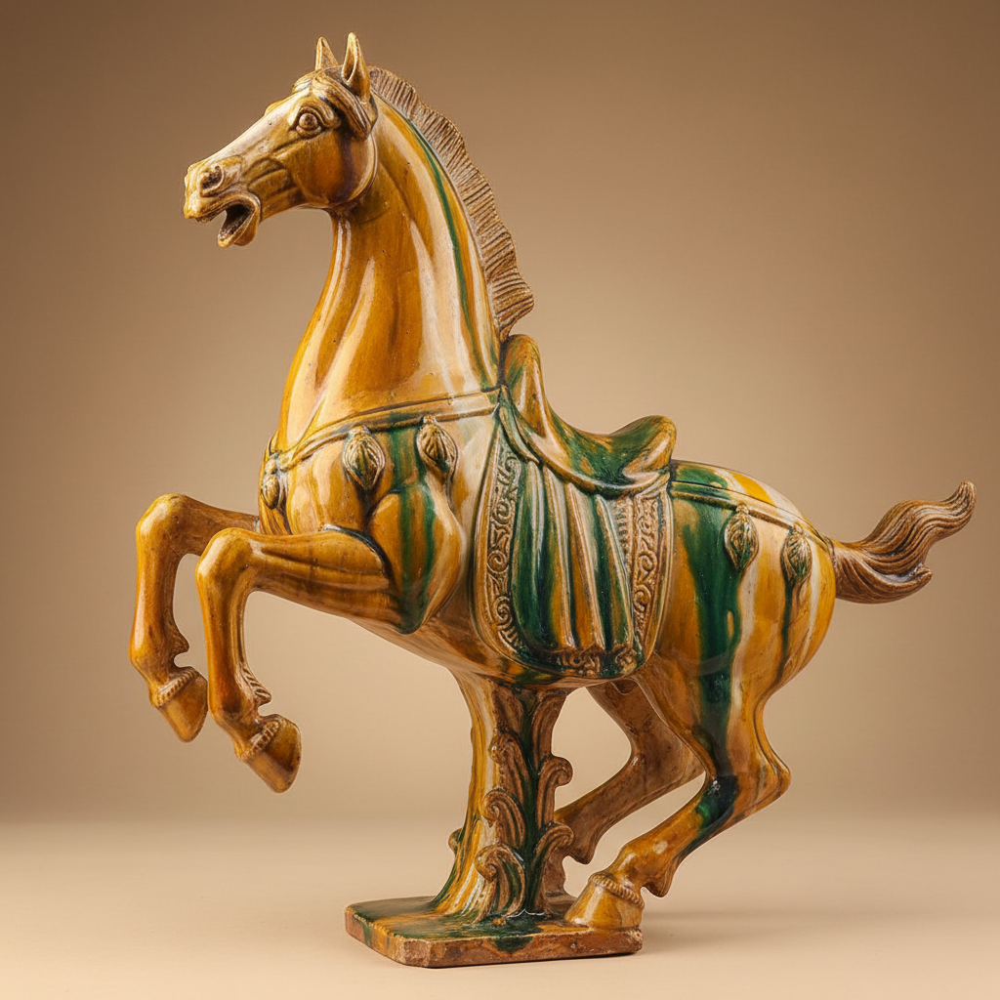

# Tang Sancai Art 唐三彩艺术

> "Tang sancai is the Tang dynasty's exuberance made ceramic — three colors that are really many more, amber, green, and cream flowing and mingling on the surfaces of horses, camels, and court ladies, lead glazes that run like watercolors on bisque-fired earthenware, each piece a snapshot of the most cosmopolitan empire the world had yet seen, its Silk Road confidence expressed in the bold freedom of uncontrolled glaze." — Unknown

## 概述

唐三彩艺术（Tang Sancai Art）是中国唐代（618-907年）发展的一种以黄、绿、白（褐）三色铅釉为主要特征的低温彩釉陶器艺术。"三彩"并非仅限三色，而是多种色彩的统称——包括黄、绿、白、褐、蓝等多种釉色在器物表面自由流淌、交融渗透，形成绚丽多彩的装饰效果。唐三彩是唐代开放繁荣社会的艺术缩影，主要用于随葬明器。

唐三彩艺术的核心要素包括：1）多色铅釉——黄绿白褐蓝等多色；2）自由流淌——釉色自由流动交融；3）低温烧成——约800-1000°C低温；4）明器功能——主要用于随葬；5）造型丰富——人物动物器皿等；6）盛唐气象——反映唐代繁荣开放；7）丝路文化——体现丝绸之路文化交流。

## 核心特征

| 特征 | 描述 |
|------|------|
| 多色铅釉 | 黄绿白褐蓝多色 |
| 自由流淌 | 釉色自由流动交融 |
| 低温烧成 | 800-1000°C低温 |
| 明器功能 | 主要用于随葬 |
| 造型丰富 | 人物动物器皿 |
| 盛唐气象 | 反映唐代繁荣 |

## 视觉特征

- **三色交融**：黄绿白三色的自由交融
- **流淌效果**：釉色如水彩般流淌
- **鲜艳色彩**：明亮鲜艳的色彩
- **造型生动**：人物动物的生动造型
- **丰满圆润**：唐代审美的丰满感
- **异域风情**：胡人骆驼等丝路元素

## 代表作品

| 作品 | 艺术家/文化 | 年代 | 意义 |
|------|-------------|------|------|
| *三彩骆驼载乐俑* | 唐代 | 8世纪 | 丝路文化的象征 |
| *三彩马* | 唐代 | 7-8世纪 | 唐代马文化 |
| *三彩女俑* | 唐代 | 7-8世纪 | 唐代女性形象 |
| *三彩天王俑* | 唐代 | 7-8世纪 | 墓葬守护神 |
| *三彩凤首壶* | 唐代 | 8世纪 | 异域造型的融合 |

## 历史时间线

| 时期 | 事件 |
|------|------|
| 初唐 | 唐三彩的萌芽 |
| 盛唐 | 唐三彩的鼎盛 |
| 中晚唐 | 唐三彩的衰落 |
| 宋辽 | 辽三彩的延续 |
| 当代 | 唐三彩的仿制和研究 |

## 中国语境

唐三彩是中国陶瓷艺术中最具代表性的品种之一，也是唐代文化的标志性符号。唐三彩的繁荣与唐代的开放包容密切相关——骆驼、胡人、异域乐器等题材反映了丝绸之路带来的文化交流。唐三彩主要出土于洛阳和西安地区的唐代墓葬——作为明器，它们反映了唐人对来世生活的想象。唐三彩的制作工艺体现了唐代工匠的高超技艺——先素烧成型，再施彩釉二次烧成，釉色的流动效果需要精确控制。唐三彩对后世影响深远——辽三彩、宋三彩、明清素三彩都是其传统的延续。唐三彩也影响了日本的奈良三彩和波斯的仿制品，是中国陶瓷文化向外传播的重要证据。

## AI生成概念图

## 与其他风格的关系

- **Lead Glaze** → 铅釉
- **Tomb Figurine** → 明器
- **Silk Road** → 丝绸之路
- **Tang Dynasty** → 唐代艺术
- **Polychrome** → 多彩装饰
- **Low-Fire Ceramics** → 低温陶瓷

---

*浮光艺志 | Chronicle of Artistry*
