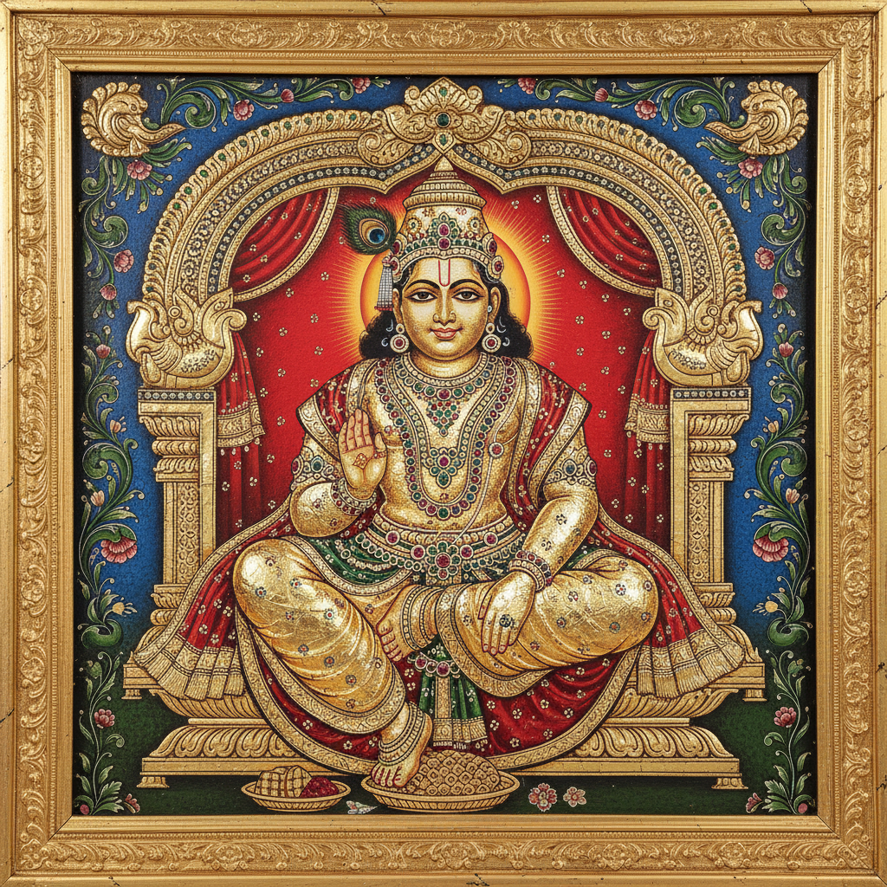

# Tanjore Painting 坦贾武尔绘画 | தஞ்சாவூர் ஓவியம்

> **"金箔和宝石堆砌的神圣——南印度最华丽的宗教绘画。"**

## 概述

坦贾武尔绘画（Tanjore Painting / Thanjavur Painting / தஞ்சாவூர் ஓவியம்）是印度泰米尔纳德邦坦贾武尔（Thanjavur）地区的传统绘画艺术，以其大量使用金箔、宝石镶嵌和浮雕效果著称。这种绘画起源于16世纪纳亚克王朝（Nayak Dynasty），主要描绘印度教神灵，尤其是克里希纳、拉克什米和萨拉斯瓦蒂。其独特的立体质感和金碧辉煌的视觉效果使其成为印度最具辨识度的古典绘画形式之一。

## 核心特征

- **金箔覆盖**：大面积使用22K金箔装饰衣饰和背景
- **浮雕效果**：用石灰和阿拉伯胶混合物堆出立体纹理
- **宝石镶嵌**：半宝石、玻璃珠、珍珠装饰
- **木板基底**：在木板上涂覆白垩底料
- **圆拱形构图**：神灵置于装饰性拱门（Prabhavali）内
- **鲜艳色彩**：红、蓝、绿与金色的强烈对比

## 制作工艺

1. 木板准备和白垩底料涂覆
2. 炭笔素描轮廓
3. 石灰浮雕堆塑（Gesso work）
4. 金箔贴覆
5. 宝石和玻璃珠镶嵌
6. 天然颜料上色
7. 细节描绘和最终修饰

## 主要题材

| 题材 | 特征 |
|------|------|
| 克里希纳 | 最常见，婴儿或少年形象 |
| 拉克什米 | 财富女神，莲花座 |
| 萨拉斯瓦蒂 | 知识女神，持琴 |
| 湿婆 | 舞王形象 |
| 圣人和圣者 | 南印度圣人传统 |

## 视觉特征

- 金碧辉煌的整体效果
- 立体浮雕的装饰纹理
- 圆润丰满的人物造型
- 精美的珠宝和衣饰细节
- 拱门形的构图框架
- 红色和金色为主的暖色调

## 与其他风格的关系

| 风格 | 关系 |
|------|------|
| Mysore Painting | 南印度姊妹传统，更素雅 |
| 拜占庭圣像 | 共享金色背景和宗教功能 |
| 俄罗斯圣像画 | 共享金箔和宝石装饰 |
| Pattachitra | 共享印度宗教绘画传统 |
| 当代印度装饰 | Tanjore风格的现代家居应用 |

## 概念图

---

*浮光艺志 | Chronicle of Artistry*
