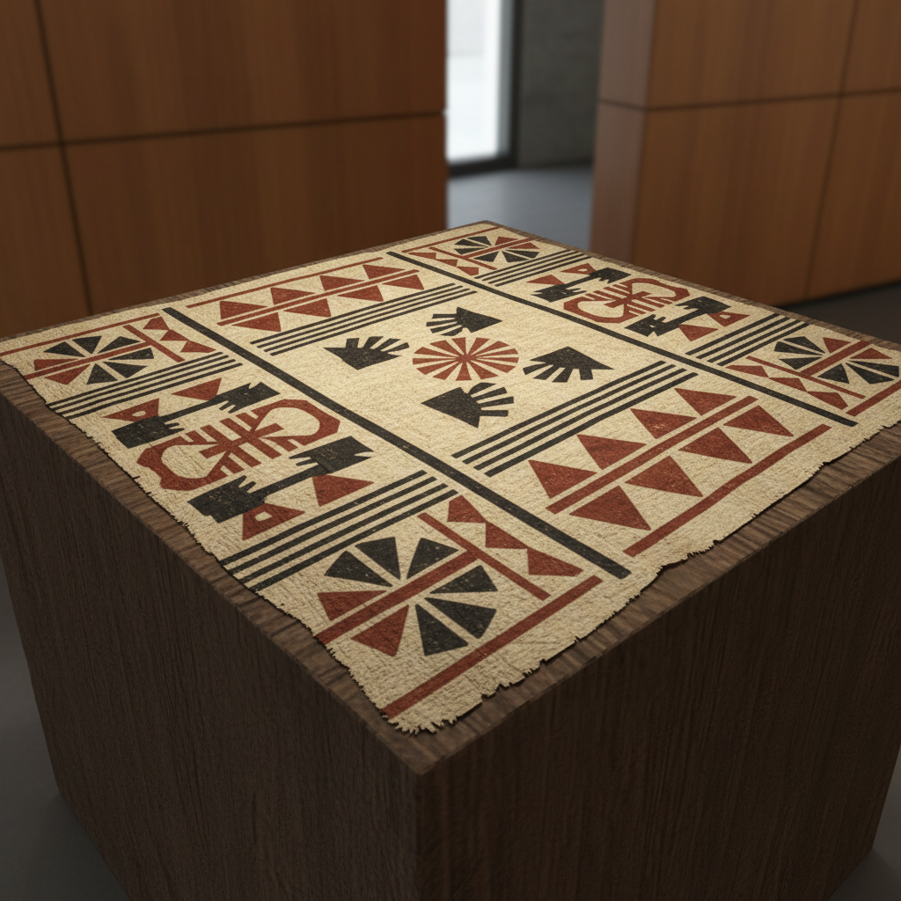

# Tapa Cloth 树皮布

> "Tapa is the fabric of the Pacific — beaten from bark, painted with stories of the ancestors." — Unknown

## 概述

树皮布（Tapa Cloth/Bark Cloth）是太平洋岛屿文化中用树皮（主要是桑树皮）经过浸泡、捶打、晾干制成的布料，再用天然颜料绘制几何图案的传统纺织艺术。从汤加的ngatu到萨摩亚的siapo，从斐济的masi到夏威夷的kapa，树皮布是太平洋文化最具代表性的艺术形式——它不仅是布料，更是身份、地位和祖先故事的载体。

树皮布的哲学在于：自然提供一切——一棵树的内皮，经过人的耐心和智慧，可以变成承载文化记忆的画布。

## 核心特征

| 特征 | 描述 |
|------|------|
| 树皮 | 用树皮制成的布料 |
| 捶打 | 通过反复捶打制作 |
| 几何 | 几何图案的装饰 |
| 天然 | 天然材料和颜料 |
| 文化 | 深厚的文化象征意义 |
| 集体 | 常为集体创作 |

## 视觉特征

- **几何**：大胆的几何图案
- **对称**：重复对称的排列
- **棕色**：天然的棕色和黑色
- **质感**：树皮纤维的质感
- **大尺度**：常为大幅作品
- **手工**：明显的手工痕迹

## 代表作品

| 作品 | 艺术家 | 年代 | 意义 |
|------|--------|------|------|
| *Tongan ngatu* | 匿名女性 | 传统 | 汤加树皮布 |
| *Samoan siapo* | 匿名女性 | 传统 | 萨摩亚树皮布 |
| *Fijian masi* | 匿名 | 传统 | 斐济树皮布 |
| *Hawaiian kapa* | 匿名 | 传统 | 夏威夷树皮布 |
| *Contemporary tapa art* | Various | 2000s+ | 当代树皮布艺术 |

## 历史时间线

| 时期 | 事件 |
|------|------|
| 3000年前 | 太平洋岛民开始制作树皮布 |
| 传统 | 各岛屿发展独特的风格 |
| 18世纪 | 欧洲探险家记录树皮布 |
| 19-20世纪 | 殖民影响下的衰落 |
| 1970s+ | 文化复兴运动 |
| 当代 | 树皮布作为当代艺术媒介 |

## 中国语境

树皮布在中国主要作为太平洋文化的一部分被了解。有趣的是，中国云南的少数民族（如傣族）也有制作树皮布的传统——海南黎族的树皮布制作技艺被列为国家级非物质文化遗产。中国的树皮布传统与太平洋岛屿的树皮布有独立的发展路径，但在技法上有惊人的相似。

## AI生成概念图

## 与其他风格的关系

- **Textile Art** → 纺织艺术的原始形式
- **Batik** → 蜡染与树皮布有装饰逻辑相似
- **Block Printing** → 木版印刷与树皮布印花相似
- **Folk Art** → 民间艺术的太平洋代表
- **Pattern Design** → 树皮布图案影响当代设计
- **Fiber Art** → 纤维艺术的古老形式

---

*浮光艺志 | Chronicle of Artistry*
