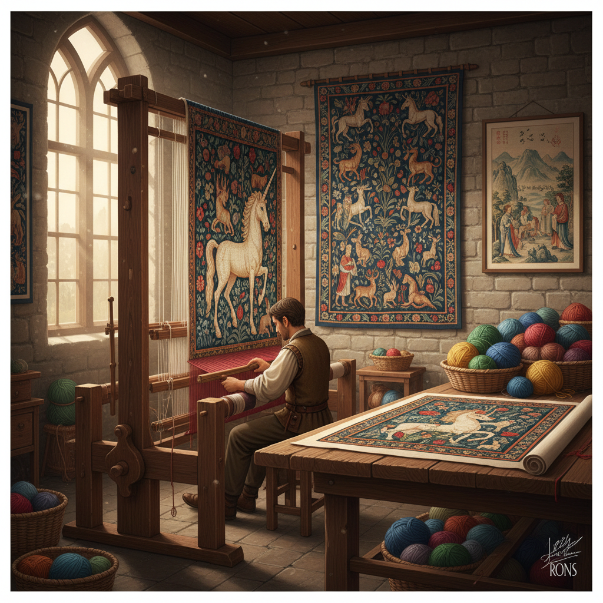

# Tapestry Art 挂毯艺术

> "A tapestry is a painting made of thread — each color placed not with a brush but with a shuttle, each form built not in minutes but in months, each square inch requiring hundreds of individual weft threads interlocked with the warp. A tapestry weaver works from the back, seeing only the reverse of the image they create, trusting their skill and their cartoon to guide them. When the tapestry is finally cut from the loom and turned around, it is a revelation." — Unknown

## 概述

挂毯艺术（Tapestry Art）是通过编织技法在织物上创造图像和图案的艺术形式——使用彩色纬线在经线上交织，形成复杂的画面。挂毯是人类最古老的纺织艺术形式之一，在中世纪欧洲达到了艺术的巅峰。

挂毯艺术的实践包括：1）传统挂毯编织——在大型织机上编织叙事性图像；2）奥比松挂毯——法国奥比松的传统挂毯；3）戈布兰挂毯——法国戈布兰工坊的皇家挂毯；4）当代纤维艺术——用挂毯技法创作的当代艺术；5）小型挂毯——个人艺术家在小型织机上的创作；6）数码挂毯——用计算机辅助设计的当代挂毯；7）挂毯修复——历史挂毯的保护和修复。

## 核心特征

| 特征 | 描述 |
|------|------|
| 编织 | 经纬线交织 |
| 叙事 | 叙事性的图像 |
| 耗时 | 极其耗时的创作 |
| 大型 | 可以非常大 |
| 纺织 | 纺织品的质感 |
| 耐久 | 可保存数百年 |

## 视觉特征

- **色彩**：丰富的染色纱线色彩
- **纹理**：编织的纹理质感
- **叙事**：复杂的叙事场景
- **大型**：覆盖整面墙壁
- **细节**：极精细的编织细节
- **温暖**：纺织品的温暖感

## 代表作品

| 作品 | 艺术家 | 年代 | 意义 |
|------|--------|------|------|
| *Bayeux Tapestry* | Unknown | 约1070 | 诺曼征服叙事 |
| *The Lady and the Unicorn* | Unknown | 约1500 | 中世纪挂毯杰作 |
| *Apocalypse Tapestry* | Nicolas Bataille | 1377-1382 | 最大的中世纪挂毯 |
| *Gobelins tapestries* | 戈布兰工坊 | 17世纪至今 | 法国皇家挂毯 |
| *Contemporary tapestries* | Various | 当代 | 当代挂毯艺术 |

## 历史时间线

| 时期 | 事件 |
|------|------|
| 古代 | 最早的编织挂毯 |
| 中世纪 | 欧洲挂毯的黄金时代 |
| 15-16世纪 | 佛兰德斯挂毯的巅峰 |
| 17世纪 | 戈布兰皇家工坊 |
| 当代 | 挂毯作为当代纤维艺术 |

## 中国语境

挂毯艺术在中国有独特的传统形式。中国的"缂丝"（kesi）——通过"通经断纬"技法编织的丝织品——是中国独有的挂毯艺术形式，被誉为"织中之圣"。缂丝可以精确再现中国画的笔墨效果，宋代的缂丝作品已达到极高的艺术水平。中国的藏毯——西藏和新疆的手工编织地毯——也是重要的挂毯艺术传统。中国的壁挂织锦——如南京云锦、成都蜀锦——虽然技法不同于西方挂毯，但同样是在织物上创造复杂图像的艺术。中国当代的纤维艺术家将传统缂丝技法与当代艺术观念结合，创作出融合东方美学与当代表达的挂毯作品。

## AI生成概念图

## 与其他风格的关系

- **Textile Art** → 纺织艺术
- **Weaving Art** → 编织艺术
- **Embroidery Art** → 刺绣艺术
- **Fiber Art** → 纤维艺术
- **Mural Art** → 壁画艺术
- **Narrative Art** → 叙事艺术

---

*浮光艺志 | Chronicle of Artistry*
