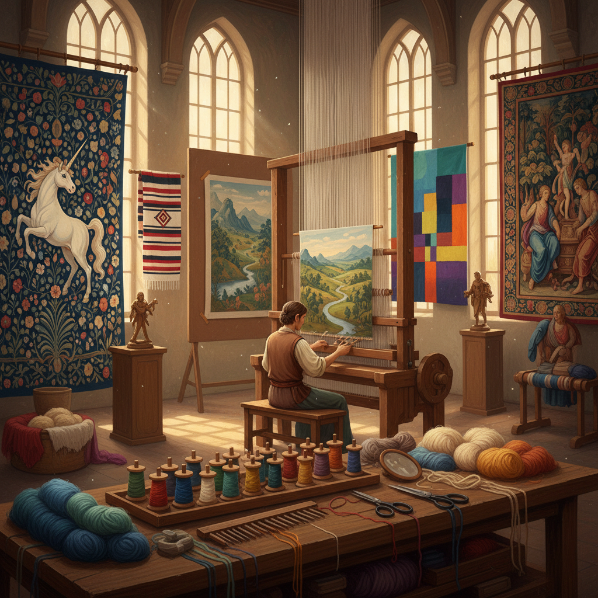

# Tapestry Weaving Art 挂毯编织艺术

> "Tapestry is painting with thread — each color change a brushstroke, each weft pass a line of pigment laid down on the warp canvas. The tapestry weaver works from behind, building the image in reverse, trusting memory and mirror to guide the shuttle through a picture that will only be seen complete when cut from the loom. It is the slowest of paintings, measured not in hours but in months and years." — Unknown

## 概述

挂毯编织艺术（Tapestry Weaving Art）是一种在织机上通过手工将彩色纬线按照图案设计织入经线中的编织工艺——与普通织物不同，挂毯的纬线不是连续通过整个幅面，而是在需要的区域来回编织，形成图案和画面。挂毯是人类最古老的叙事性纺织艺术形式之一。

挂毯编织艺术的实践包括：1）高经织——经线垂直的织机编织；2）低经织——经线水平的织机编织；3）Gobelin挂毯——法国戈布兰工坊风格；4）Aubusson挂毯——法国奥比松风格；5）Navajo织毯——纳瓦霍传统织毯；6）当代挂毯——将传统技法与现代艺术结合的创作；7）微型挂毯——小尺寸的精细挂毯。

## 核心特征

| 特征 | 描述 |
|------|------|
| 叙事 | 强大的叙事能力 |
| 色彩 | 丰富的色彩表现 |
| 耐久 | 极其耐久的织物 |
| 大型 | 可制作巨大尺寸 |
| 缓慢 | 极其缓慢的制作过程 |
| 协作 | 常需多人协作 |

## 视觉特征

- **图案**：精美的图案和画面
- **色彩**：丰富的色彩层次
- **纹理**：编织的纹理质感
- **叙事**：叙事性的场景
- **尺度**：从微型到巨型
- **边框**：装饰性的边框设计

## 代表作品

| 作品 | 艺术家/文化 | 年代 | 意义 |
|------|-------------|------|------|
| *Bayeux Tapestry* | 诺曼底 | 约1070 | 历史叙事挂毯 |
| *The Unicorn Tapestries* | 佛兰德斯 | 约1500 | 中世纪挂毯杰作 |
| *Gobelin tapestries* | 法国戈布兰 | 17世纪至今 | 法国皇家挂毯 |
| *Navajo weavings* | 纳瓦霍 | 传统至今 | 美洲原住民织毯 |
| *Grayson Perry tapestries* | Grayson Perry | 当代 | 当代挂毯艺术 |

## 历史时间线

| 时期 | 事件 |
|------|------|
| 古代 | 最早的挂毯编织（埃及/中国） |
| 中世纪 | 欧洲挂毯的黄金时代 |
| 文艺复兴 | 挂毯作为宫廷艺术 |
| 17-18世纪 | 戈布兰和奥比松工坊 |
| 当代 | 挂毯的当代艺术复兴 |

## 中国语境

挂毯编织艺术在中国有悠久的传统——中国的缂丝（kesi）是世界上最精美的挂毯编织形式之一。缂丝被称为"织中之圣"——其技法与西方挂毯编织原理相同，但精细程度更高。中国的缂丝可追溯到汉代——宋代达到艺术巅峰，能够精确再现绘画作品。中国的藏毯（藏族手工地毯）也是重要的挂毯编织传统——以其独特的图案和色彩著称。中国的新疆地毯有悠久的编织传统——受到中亚和波斯地毯文化的影响。中国当代的一些纺织艺术家将传统缂丝技法与现代艺术理念相结合——创造具有当代感的挂毯作品。中国的缂丝技艺已被列入国家级非物质文化遗产名录——苏州是缂丝的主要传承地。

## AI生成概念图

## 与其他风格的关系

- **Weaving** → 编织艺术
- **Embroidery** → 刺绣
- **Textile Art** → 纺织艺术
- **Painting** → 绘画
- **Fiber Art** → 纤维艺术
- **Narrative Art** → 叙事艺术

---

*浮光艺志 | Chronicle of Artistry*
