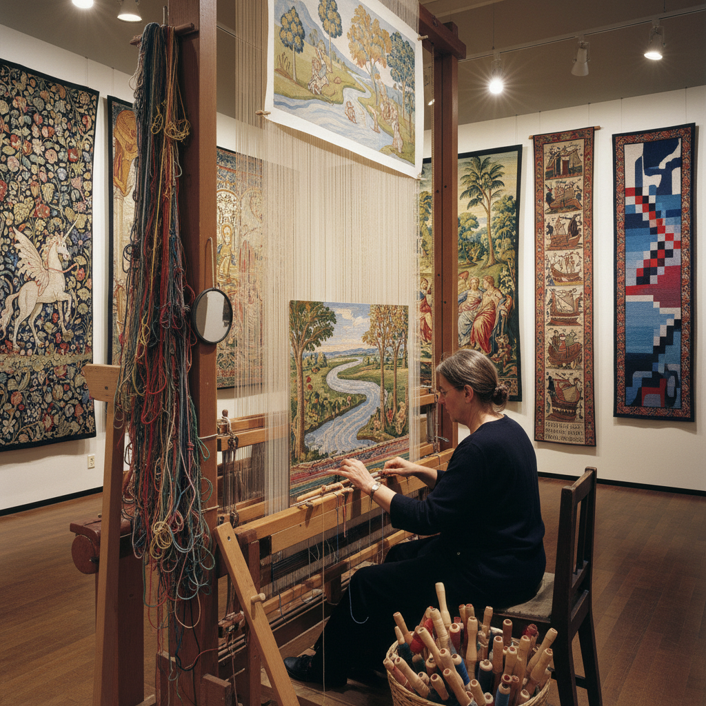

# Tapestry Weaving 挂毯编织

> "Tapestry weaving is the slowest painting — each color change requires a new weft thread, each shape is built stitch by stitch, and a masterpiece may consume a weaver's entire working life." — Unknown

## 概述

挂毯编织（Tapestry Weaving）是一种在织机上通过纬线（weft）完全覆盖经线（warp）来创造图像的编织技法。与普通编织不同，挂毯编织中纬线不是从一端连续织到另一端，而是在需要的区域来回编织——每种颜色的纬线只在其图案区域内穿梭，从而创造出如绘画般的图像。

挂毯编织是最古老的图像制作技术之一——从古埃及的亚麻挂毯到中世纪欧洲的巨幅叙事挂毯（如贝叶挂毯），挂毯一直是权力、财富和艺术的象征。中世纪和文艺复兴时期的欧洲宫廷将挂毯视为最珍贵的艺术品——比绘画更昂贵，因为一幅大型挂毯可能需要多名织工数年的劳动。

## 核心特征

| 特征 | 描述 |
|------|------|
| 纬面 | 纬线完全覆盖经线 |
| 图像 | 可创造复杂图像 |
| 缓慢 | 极其缓慢的过程 |
| 织机 | 在织机上操作 |
| 耐久 | 极其耐久 |
| 珍贵 | 历史上极其珍贵 |

## 视觉特征

- **图像**：如绘画般的图像
- **质感**：编织的质感
- **色彩**：丰富的色彩
- **大尺度**：常为大尺度作品
- **叙事**：叙事性的内容
- **纹理**：独特的编织纹理

## 代表作品

| 作品 | 艺术家 | 年代 | 意义 |
|------|--------|------|------|
| *Bayeux Tapestry* | 匿名 | 11世纪 | 中世纪叙事挂毯 |
| *The Lady and the Unicorn* | 匿名 | 15世纪 | 哥特式挂毯 |
| *Raphael Cartoons tapestries* | 拉斐尔设计 | 16世纪 | 文艺复兴挂毯 |
| *Gobelins tapestries* | 戈布兰工坊 | 17世纪+ | 法国皇家挂毯 |
| *Contemporary tapestry* | Various | 当代 | 当代挂毯艺术 |

## 历史时间线

| 时期 | 事件 |
|------|------|
| 古埃及 | 最早的挂毯编织 |
| 中世纪 | 欧洲挂毯的黄金时代 |
| 15-16世纪 | 佛兰德斯挂毯的巅峰 |
| 17世纪 | 法国戈布兰工坊的建立 |
| 20世纪 | 现代挂毯运动 |
| 当代 | 当代纤维艺术中的挂毯 |

## 中国语境

挂毯编织在中国有着独特的传统——中国的缂丝（kesi）是一种与西方挂毯编织原理相同的技法，被称为"织中之圣"。缂丝使用"通经断纬"的技法，可以织出如绘画般精细的图像。中国的缂丝传统可追溯到唐代，宋代达到巅峰——宋代的缂丝作品被视为与书画同等的艺术品。缂丝被列为国家级非物质文化遗产。当代中国的一些艺术家和工坊仍在传承缂丝技艺，同时探索当代表达。

## AI生成概念图

## 与其他风格的关系

- **Weaving** → 编织
- **Rug Making** → 织毯
- **Embroidery** → 刺绣
- **Textile Art** → 纺织艺术
- **Fiber Art** → 纤维艺术
- **Kesi (缂丝)** → 缂丝

---

*浮光艺志 | Chronicle of Artistry*
