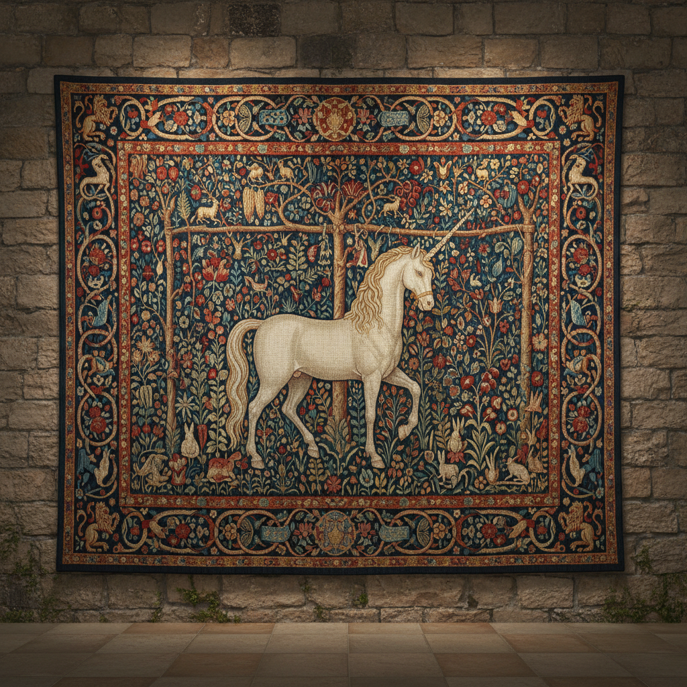

# Tapestry 挂毯艺术

> "A tapestry is a painting in thread." — Jean Lurçat

## 概述

挂毯艺术（Tapestry）是以经纬线交织创造图像的纺织艺术形式，是人类最古老的叙事媒介之一。从古埃及的亚麻挂毯到中世纪的巨型叙事壁挂、从法国戈布兰工坊到当代纤维艺术家的实验，挂毯跨越了数千年的历史。

挂毯不同于一般的纺织品——它是"用线编织的绘画"，每一根纬线都是一笔色彩。中世纪的挂毯是贵族的移动壁画，既是装饰也是保暖，既是叙事也是权力的象征。

## 核心特征

| 特征 | 描述 |
|------|------|
| 经纬交织 | 纬线覆盖经线形成图像 |
| 叙事性 | 讲述故事、记录历史、表达寓意 |
| 纪念碑性 | 大尺度的墙面覆盖 |
| 协作性 | 大型挂毯需要多人长期合作 |
| 耐久性 | 正确保存可持续数百年 |
| 奢侈性 | 历史上是极其昂贵的艺术品 |

## 视觉特征

- **尺度**：从小型装饰到覆盖整面墙壁
- **色彩**：染色羊毛/丝线的丰富色谱
- **质感**：织物特有的柔和、温暖质感
- **图像**：从具象叙事到抽象图案
- **边框**：传统挂毯有装饰性边框
- **背面**：背面的线头和结构是隐藏的"另一面"

## 代表作品

| 作品 | 创作者 | 年代 | 意义 |
|------|--------|------|------|
| *贝叶挂毯 (Bayeux Tapestry)* | 佚名 | 约1070 | 70米长的诺曼征服叙事 |
| *独角兽系列* | 佚名 | 约1500 | 中世纪挂毯的巅峰之作 |
| *贵妇与独角兽* | 佚名 | 约1500 | 六感的寓言——法国国宝 |
| *Apocalypse Tapestry* | Nicolas Bataille | 1377-82 | 最大的中世纪挂毯组 |
| *Le Chant du Monde* | Jean Lurçat | 1957-66 | 20世纪挂毯复兴的标志 |
| *Christ in Glory* | Graham Sutherland | 1962 | 考文垂大教堂的现代挂毯 |

## 历史时间线

| 时期 | 事件 |
|------|------|
| 前3000年 | 古埃及的早期挂毯 |
| 11世纪 | 贝叶挂毯——叙事挂毯的里程碑 |
| 14-15世纪 | 法兰德斯挂毯的黄金时代 |
| 1662 | 法国戈布兰皇家工坊成立 |
| 18世纪 | 挂毯逐渐衰落——被绘画和壁纸取代 |
| 1930s | Jean Lurçat——法国挂毯复兴运动 |
| 1962 | Lausanne国际挂毯双年展开始 |
| 1960s-70s | 新挂毯运动——从平面走向立体 |
| 2000s-至今 | 当代艺术家重新发现挂毯媒介 |

## 子类型

| 子类型 | 特征 |
|--------|------|
| 叙事挂毯 | 贝叶挂毯——讲述历史故事 |
| 千花挂毯 | Millefleurs——密集花卉背景 |
| 戈布兰挂毯 | 法国皇家工坊的精细织造 |
| 现代挂毯 | Lurçat——简化色彩和形式 |
| 当代挂毯 | 艺术家与工坊合作的当代作品 |
| 数字挂毯 | 数字提花织机的新可能 |

## 中国语境

中国有丰富的织锦传统——云锦、蜀锦、宋锦、壮锦——虽然技术上与西方挂毯不同（中国多为提花织锦），但在"用线编织图像"的本质上是相通的。中国的缂丝（kesi）技术与西方挂毯最为接近，被称为"织中之圣"。当代中国的纤维艺术家如施慧、梁绍基等将传统织造技术转化为当代艺术语言。

## 争议与遗产

- **争议**：挂毯是独立艺术还是绘画的"翻译"？
- **原创性**：传统挂毯根据画稿（cartoon）织造——织工是艺术家吗？
- **时间成本**：一幅大型挂毯可能需要数年——在快节奏时代如何生存？
- **遗产**：证明了纺织可以承载最宏大的叙事和最精细的图像
- **当代回响**：数字提花、当代纤维艺术、艺术家与工坊的新合作模式

## AI生成概念图

## 与其他风格的关系

- **Textile Art** → 纺织艺术是挂毯的上位类别
- **Medieval Art** → 中世纪是挂毯的黄金时代
- **Narrative Art** → 叙事艺术在挂毯中有最古老的传统
- **Pattern and Decoration** → P&D运动重新评价了装饰性织物
- **Mural Art** → 壁画与挂毯共享墙面叙事的功能
- **Digital Art** → 数字提花织机为挂毯带来新可能

---

*浮光艺志 | Chronicle of Artistry*
