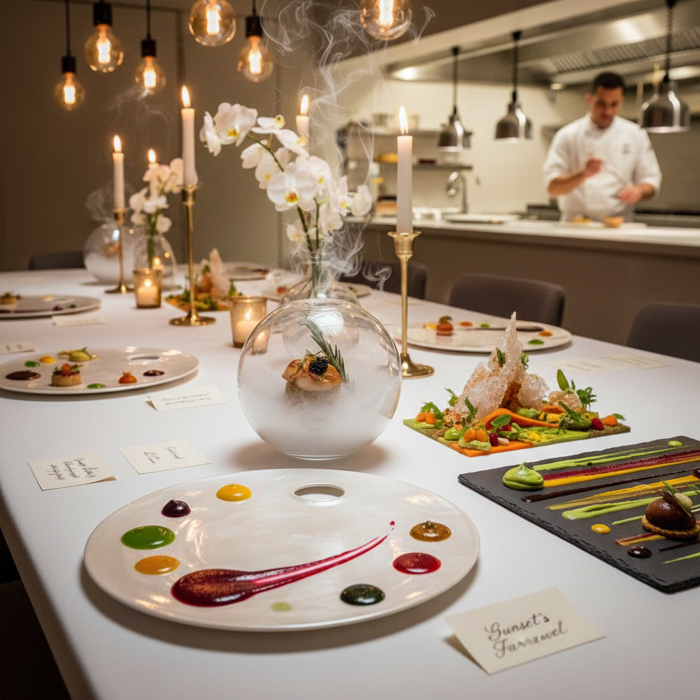

# Taste Art 味觉艺术

> "Taste art asks the most intimate question in aesthetics — can flavor be art? Can the arrangement of sweet, sour, bitter, salty, and umami on the tongue constitute an aesthetic experience as valid as color on canvas? When a chef composes a dish with the same intentionality as a painter composes an image, when eating becomes a performance and the diner becomes an audience, when food is designed not merely to nourish but to provoke thought, memory, and emotion, then the boundary between cuisine and art dissolves, and the oldest human creative act — cooking — finally claims its place in the gallery of the senses." — Unknown

## 概述

味觉艺术（Taste Art / Gustatory Art）是一种以味觉体验为核心媒介的艺术实践，将食物和饮品的创作提升到艺术的层面。味觉艺术不同于简单的"美食"或"烹饪艺术"——它是一种自觉的艺术实践，使用味觉作为表达概念、情感和美学理念的媒介。

味觉艺术的实践范围包括：1）概念性的食物装置——使用食物材料创作的艺术作品；2）表演性的烹饪——将烹饪过程作为表演艺术；3）味觉体验设计——设计特定的味觉序列来传达叙事或情感；4）食物雕塑——使用食物材料的雕塑创作；5）跨感官的味觉实验——探索味觉与其他感官的联觉关系。代表性的实践者包括：Rirkrit Tiravanija（烹饪作为关系艺术）、Ferran Adrià（分子料理作为艺术）、以及各种将食物引入当代艺术语境的艺术家。

## 核心特征

| 特征 | 描述 |
|------|------|
| 味觉 | 味觉作为核心媒介 |
| 概念 | 概念性的食物创作 |
| 表演 | 烹饪作为表演 |
| 短暂 | 作品的短暂性 |
| 参与 | 观众的身体参与 |
| 记忆 | 味觉与记忆的联系 |

## 视觉特征

- **摆盘**：精心设计的摆盘
- **色彩**：食物的自然色彩
- **质感**：多样的口感质感
- **容器**：非传统的容器
- **环境**：用餐环境的设计
- **过程**：烹饪过程的展示

## 代表作品

| 作品 | 艺术家 | 年代 | 意义 |
|------|--------|------|------|
| *Pad Thai* | Rirkrit Tiravanija | 1990 | 烹饪作为艺术 |
| *elBulli* | Ferran Adrià | 1987-2011 | 分子料理的艺术性 |
| *Eat Art* | Daniel Spoerri | 1960年代 | 食物艺术的先驱 |
| *The Dinner Party* | Judy Chicago | 1979 | 食物与女性主义 |
| *Food installations* | Various | 当代 | 食物装置艺术 |

## 历史时间线

| 时期 | 事件 |
|------|------|
| 1960年代 | Spoerri的"Eat Art"概念 |
| 1990年代 | Tiravanija的烹饪表演 |
| 2000年代 | 分子料理的艺术化 |
| 2010年代 | 食物设计的兴起 |
| 当代 | 多感官餐饮体验 |

## 中国语境

味觉艺术在中国有极其深厚的文化基础。中国的饮食文化本身就具有高度的艺术性——从"色香味形"的美学标准，到宴席的仪式性，到茶道的精神性，到食物与季节、节气的对应关系。中国传统文化中"食不厌精，脍不厌细"的理念本身就是一种味觉美学的宣言。当代中国的一些厨师和艺术家在探索将传统饮食文化与当代艺术实践结合——如将传统宴席重新设计为沉浸式体验、将地方食材的故事转化为叙事性的味觉旅程、以及将中国茶道的精神与当代表演艺术融合。中国的"食物设计"领域也在快速发展，将设计思维引入食物的创作和体验。

## AI生成概念图

## 与其他风格的关系

- **Sensory Art** → 感官艺术
- **Performance Art** → 表演艺术
- **Relational Aesthetics** → 关系美学
- **Food Design** → 食物设计
- **Molecular Gastronomy** → 分子料理
- **Installation Art** → 装置艺术

---

*浮光艺志 | Chronicle of Artistry*
