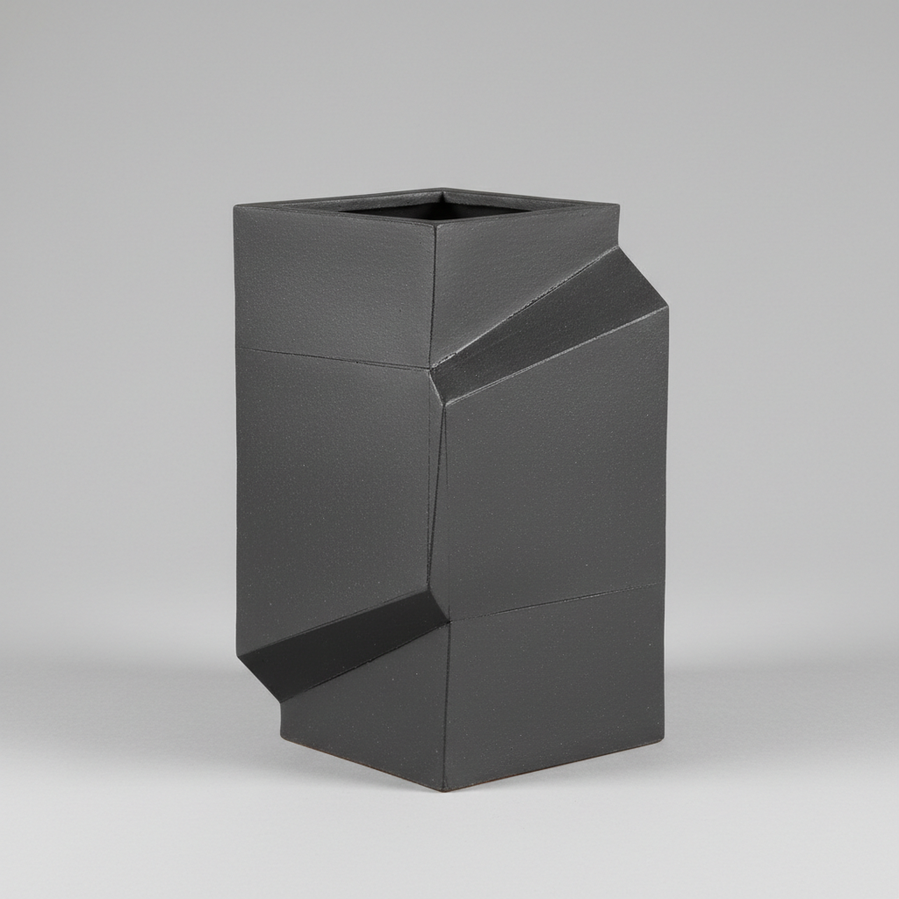

# Tatara Art 板作り艺术

> "Tatara is architecture in clay — flat slabs rolled to even thickness, cut with precision, scored and joined at angles to build vessels that echo the geometry of buildings and boxes, each seam a deliberate structural line, each surface a canvas for texture and pattern, the potter working like a tailor cutting fabric or a carpenter joining boards." — Unknown

## 概述

板作り艺术（Tatara Art）是一种使用平板粘土（泥板）通过切割、弯曲、拼接来构建陶瓷器物的成型技法。与拉坯的圆形限制不同，板作り可以创造方形、三角形、多边形等几何造型，也可以通过弯曲泥板形成有机曲面。这种技法强调结构性和建筑感，使陶瓷作品具有独特的几何美学。

板作り艺术的核心要素包括：1）泥板制作——将粘土擀压成均匀厚度的平板；2）切割——按设计裁切泥板；3）拼接——将泥板片通过刻痕和泥浆连接；4）几何造型——方形、三角等非圆形器形；5）表面处理——在平面上进行纹理和装饰；6）结构设计——考虑器物的结构稳定性；7）建筑感——具有建筑般的几何美感。

## 核心特征

| 特征 | 描述 |
|------|------|
| 泥板成型 | 使用平板粘土构建器物 |
| 几何造型 | 方形、多边形等非圆形 |
| 结构性 | 建筑般的结构逻辑 |
| 接缝美学 | 拼接线条作为设计元素 |
| 平面装饰 | 平坦表面便于装饰 |
| 精确性 | 需要精确的测量和切割 |

## 视觉特征

- **几何形态**：方形、三角等清晰几何
- **平坦表面**：均匀平整的泥板面
- **接缝线条**：可见的拼接结构线
- **建筑感**：如建筑模型般的造型
- **纹理印痕**：泥板上的织物或工具纹理
- **棱角分明**：清晰的边缘和转角

## 代表作品

| 作品 | 艺术家/文化 | 年代 | 意义 |
|------|-------------|------|------|
| *板作り方形花器* | 日本传统 | 江户时代 | 传统板作り |
| *Ken Price几何陶瓷* | Ken Price | 20世纪 | 几何陶瓷雕塑 |
| *板作り茶器* | 当代日本 | 当代 | 现代板作り茶器 |
| *建筑陶瓷* | 各地陶艺家 | 当代 | 建筑感陶瓷 |
| *泥板拼接器* | 当代陶艺家 | 当代 | 当代泥板创作 |

## 历史时间线

| 时期 | 事件 |
|------|------|
| 古代 | 早期泥板成型技法 |
| 中世纪 | 日本瓦和建筑陶瓷的泥板技术 |
| 江户时代 | 板作り在茶道器物中的应用 |
| 20世纪 | 现代陶艺中泥板技法的创新 |
| 当代 | 板作り在全球陶艺教育中的普及 |

## 中国语境

泥板成型在中国有悠久的历史。中国古代的砖瓦制作就是泥板技术的大规模应用。宜兴紫砂壶的"镶身筒"技法——用泥片围合成型——是中国最精湛的泥板成型技艺之一。中国当代陶艺教育中，泥板成型是基础课程的重要组成部分。中国陶艺家利用泥板技法创作了大量具有建筑感和现代感的作品。泥板技法的精确性和可控性使其特别适合表达当代设计理念，在中国的陶瓷设计领域应用广泛。

## AI生成概念图

## 与其他风格的关系

- **Coil Building** → 盘筑
- **Wheel Throwing** → 拉坯
- **Architecture** → 建筑
- **Geometric Art** → 几何艺术
- **Origami** → 折纸（灵感来源）
- **Yixing Teapot** → 宜兴紫砂

---

*浮光艺志 | Chronicle of Artistry*
