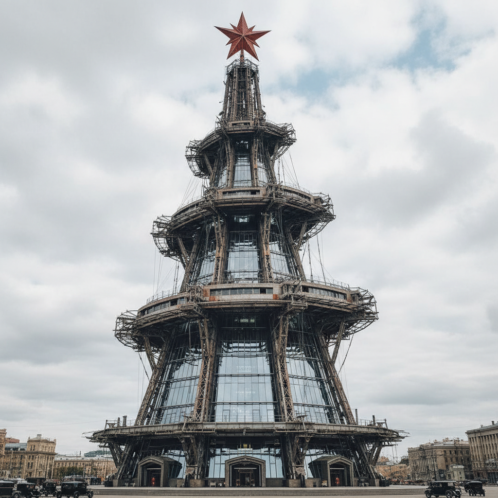

# Tatlin Art 塔特林艺术

> "The material dictates the form." — Vladimir Tatlin

## 概述

塔特林艺术（Tatlin Art）是20世纪初俄罗斯先锋派艺术家弗拉基米尔·叶夫格拉福维奇·塔特林（Vladimir Yevgrafovich Tatlin, 1885-1953）创立的构成主义（Constructivism）艺术风格。塔特林被誉为构成主义的创始人——他以"材料即形式"的理念，将艺术从画布上解放出来，创造了一种以真实材料（金属、木材、玻璃）在三维空间中构成的全新艺术形式。

塔特林最著名的作品是《第三国际纪念塔》（1919-1920）的模型——这座从未建成的螺旋形钢铁塔被设计为400米高（超过埃菲尔铁塔），内部包含旋转的玻璃体，象征着革命的动态精神。虽然从未实现，但它成为了20世纪最具影响力的建筑/雕塑构想之一——代表了艺术与技术、美学与功能融合的乌托邦理想。

塔特林艺术的核心要素包括：1）构成主义——以真实材料构成艺术；2）材料至上——材料决定形式；3）反绑画——从平面走向三维空间；4）功能美学——艺术与实用的统一；5）技术乌托邦——艺术服务于社会建设；6）角浮雕——悬挂在墙角的材料构成；7）飞行器——晚期对人力飞行器的探索。

## 核心特征

| 特征 | 描述 |
|------|------|
| 构成主义 | 以真实材料构成艺术 |
| 材料至上 | 材料决定形式 |
| 反绑画 | 从平面走向三维空间 |
| 功能美学 | 艺术与实用统一 |
| 技术乌托邦 | 艺术服务社会建设 |
| 角浮雕 | 悬挂墙角材料构成 |

## 视觉特征

- **金属材料**：铁、钢、铝等工业材料
- **螺旋结构**：动态的螺旋和斜线
- **悬挂构成**：悬挂在空间中的构成
- **几何框架**：裸露的几何结构框架
- **材料质感**：不同材料的对比质感
- **工业美学**：机器和工业的美感

## 代表作品

| 作品 | 年代 | 意义 |
|------|------|------|
| *第三国际纪念塔* (Monument to the Third International) | 1919-1920 | 构成主义的象征 |
| *角浮雕* (Corner Counter-Relief) | 1914-1915 | 材料构成的开创 |
| *材料选择* (Selection of Materials) | 1914 | 材料实验 |
| *列塔特林* (Letatlin) | 1929-1932 | 人力飞行器 |
| *绑画浮雕* (Painterly Relief) | 1913-1914 | 从绑画到雕塑 |
| *新生活工人服装设计* | 1920年代 | 功能设计 |

## 历史时间线

| 时期 | 事件 |
|------|------|
| 1885年 | 出生于莫斯科 |
| 1902-1910年 | 莫斯科和彭扎学习 |
| 1913年 | 访问巴黎毕加索工作室 |
| 1914-1915年 | 创作角浮雕系列 |
| 1919-1920年 | 设计第三国际纪念塔 |
| 1920年代 | 投身实用设计 |
| 1929-1932年 | 设计列塔特林飞行器 |
| 1953年 | 在莫斯科去世 |

## 中国语境

塔特林在中国设计教育和当代艺术理论中有着重要的地位。《第三国际纪念塔》作为构成主义的象征——它代表了艺术与社会建设融合的理想——在中国建筑和设计教育中被广泛讨论。塔特林"材料即形式"的理念对中国当代雕塑和装置艺术有直接的影响——许多中国当代艺术家在创作中强调材料本身的表现力。构成主义"艺术服务于生活"的理念与中国"艺术为人民服务"的传统有某种呼应——都追求艺术的社会功能。塔特林的列塔特林飞行器——虽然从未成功飞行——展现了艺术家对技术和未来的浪漫想象，这种精神在中国当代科技艺术中找到了新的表达。

## 概念图

## 与其他风格的关系

- **Constructivism** → 构成主义（创始人）
- **Malevich** → 马列维奇（对手和竞争者）
- **Rodchenko** → 罗德钦科（后继者）
- **Bauhaus** → 包豪斯
- **De Stijl** → 风格派
- **Industrial Design** → 工业设计

---

*浮光艺志 | Chronicle of Artistry*
