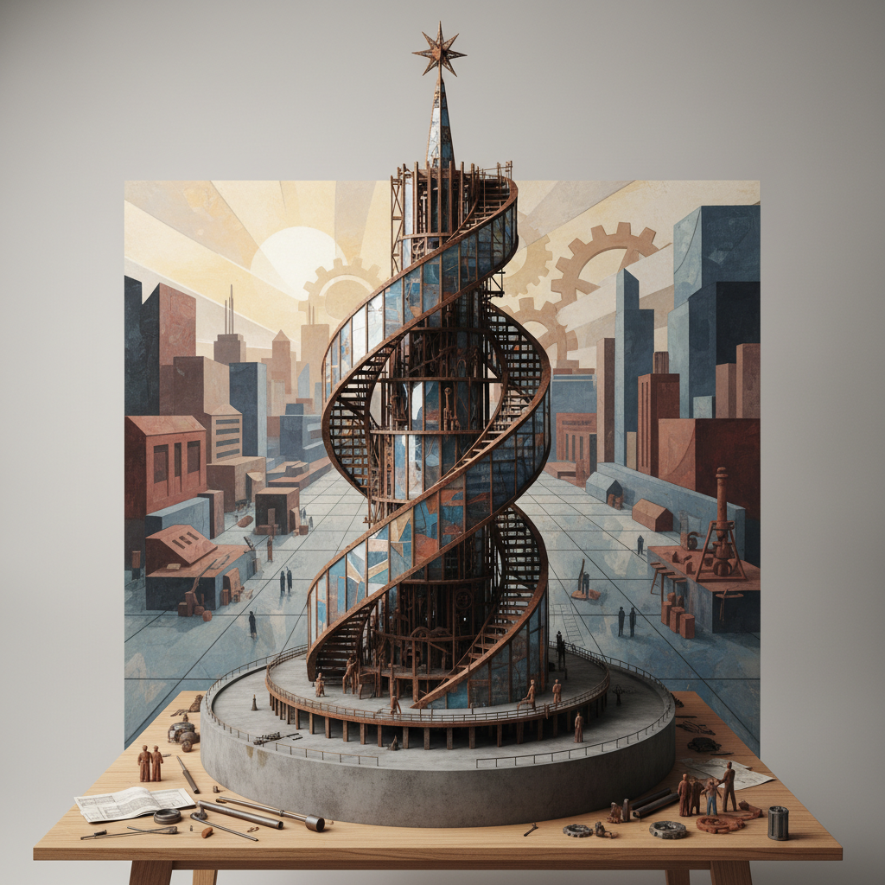

# Vladimir Tatlin 塔特林

> "The material itself dictates the forms." — Vladimir Tatlin

## 概述

弗拉基米尔·塔特林（Vladimir Tatlin，1885–1953）是俄国构成主义的创始人，以"材料的文化"理念和未建成的《第三国际纪念塔》闻名。他主张艺术应从画布走向真实材料和空间，用铁、玻璃、木材创造"反浮雕"，开创了将艺术与工程、建筑融合的先河。

## 核心特征

| 特征 | 描述 |
|------|------|
| 反浮雕 | 真实材料的空间构成 |
| 材料真实性 | 铁、玻璃、木材的本质表达 |
| 功能主义 | 艺术服务于社会建设 |
| 螺旋结构 | 动态上升的建筑形式 |
| 生产艺术 | 从画架走向工厂 |
| 乌托邦建筑 | 未来社会的视觉蓝图 |

## 代表作品

| 作品 | 年代 | 意义 |
|------|------|------|
| *Monument to the Third International* | 1919–20 | 构成主义建筑的象征 |
| *Corner Counter-Relief* | 1914–15 | 反浮雕的开创之作 |
| *Letatlin* | 1929–32 | 人力飞行器的乌托邦 |
| *Material Selection* | 1914 | 材料文化的宣言 |

## AI生成概念图

## 与其他风格的关系

- **Constructivism** → 构成主义的创始人
- **Rodchenko** → 影响了罗德琴科等后辈
- **Picasso** → 受毕加索拼贴启发
- **Deconstructivism** → 影响了解构主义建筑
