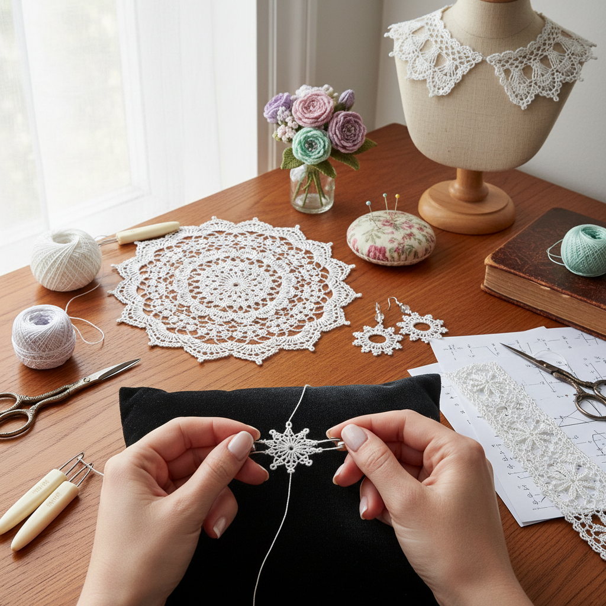

# Tatting Art 梭编艺术

> "Tatting is knot-making elevated to lace — a single shuttle carrying thread through loops and rings, building snowflake patterns from nothing but tension and timing. The tatter works with the simplest of tools — a small shuttle and a length of thread — yet produces lace of extraordinary complexity, each ring and chain locked in place by the fundamental geometry of the knot." — Unknown

## 概述

梭编艺术（Tatting Art）是使用梭子（shuttle）将线通过一系列结（双半结/lark's head knot）编织成精美蕾丝图案的纺织工艺——通过控制线的张力和结的排列，形成环（rings）和链（chains）的组合，创造出精致的镂空蕾丝效果。梭编是制作蕾丝的传统技法之一。

梭编艺术的实践包括：1）梭编蕾丝——传统的梭编蕾丝制作；2）针编——用针代替梭子的变体技法；3）梭编首饰——梭编制作的耳环、项链等；4）梭编装饰——桌布、窗帘边饰等；5）3D梭编——立体的梭编造型；6）彩色梭编——使用多色线的梭编；7）当代梭编——将传统技法与现代设计结合的创作。

## 核心特征

| 特征 | 描述 |
|------|------|
| 结构 | 基于结的结构 |
| 精细 | 极其精细的蕾丝 |
| 便携 | 工具简单便携 |
| 几何 | 几何图案的美感 |
| 镂空 | 通透的镂空效果 |
| 耐久 | 结构牢固耐久 |

## 视觉特征

- **环形**：圆环形的基本单元
- **链状**：连接环的链状结构
- **镂空**：通透的镂空图案
- **对称**：精确的对称设计
- **精细**：极其精细的线条
- **雪花**：雪花般的放射图案

## 代表作品

| 作品 | 艺术家/文化 | 年代 | 意义 |
|------|-------------|------|------|
| *Victorian tatted lace* | 英国维多利亚 | 19世纪 | 维多利亚梭编 |
| *Italian tatting* | 意大利传统 | 16世纪至今 | 意大利梭编 |
| *Japanese tatting* | 日本当代 | 当代 | 日本梭编创新 |
| *Tatted jewelry* | Various | 当代 | 梭编首饰 |
| *3D tatted flowers* | Various | 当代 | 立体梭编花卉 |

## 历史时间线

| 时期 | 事件 |
|------|------|
| 16世纪 | 梭编的起源（可能在意大利） |
| 18世纪 | 梭编在欧洲宫廷流行 |
| 19世纪 | 维多利亚时代的梭编热潮 |
| 20世纪 | 梭编的衰落和小众传承 |
| 当代 | 梭编的现代复兴 |

## 中国语境

梭编艺术在中国是一个相对小众但正在发展的手工艺领域。中国传统的编结艺术（中国结）与梭编有相似之处——都是基于结的装饰技法，但技法和工具不同。中国当代的手工爱好者中，梭编（tatting）作为一种西方传入的蕾丝技法正在获得关注——一些手工社区和工作室开始教授梭编技法。中国的电商平台上可以购买到梭编工具和材料——梭子、专用线等。中国的一些手工艺人将梭编与中国传统元素相结合——如用梭编技法制作中国风格的图案。中国的手工首饰市场中，梭编首饰作为一种独特的品类开始出现——以其精致的蕾丝质感吸引消费者。中国的一些手工书籍和网络教程开始介绍梭编技法——帮助更多人了解这种古老的蕾丝制作方式。

## AI生成概念图

## 与其他风格的关系

- **Bobbin Lace** → 棒槌蕾丝
- **Needle Lace** → 针编蕾丝
- **Crochet** → 钩编
- **Knitting** → 编织
- **Jewelry Art** → 珠宝艺术
- **Textile Art** → 纺织艺术

---

*浮光艺志 | Chronicle of Artistry*
