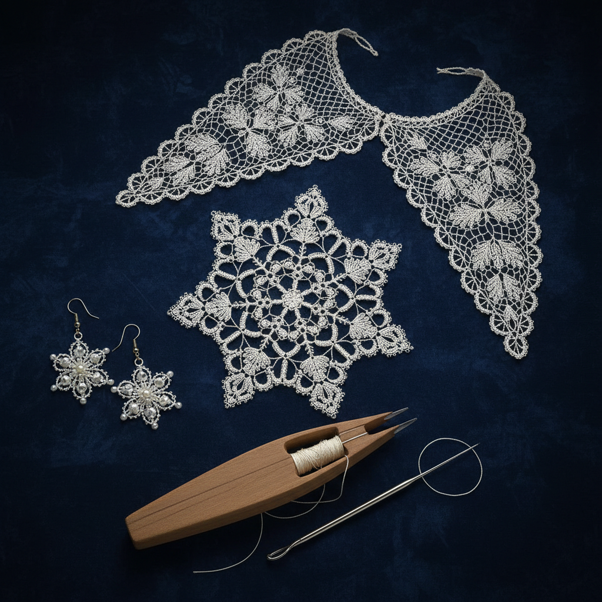

# Tatting 梭编

> "Tatting is lace made from a single thread and a shuttle — each ring and chain a meditation in miniature geometry." — Unknown

## 概述

梭编（Tatting）是使用梭子（shuttle）将单根线编结成精细蕾丝的手工艺。梭编的基本元素是"环"（ring）和"链"（chain）——通过双结（double stitch）的重复形成弧形的环和直线的链，再组合成复杂的蕾丝图案。与钩针蕾丝或棒针蕾丝不同，梭编蕾丝特别精细、坚固，具有独特的几何美感。梭编可以使用传统梭子或针（needle tatting）完成。

梭编的独特之处在于：极简的工具与极繁的效果——仅用一个梭子和一根线，就能创造出如同雪花般精美的蕾丝图案。

## 核心特征

| 特征 | 描述 |
|------|------|
| 梭子 | 使用梭子编结 |
| 单线 | 通常使用单根线 |
| 环链 | 环和链的基本结构 |
| 精细 | 极其精细的蕾丝 |
| 坚固 | 比其他蕾丝更坚固 |
| 几何 | 几何性的图案 |

## 视觉特征

- **精细**：极其精细的线条
- **环形**：圆环形的基本单元
- **对称**：高度对称的图案
- **通透**：通透的蕾丝效果
- **几何**：几何性的重复图案
- **雪花**：如雪花般的精美

## 代表作品

| 作品 | 艺术家 | 年代 | 意义 |
|------|--------|------|------|
| *Victorian tatted collars* | 匿名 | 19世纪 | 维多利亚梭编领饰 |
| *Mlle Riego patterns* | Mlle Riego de la Branchardière | 1850s+ | 梭编图案先驱 |
| *Japanese tatting* | Various | 当代 | 日本精细梭编 |
| *Contemporary tatted jewelry* | Various | 当代 | 当代梭编首饰 |
| *Large-scale tatted art* | Various | 当代 | 大型梭编艺术 |

## 历史时间线

| 时期 | 事件 |
|------|------|
| 16-17世纪 | 梭编的起源（有争议） |
| 18世纪 | 欧洲宫廷的流行 |
| 19世纪 | 维多利亚时代的全盛期 |
| 20世纪初 | 梭编的持续流行 |
| 20世纪中后期 | 逐渐式微 |
| 当代 | 小众但热情的复兴 |

## 中国语境

梭编在中国是相对小众的手工艺，但有一批热情的爱好者。中国的梭编社区主要通过网络连接，分享图案和技法。一些中国手工艺人将梭编与中国传统图案结合——如用梭编技法制作中国风的花卉和吉祥图案。梭编首饰（耳环、项链）在中国手工市集上也有一定的受众。中国传统的"络子"（装饰绳结）在某些方面与梭编有相似之处。

## AI生成概念图

## 与其他风格的关系

- **Bobbin Lace** → 棒针蕾丝
- **Needle Lace** → 针蕾丝
- **Crochet** → 钩针编织
- **Lacemaking** → 蕾丝制作
- **Jewelry** → 梭编首饰
- **Fiber Art** → 纤维艺术

---

*浮光艺志 | Chronicle of Artistry*
